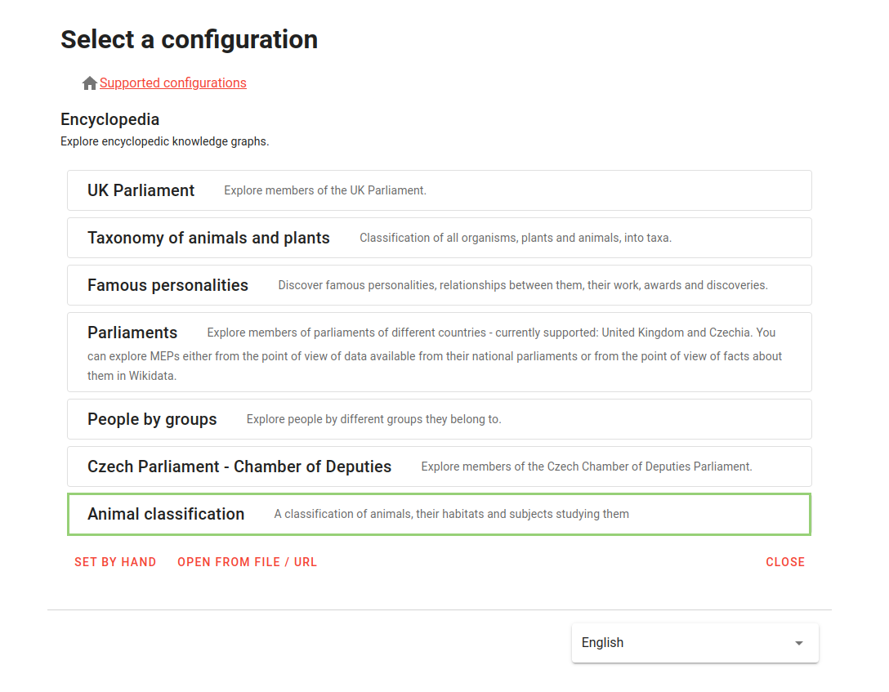

### Table of Contents

- [Motivation](#motivation)
- [Glossary](#glossary)
- [Configuration selection](#configuration-selection)
- [Get started with graph exploration](#get-started-with-graph-exploration)

---

<h1 id="motivation">Motivation</h1>

We all know how zoom in/out works on mapping platforms such as [google maps](https://maps.google.com), maps.cz, etc. Zoom is used to increase or decrease the zoom level at a specific point and show more or less detail on a map.

Our extension of the original Knowledge Graph browser is inspired by such mapping platforms.

<h1 id="glossary">Glossary</h1>

In this part of the guide, you will learn the necessary terms that will help you understand the basic principle of how our extension works.

<h2 id="hierarchical-relationships-glossary">Hierarchical relationships</h2>

In our approach, we introduce the concept of hierarchical relationships. 

Typically, nodes in a graph are related to each other, for example, a company has employees, university has scientists, scientist has awards, scientist writes scientific papers, university has departments, and many other examples. In what follows, for simplicity, we will consider universities and departments as an example, and relation between them will be - "university has department(s)".

One possible way to visualize such relation is to create an edge between nodes. But there is also another way, namely adding a hierarchy between the nodes, that is, in our example, the university acts as a parent node, and its departments act as child nodes. In such case, "university has department(s)" relation is hierarchical one, i.e. representing a *"parent-child"* relationship.

See the picture below for an example:

     
    <em>Figure 1. Parent-child relationship</em>

Here the node *"Fakulty"* is the parent node of the node *"Matematicko-fyzikální fakulta"*, which, in turn, is the parent of the internal nodes that are light-blue and have titles inside the node.

Non-hierarchical relationships are represented by edge between nodes.

<h2 id="hierarchical-groups">Hierarchical groups</h2>

> A hierarchical group is a cluster of nodes that are related to each other by parent-child relationships. 

Each node in a hierarchical group must have a [hierarchical class](#hierarchical-class) that represents that hierarchical group.

An example of one such hierarchical group is shown in Figure 1.

The hierarchical group is predefined by the technician in the visual configuration.

<h2 id="visual-groups">Visual groups</h2>

> A visual group is a cluster of nodes located in the same area on a graph.

The visual group is predefined by the technician in the visual configuration.

Each node in a visual group must have a visual class that represents that hierarchical group. It can be the same class as the hierarchical class.

     
    <em>Figure 2. Visual groups</em>

<h2 id="hierarchical-class">Hierarchical class</h2>

> A hierarchical class is a visual class that determines which hierarchical group a node belongs to.

<h2 id="hierarchical-level">Hierarchical level</h2>

> The hierarchical level indicates the depth of the hierarchy at which the node resides.

<h1 id="how-to-use-the-extension">How to use the extension?</h1>

This guide will explain and teach you how the *"clustering and grouping"* extension works and what benefits it provides.

<h2 id="configuration-selection">Configuration selection</h2>

> **Note**
> The Knowledge Graph Browser currently supports only one configuration that allows this extension to be used.

**1)** Choose "Charles Explorer" meta-configuration. See the Figure 3 for more detail.

     
    <em>Figure 3. Meta-Configuration selection</em>

**2)** Choose "Browsing topics cultivated at Charles University (with constraints)" configuration

     
    <em>Figure 4. Meta-Configuration selection</em>

**3)** Choose starting node

> **Warning**
> Wait for the starting node to fully load (the loading sign will disappear and starting node will look like at the picture below). This is a necessary step for the extension to work correctly. 

     
    <em>Figure 5. Starting node</em>

<h2 id="get-started-with-graph-exploration">Get started with graph exploration</h2>

<h3 id="hierarchical-relationships-guide">Hierarchical relationships</h3>

As mentioned in the [Glossary](#glossary), namely [Hierarchical relationships](#hierarchical-relationships-glossary), there are hierarchical and non-hierarchical relationships.

An expansion query predefined in the configuration allows you to show the neighborhood of a node in which the node is in either a hierarchical or non-hierarchical relationship with its neighbor.

The hierarchical and non-hierarchical expansions are listed below and shown in the Figure 6.

Hierarchical expansions:
- "Nadřazená pracoviště"
- "Podřazená pracoviště"

Non-hierarchical expansions:
- "Témata pracoviště"
- "Sdílená témata pracoviště"

     
    <em>Figure 6. Hierarchical and non hierarchical expansions</em>

<h1 id="references">References</h1>

[1] https://www.geeksforgeeks.org/google-maps-zoom/

