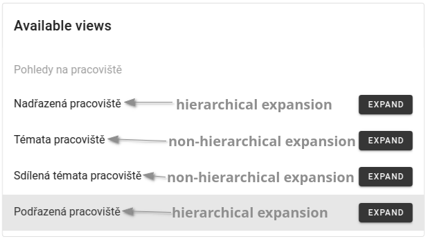

### Table of Contents

- [Motivation](#motivation)
- [Glossary](#glossary)
- [Configuration selection](#configuration-selection)
- [Get started with graph exploration](#get-started-with-graph-exploration)

---

<h1 id="motivation">Motivation</h1>

We all know how zoom in/out works on mapping platforms such as [google maps](https://maps.google.com), maps.cz, etc. Zoom is used to increase or decrease the zoom level at a specific point and show more or less detail on a map.

Our extension of the original Knowledge Graph browser is inspired by such mapping platforms.

<h1 id="glossary">Glossary</h1>

In this part of the guide, you will learn the necessary terms that will help you understand the basic principle of how the extension works. They may differ from the usual terms you may be familiar with.

<h2 id="hierarchical-relationships-glossary">Hierarchical relationship</h2>

In our approach, we introduce the concept of hierarchical relationships. 

Typically, nodes in a graph are related to each other, for example, a company has employees, university has scientists, scientist has awards, scientist writes scientific papers, university has departments, and many other examples. In what follows, for simplicity, we will consider universities and departments as an example, and relation between them will be - "university has department(s)".

One possible way to visualize such relation is to create an edge between nodes. But there is also another way, namely adding a hierarchy between the nodes, that is, in our example, the university acts as a parent node, and its departments act as child nodes. In such case, "university has department(s)" relation is hierarchical one, i.e. representing a *"parent-child"* relationship.

See the picture below for an example:

     
    <em>Figure 1. Parent-child relationship</em>

Here the node *"Fakulty"* is the parent node of the node *"Matematicko-fyzikální fakulta"*, which, in turn, is the parent of the internal nodes that are light-blue and have titles inside the node.

Non-hierarchical relationships are represented by edge between nodes.

<h2 id="hierarchical-groups">Hierarchical group</h2>

> A hierarchical group is a cluster of nodes that are related to each other by parent-child relationships. 

Each node in a hierarchical group must have the [hierarchical class](#hierarchical-class) that represents that hierarchical group.

An example of one such hierarchical group is shown in Figure 1.

The hierarchical group is predefined by the technician in the visual configuration.

<h2 id="visual-groups-glossary">Visual group</h2>

> A visual group is a cluster of nodes located in the same area on a graph. Nodes that belong to the same visual group are placed under the same "pseudo-parent" representing the visual group itself.

     
    <em>Figure 2. Visual group</em>

The visual group is predefined by the technician in the visual configuration.

Example of visual group is shown above in the Figure 2.

Each node in a visual group must have a visual class representing that visual group. It can be the same class as the hierarchical class.

     
    <em>Figure 3. Visual groups</em>

> The hierarchical groups themselves can be interpreted as visual groups. In such a case, there is no need for a "pseudo-parent".

An example of two visual groups "pracovisteVisualGroup" and "tema" is shown in Figure 3 above.

> **Note**
> The main advantage of visual groups is that you can easily move all the nodes that belong to the same group across the entire graph area at the same time. This way they won't be scattered all over the graph area. 

<h2 id="hierarchical-class">Hierarchical class</h2>

> A hierarchical class is a visual class that determines which hierarchical group a node belongs to. A node can only be assigned to one hierarchical class.

The hierarchical class, if it exists, is shown along with the label of a node. See Figure 4 below for more details.

     
    <em>Figure 4. Hierarchical class</em>

<h2 id="hierarchical-level">Hierarchical level</h2>

> The hierarchical level indicates the depth of the hierarchy at which the node resides.

The amount of detail displayed on the maps (in mapping platforms) depends on the zoom level. Our implementation uses the same idea. At the deepest [level of the hierarchy](#hierarchical-level), the graph shows all possible details, and as you zoom out, it generalizes the details to the parent nodes and shows less detail (the depth of the [hierarchical level](#hierarchical-level) decreases). And at the highest [level of the hierarchy](#hierarchical-level), the graph shows only those single nodes that are representatives of the hierarchies themselves. 

<h2 id="cluster-glossary">Cluster</h2>

> Cluster is a set of the same or similar elements, assembled or located close to each other. 

<h2 id="grouping-glossary">Grouping</h2>

> Grouping is the task of converting clusters into a single node.

<h2 id="checkbox-glossary">Checkbox</h2>

"Scaling options" checkbox is used to choose whether to group nodes or to zoom. It is placed in the right corner of the graph area. See the Figure 5 for more detail.

     
    <em>Figure 5. Scaling options</em>

<h3 id="grouping-of-clusters-glossary">Grouping of clusters</h3>

When you zoom in on a specific point on the mapping platforms, at each zoom level, you see more and more details about the region you zoom in, and also otherwise, when you zoom out, some details disappear. The same principle is used in the *"grouping of clusters"* algorithm, namely, when you zoom in, you see more detail in terms of nodes, and when you zoom out, you see less detail in terms of nodes.

The *"grouping of clusters"* algorithm must first cluster the nodes into a [cluster](#cluster-glossary), and then collapse this cluster into a single group node. Which nodes to cluster and then group into a single node is determined by an algorithm based on the location of the nodes. This algorithm uses well-known clustering methods such as k-Means clustering [1] and k-Medoids clustering [2] (the method used is set by the technician).

The basic approach of the algorithm is that it creates several centroids, combines them into an empty group (k-Means clustering [1]) or into a group consisting of a single node (k-Medoids clustering [2]), and then adds surrounding nodes to the closest group.

The grouping of nodes is determined based on the [hierarchical class](#hierarchical-class), the parent node, the [level of the hierarchy](#hierarchical-level), and the visual class. First of all, the nodes must be grouped by the hierarchical group class to which they belong. 

As the map (in the mapping platforms) scales down and details disappear, new correlated details appear in their place that generalize the disappeared details. In our case, the parent node is such a generalization. Therefore, the second condition of the grouping algorithm must be the grouping of nodes that have the same parent node.

> **Wartning**
> The algorithm always groups the nodes that are at the deepest [hierarchical level](#hierarchical-level) shown in the graph area. Only when all nodes in a level will be the only nodes of their parents, the algorithm will collapse those nodes into their parents and increase the hierarchical level by 1.

When zooming out, child nodes are collapsed into their parents, and all incoming and outgoing edges of child nodes remain preserved. This is done by moving edges to parent nodes.

When switching between zoom levels and therefore hierarchy levels, the graph shows more or less details in terms of the number of nodes. They only disappear, but still exist on the graph (in other words, they are not mounted in the hierarchy, but still mounted in the graph). Also otherwise, when you zoom in, the disappeared nodes reappear (similar to mapping platforms). 

> **Warning**
> When you zoom in, the disappeared nodes reappear in a different way than they were grouped and collapsed, namely when the parent node expands during the zoom operation, only one node appears inside the parent node (either a group or a single node), and on the next zoom in (in case this node is a group), the group gets broken and releases all child nodes of the expanded parent node. In such case the hierarchical level may increase by 1.

By default, only nodes of the same visual class (other than [hierarchical class](#hierarchical-class)) can be grouped together, but it is also possible to group multiple nodes of different visual classes into one group node (this is predefined in the visual configuration by the technician). Therefore, when grouping nodes, their visual classes must also be taken into account.

<h3 id="node-removal-glossary">Node removal</h3>

> The deletion of a node propagates recursively to the deletion of the node's descendants.

<h1 id="how-to-use-the-extension">How to use the extension?</h1>

This guide will explain and teach you how the *"grouping of clusters"* extension works and what benefits it provides.

<h2 id="configuration-selection">Configuration selection</h2>

> **Note**
> The Knowledge Graph Browser currently supports only one configuration that allows this extension to be used.

**1)** Choose "Charles Explorer" meta-configuration. See the Figure 6 for more details.

     
    <em>Figure 6. Meta-Configuration selection</em>

**2)** Choose "Browsing topics cultivated at Charles University (with constraints)" configuration

     
    <em>Figure 7. Meta-Configuration selection</em>

**3)** Choose starting node

> **Warning**
> Wait for the starting node to fully load (the loading sign will disappear and starting node will look like at the picture below). This is a necessary step for the extension to work correctly. 

     
    <em>Figure 8. Starting node</em>

<h2 id="get-started-with-graph-exploration">Get started with graph exploration</h2>

<h3 id="starting-node">Starting node</h3>

The starting node is shown in the same way as in other configurations.

<h3 id="hierarchical-extensions">Hierarchical extensions</h3>

As mentioned in the [Hierarchical relationships](#hierarchical-relationships-glossary) section of the [Glossary](#glossary), there are hierarchical and non-hierarchical relationships.

An expansion query predefined in the visual configuration allows you to show the neighborhood of a node in which the node is in either a hierarchical or non-hierarchical relationship with its neighbors.

The hierarchical and non-hierarchical expansions are listed below:

Hierarchical expansions:
- "Nadřazená pracoviště"
- "Podřazená pracoviště"

Non-hierarchical expansions:
- "Témata pracoviště"
- "Sdílená témata pracoviště"

See the Figure 9 for an example.

     
    <em>Figure 9. Hierarchical and non-hierarchical expansions</em>

> **Note** 
> - A [hierarchical group](#hierarchical-groups) can be continuously build using a hierarchical expansions (example is shown in the Figure 1).
> - Non-hierarchical expansions expand a node with its neighborhood, where each neighbor is connected to that node by an edge.

<h3 id="checkbox-guide">Checkbox</h3>

The main tool that enable you to utilize the extension is the [checkbox](#checkbox-glossary). 

Using the checkbox, you can choose whether to:
- [Grouping of clusters](#grouping-of-clusters-glossary)
- Zooming
- Grouping of clusters and zooming at the same time
- Neither one of them

By selecting a "Grouping of clusters" and "zooming" at the same time, you can take an advantage of the main features of the mapping platforms.

<h3 id="node-removal-guide">Node removal</h3>

[Removing](#node-removal-glossary) a node is described in the [Glossary](#glossary)

Example of the node removal:

Before removal:

     
    <em>Figure 10. Before removal</em>

After removal:

     
    <em>Figure 11. After removal</em>

<h2 id="summary">Summary</h2>

<h1 id="references">References</h1>

[1] https://en.wikipedia.org/wiki/K-means_clustering
[2] https://en.wikipedia.org/wiki/K-medoids

<!-- //TODO
- zooming
- node deletion
- common principle what can be shown on the graph
- change clustering in the checkbox to grouping -->