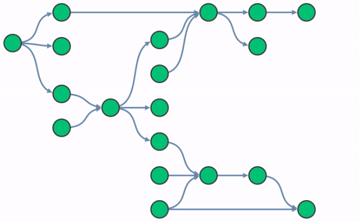
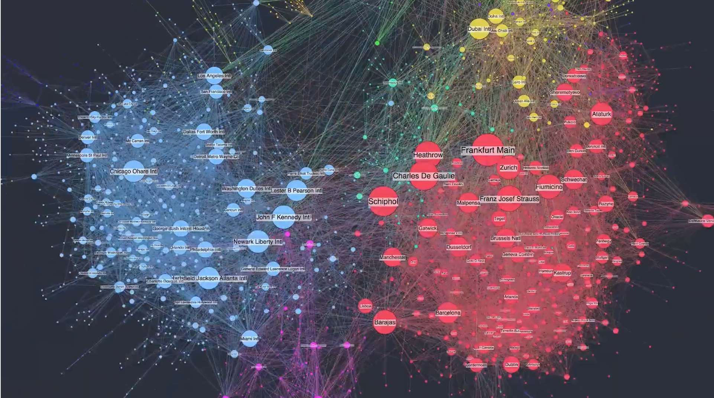
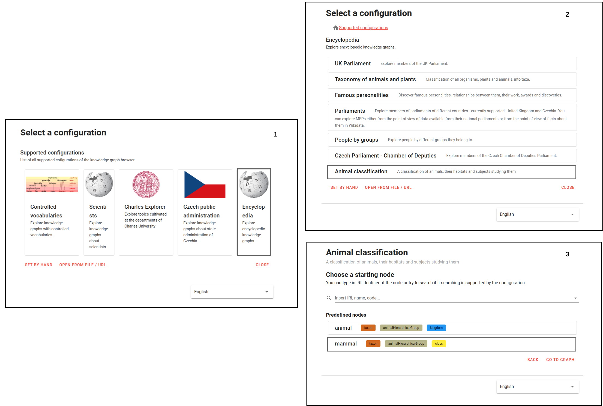
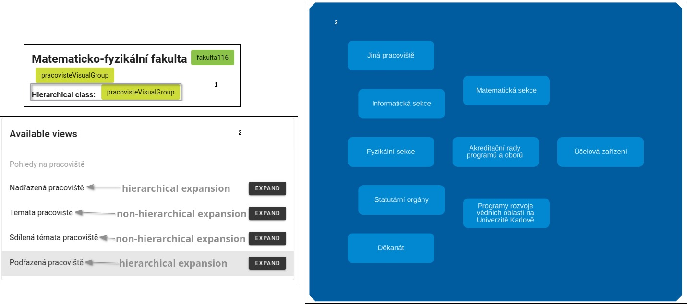

<h1>Scientific documentation of the research project</h1>
<h3>Topic: Optimization in visualization of knowledge graphs: Grouping of clusters.</h3>

Team members who contribute to the Knowledge Graph Visual Browser:
- Štěpán Stenchlák
  - basic implementation as a bachelor's thesis
- Jiří Resler
  - Faceted filtering
- Oskar Razyapov
  - [Grouping of clusters](https://github.com/Razyapoo/knowledge-graph-browser-frontend-grouping-of-clusters)

Full implementation and basic principals used in the "Grouping of clusters" extension are described in the [technical](https://github.com/Razyapoo/KGBClusteringDocumentation/blob/main/technical_documentation.md) and [user](https://github.com/Razyapoo/KGBClusteringDocumentation/blob/main/user_documentation.md) documentations.

There also exist a contribution to [the original article](https://www.sciencedirect.com/science/article/pii/S1570826822000105#b2). Available [here](https://cunicz-my.sharepoint.com/:w:/g/personal/32372635_cuni_cz/EV7T125oVxBGkA2EyI3h1fQB4vHl4NJtNkbHMSx5be4ALw?e=FZ4HxC). 

Table of content:
- [Introduction](#introduction)
- [Motivation](#motivation)
- [Approaches](#approaches)
- [Grouping of clusters](#grouping-of-clusters-extension)
- [References](#references)

This paper proposes several prototypes (developed by the student or found in other research papers) used to optimize the visualization of knowledge graphs so that they are well organized and easy to understand for ordinary users. It is also supposed to compare prototypes and implement at least one of them.

The paper is organized as follows. Section [1](#introduction) contains an introduction. Section [2](#motivation) describes the motivation used in our extension. Section [3](#approaches) describes different approaches used to simplify large graphs. Section [4](#references) describes final approach.

<h2 id="introduction">1. Introduction</h2>

A [knowledge graph](https://en.wikipedia.org/wiki/Knowledge_graph), also known as a semantic network, represents a network of real-world entities: objects, events, situations, or concepts, and illustrates the relationship between them. This information is typically stored in a graph database and visualized as a graph structure, giving rise to the term "knowledge graph" [[1]](#references). The most common way to represent knowledge graphs is to use the [RDF standard](https://en.wikipedia.org/wiki/Resource_Description_Framework).

However, it can be difficult for non-specialists to study knowledge graphs due to background technicalities. To solve this problem, the paper “Interactive and iterative visual exploration of knowledge graphs based on shared and reusable visual configurations” [[2]](#references) proposes the [Knowledge Graph Visual browser](https://try.kgbrowser.opendata.cz/) interactive tool which allows non-specialists to explore knowledge graphs without knowing the underlying technical details.

<h2 id="motivation">2. Motivation</h2>

Often the graphs are quite large, contain too much detail, which slows down and makes them difficult to visualize. And as a result, they do not provide easy visual learning and understanding for regular users.

A good visualization can show (reveal) patterns in the graph that are of value to the user. Such visualization, for example, can be used for the presentation purposes.

<h2 id="approaches">3. Approaches</h2>

There are two approaches to start with. The first approach is to reduce the time used to render large graphs, i.e., optimize the backend methods used in graph rendering. This approach does not reduce the amount of detail shown on the graph, but only the rendering time.

The second approach is to make the graph more readable and understandable for non-specialists, i.e. optimize frontend visualization. For example, to reduce the amount of detail such as edges or nodes, or to use a different, more efficient, layout algorithm. This approach takes precedence because the original proposal of the Knowledge Graph Visual Browser was to hide technical complexity such as SPARQL queries and RDF standards to simplify the graph exploration for non-specialist users. This approach can also improve rendering time. Therefore, this paper will rely on this approach.

By examining what a good, understandable graph should look like, and relying on articles [[3]](#references), [[4]](#references), we can establish several criteria and rely on them:
- Intuitiveness / Perceptibility / Easy navigation
- Simplicity
- Usefulness
- Highlighting key details

<h3 id="filtering">Filtering</h3>

The first way to simplify a graph is to use filtering, as it helps users extract and understand the information they need in the graph. The method should allow users to freely select attributes and relationships they are interested in and then use these features to create a small and informative summary graph that reveals the basic characteristics of the nodes and their relationships in the original graph.

However, this correlates with the topic of another student, so we decided to skip it.

<h3 id="layouts">Layouts</h3>

The second way is to use an existing layout or implement own. 

Let's highlight a few criteria that need to be considered in a good layout that can be used to show large graphs:
1. Nodes connected by an edge must be close to each other
2. There must be the minimum number of intersections of edges, or even no intersections
3. Large amount of nodes should be split into chunks, or clusters
4. Clusters should contain related nodes
5. Overall graph representation should represent (tell) a good story in understandable way

Unfortunately, it is very difficult and time consuming to implement the own layout, because it requires to make changes in the big part of the Cytoscape library.

---

Fortunately, we can still integrate graph simplification techniques with existing layouts to make the graph visualization more user-friendly. To do this, we describe the following five techniques:
- [Elimination of redundant nodes and edges. Sparsification](#nodes-edges-eliminations)
- [Summarization](#summarization)
- [Clustering](#clustering)
- [Coarsening](#coarsening)
- [Condensation](#condensation)

<h4 id="nodes-edges-eliminations">Elimination of redundant nodes and edges. Sparsification</h4>

This technique is used to compress the original graph, remove all redundant nodes without changing the graph structure. 

A key difference between graph compression and graph summarization is that graph summarization focuses on finding structural patterns within the original graph, whereas graph compression focuses on compressions the original graph to be as small as possible. 

<h4 id="summarization">Summarization</h4>

Graph summarization transforms graphs into more compact representations while preserving structural patterns. They produce summary graphs in the form of supergraphs. Supergraphs are the most common representation, which consists of supernodes and original nodes that are connected by edges and superedges that represent aggregated original edges [[5]](#references).

As was mentioned in the [Elimination of redundant nodes and edges](#nodes-edges-eliminations) section above, sparsification technique removes unimportant (redundant) nodes and edges from the graph that are difficult to recover, so we decided to continue exploring grouping/aggregation summarization methods.

<h4 id="clustering">Clustering</h4>

Graph clustering is the process of grouping the nodes of the graph into clusters, taking into account edge and node structures of the graph in such a way that there are several edges within each cluster and very few (or even no edges) between clusters [[6]](#references). Graph clustering clusters the nodes based on their similarity measure.

<h4 id="coarsening">Coarsening</h4>

The goal of this method is to replace the original graph by one which has fewer nodes, but whose structure and characteristics are similar to those of the original graph. Usually nodes with similar properties are grouped into a clusters. These similarity clusters form the new nodes of the coarsened graph and are hence termed as supernodes [[7]](#references).

<h4 id="condensation">Condensation</h4>

Graph condensation returns a directed graph whose nodes represent the strong components of the original graph. This reduction provides a simplified view of the connectivity between components. 

The main advantage of this approach is that it simplifies the original graph so that the various algorithms that run on the graph become faster. 

The disadvantage of this method is that as its output we get a directed acyclic graph (DAG), in which each strongly connected component (SCC) does not take into account node similarities (for example classes) and consists of a mix of nodes. As an improvement, we can add a criterion that the SCC should only contain node having similar properties.

This is the first technique implemented. I implemented it just to understand the Knowledge Graph Visual Browser implementation and how it works. The idea was to use the graph condensation method and create a new graph consisting of nodes that represent strongly connected components in the original graph.

---

Let's find out what types of layouts exist that are used to present large graphs and can be useful in Knowledge Graph Visual browser.

<h3 id="sequential-layout">Sequential layout</h3>

Because in the Knowledge Graph Visual Browser we always expand the neighborhood of a node, it can be useful to use sequential layout.

     
    <em>Figure 1. Sequential layout</em>

The sequential layout (shown in the Figure 1 above) is designed to display data that contains a clear sequence of distinct levels of nodes. It takes multiple components into account and minimizes link crossings [[8]](#references).

This layout meets 1, 2, and 5 criteria listed at the beginning of the [Layouts](#layouts) section. It satisfies the first criterion because we expand the neighborhood in the same direction (the direction must be determined at the beginning), so we can place nodes in the neighborhood close to the expanding node. It meets the second criterion because we are expanding the nodes in the same direction, so we have room to place its neighbors in such a way that there are no edge intersections. It also meets the fifth criterion because it is visually understandable to non-specialists.

However, this layout is only good if we always expand nodes that were not in the graph up to this point. Because otherwise we would have back edges leading in the opposite direction. It is also hard to make clusters of nodes. This requires node swapping that might be time and resource consuming.

<h3 id="visual-tricks">Visual tricks</h3>

There are many layouts with interesting features, but unfortunately they are not supported by the Cytoscape library. But we can still integrate the visual tricks used in these layouts into existing layouts already implemented in the Cytoscape library.

The main visual tricks:
- Hiding background
- Highlighting key nodes and edges
- Using node aggregation

<h3 id="hiding-background">Hiding background</h3>

This technique allows to show only those nodes that are of interest to the user. This method also hides redundant nodes (or background) or makes them less visible to the user. A possible implementation of such a technique is shown in Figure 2 below.

     
    <em>Figure 2. Hiding redundant nodes [9].</em>

However, this technique has already been implemented in the Knowledge Graph Visual browser by Štěpán Stenchlák.

<h3 id="highlighting-key-nodes-and-edges">Highlighting key nodes and edges</h3>

The second approach is to highlight key nodes or areas (clusters) of nodes that may be of interest to the user. The most important nodes can also be larger than others. An example of such a representation is shown in Figure 3.

     
    <em>Figure 3. Node and edge highlighting [10].</em>

The disadvantage of this method is that it only improves visual perception, but does not simplify the graph and does not make it faster.

<h3 id="node-aggregation">Node aggregation</h3>

Node aggregation is an example of [graph coarsening](#coarsening). A coarsened graph consists of aggregated nodes. But this is not what we want to do, because in this way we will lose other nodes and edges that may need to be restored. It would be much better to still be able to reveal nodes and edges hidden within aggregated nodes.

However, this can cause a problem in the Knowledge Graph Visual browser, because there are detailed queries that are used to display node details, and if we aggregate nodes, it will not be possible to display details of aggregated nodes because they will be auxiliary and will not exist in the database. The same can be said for expansion and preview requests. Thus, we may lose all the functionality that the Knowledge Graph visual browser provides.

To solve this problem, can use a trick: if the user clicks on the aggregated node, a browser will display the internals of that aggregated node. The Cambridge Intelligence call this approach as [combos](https://cambridge-intelligence.com/combos/). 

I presented this approach to my supervisor and two weeks later he told me that he had found a customer who is interested in this approach. The customer was the Charles University and the topic was "Departments and subjects".

After several studies, we can state the following several criteria:

- An aggregation node must be a cluster of related nodes (for example, nodes of the same class or similar property)
- An aggregation node must somehow show the user which nodes it has inside
- An aggregation node might have separate aggregation nodes internally representing the types of nodes it aggregates (in case it aggregates different types of nodes, such as universities and subjects).
- An aggregation node may display the number of nodes it has inside.

But there are more questions:
- Based on what criteria to cluster nodes?
- How to name and represent the aggregation node?
- Can cluster have nodes of different equivalence classes (based on similarity)?
- How to represent edges between nodes that represent an aggregation of the original nodes (create only one aggregated edge, i.e. its thickness will show how many edges it combines, or show them all)?
- How to show the internals of an aggregation node?

The first draft of the approach is shown in the Figure 4 below.

     
    <em>Figure 4. First draft.</em>

From this point on, we can introduce the term "[hierarchy](https://github.com/Razyapoo/KGBClusteringDocumentation/blob/main/technical_documentation.md#parent-child-or-child-parent-hierarchical-relationship)" into use and formulate the following main criteria:
- There can be [hierarchical](https://github.com/Razyapoo/KGBClusteringDocumentation/blob/main/technical_documentation.md#parent-child-or-child-parent-hierarchical-relationship) and [non-hierarchical](https://github.com/Razyapoo/KGBClusteringDocumentation/blob/main/technical_documentation.md#non-hierarchical-relationship-) (ordinary, represented by an edge) relationships between nodes
- The hierarchical expansion (from the list of available expansions) must show the expansion within (inside) the expanded node
- It should be possible in the configuration to determine if the relationship is [hierarchical](https://github.com/Razyapoo/KGBClusteringDocumentation/blob/main/technical_documentation.md#parent-child-or-child-parent-hierarchical-relationship) or [non-hierarchical](https://github.com/Razyapoo/KGBClusteringDocumentation/blob/main/technical_documentation.md#non-hierarchical-relationship-)
- A non-hierarchical edge can lead between nodes placed in the different hierarchies, even if one of them or both contain child nodes inside
- Child nodes can be collapsed into parent nodes
- Nodes having the same [hierarchical class](https://github.com/Razyapoo/KGBClusteringDocumentation/blob/main/technical_documentation.md#hierarchical-class) must be place in the same [hierarchical group](https://github.com/Razyapoo/KGBClusteringDocumentation/blob/main/technical_documentation.md#hierarchical-group)
- It should be possible to define [visual groups](https://github.com/Razyapoo/KGBClusteringDocumentation/blob/main/technical_documentation.md#visual-group) - big clusters of nodes that might not belong to some hierarchy

We also introduce the map-style zoom used in mapping platforms, so that when you zoom in, you see more detail in terms of nodes, and when you zoom out, you see less detail in terms of nodes.

The point is not to stick with the "Departments and Subjects" topic only, but to make it abstract and reusable with other topics.

The following section describes the final approach proposed in this paper.

<h2 id="grouping-of-clusters-extension">4. Grouping of clusters</h2>

The "Grouping of clusters" algorithm first clusters the nodes into a [cluster](https://github.com/Razyapoo/KGBClusteringDocumentation/blob/main/user_documentation.md#cluster), and then collapses that cluster into a single group node. The clustering of nodes is determined based on the [hierarchical class](https://github.com/Razyapoo/KGBClusteringDocumentation/blob/main/user_documentation.md#hierarchical-class), the parent node, the [level of the hierarchy](https://github.com/Razyapoo/KGBClusteringDocumentation/blob/main/user_documentation.md#hierarchical-level) in which the node resides, and the visual class (with respect to the order).  

The visual configuration is extended with [visual layout constraints](https://github.com/Razyapoo/KGBClusteringDocumentation/blob/main/technical_documentation.md#visual-layout-constraint) which can be used to restrict the way the knowledge graph is visualized. To support visual layout constraints, we extend the Knowledge Graph Visual Browser ontology with new terms.  

Figure 5 below shows the extension of the ontology as a UML class diagram. 

     
    <em>Figure 5. Extended Knowledge Graph Visual Browser ontology for defining extended visual configurations.</em>

In the visual configuration we extend every entity node with additional [hierarchical](https://github.com/Razyapoo/KGBClusteringDocumentation/blob/main/technical_documentation.md#hierarchical-class) and visual group classes, representing [hierarchical](https://github.com/Razyapoo/KGBClusteringDocumentation/blob/main/technical_documentation.md#hierarchical-group) and [visual](https://github.com/Razyapoo/KGBClusteringDocumentation/blob/main/technical_documentation.md#visual-group) groups to which the node belongs, respectively. 

Expansion and preview queries defined in the visual configuration are extended with a new variable ?groupclass that is bound to the visual class representing either the hierarchical or visual group class. It is common to consider a hierarchical class as a group class as well, because we can interpret a root ancestor node in a hierarchy as a [pseudo-parent node](https://github.com/Razyapoo/KGBClusteringDocumentation/blob/main/technical_documentation.md#visual-group). 

The visual knowledge graph 𝒱 is associated with two new functions 𝜎 and 𝜏 that map each entity node to a set of literals called visual group classes and hierarchical group classes, respectively. Entity node is placed under the [visual group](https://github.com/Razyapoo/KGBClusteringDocumentation/blob/main/technical_documentation.md#visual-group) of class defined by 𝜎. And similarly, entity node is placed in the [hierarchical group](https://github.com/Razyapoo/KGBClusteringDocumentation/blob/main/technical_documentation.md#hierarchical-group) of class defined by 𝜏. It is also possible that the node is not assigned to a visual group class or a hierarchical group class.  

A visual configuration extended with [visual layout constraints](https://github.com/Razyapoo/KGBClusteringDocumentation/blob/main/technical_documentation.md#visual-layout-constraint) is bounded to a concrete 𝒢. As for now, the Knowledge Graph Visual browser supports only “[visual group](https://github.com/Razyapoo/KGBClusteringDocumentation/blob/main/technical_documentation.md#visualgrouplayoutconstraint-class)”, “[hierarchical groups to cluster](https://github.com/Razyapoo/KGBClusteringDocumentation/blob/main/technical_documentation.md#hierarchicalgroupstoclusterlayoutconstraint-class)”, “[classes to cluster together](https://github.com/Razyapoo/KGBClusteringDocumentation/blob/main/technical_documentation.md#classestoclustertogetherlayoutconstraint-class)” and “[hierarchical parent-child or child-parent](https://github.com/Razyapoo/KGBClusteringDocumentation/blob/main/technical_documentation.md#childparentlayoutconstraint-and-parentchildlayoutconstraint-classes)" layout constraints.  

The “[visual group](https://github.com/Razyapoo/KGBClusteringDocumentation/blob/main/technical_documentation.md#visualgrouplayoutconstraint-class)” visual layout constraint defines the visual class, namely visual group class, that represents a [visual group](https://github.com/Razyapoo/KGBClusteringDocumentation/blob/main/technical_documentation.md#visual-group). The visual layout constraint is expressed as an instance of the browser:VisualGroupLayoutConstraint class. The visual group class is assigned to this class by the browser:clusteringSelector property. 

The “[hierarchical groups to cluster](https://github.com/Razyapoo/KGBClusteringDocumentation/blob/main/technical_documentation.md#hierarchicalgroupstoclusterlayoutconstraint-class)” visual layout constraint defines the visual class, namely hierarchical group class, that represents a [hierarchical group](https://github.com/Razyapoo/KGBClusteringDocumentation/blob/main/technical_documentation.md#hierarchical-group). All nodes within such a hierarchical group allowed to be clustered and grouped. All other nodes within other hierarchical groups cannot be clustered and grouped by the extension algorithm. The visual layout constraint is expressed as an instance of the browser:HierarchicalGroupToClusterLayoutConstraint class. The hierarchical group class is assigned to this class by the browser:clusteringSelector property.  

By default, grouping of clusters algorithm clusters nodes that only have the same visual class. The “[Classes to cluster together](https://github.com/Razyapoo/KGBClusteringDocumentation/blob/main/technical_documentation.md#classestoclustertogetherlayoutconstraint-class)” visual layout constraint defines a set of visual classes that can be clustered together and then grouped into one group. The visual layout constraint is expressed as an instance of the browser:ClassesToClusterTogetherLayoutConstraint class. Each visual class from a set is assigned to this class by the browser:clusteringSelector property. 

The “[parent-child](https://github.com/Razyapoo/KGBClusteringDocumentation/blob/main/technical_documentation.md#childparentlayoutconstraint-and-parentchildlayoutconstraint-classes)” (respectively “[child-parent](https://github.com/Razyapoo/KGBClusteringDocumentation/blob/main/technical_documentation.md#childparentlayoutconstraint-and-parentchildlayoutconstraint-classes)”) visual layout constraint defines the visual class of the node that plays the role of the parent (respectively child) node and the visual class of the edge, which should be rendered as a hierarchical transition between the parent and the child rather than a line. The visual layout constraint is expressed as an instance of the browser:ParentChildLayoutConstraint (respectively browser:ChildParentLayoutConstraint) class. The visual class of the parent node is assigned to this class with the browser:parentNodeSelector (respectively browser:childNodeSelector) property. The visual class of the edge is assigned to the class with the browser:hierarchicalEdgeSelector property. 

The stateless [server](https://github.com/linkedpipes/knowledge-graph-browser-backend) is extended with a new request handler that prepares visual layout constraints and sends them to the client, which then uses them to change how the knowledge graph is visualized. 

<h3>Example</h3>

     
    <em>Figure 6. Choice of the configuration and starting node (screenshots 1-3).</em>

Let us demonstrate our extension on a visual knowledge graph about Matematicko-fyzikální fakulta. At the beginning, the user chooses the Charles Explorer meta-configuration (Figure 6, screenshot 1). The user then chooses the configuration supporting the visual layout constraints (Figure 6, screenshot 2). Not all the configurations support visual layout constraints. The user then chooses the starting node from the list of starting nodes, in our case it is Matematicko-fyzikální fakulta (Figure 6, screenshot 3). The client then visualizes the selected starting node and reads layout constraints from the server. The rest of the visualization part is as usual. 

An interesting part happens when the user starts exploring a graph. When the user selects the node on the graph, the client loads the node’s preview. If the node has assigned a hierarchical class (in the preview query) representing a hierarchical group that is allowed to be clustered and grouped, the client shows this class labeled as hierarchical class in the preview section on the side panel (Figure 7 screenshot 1). 

     
    <em>Figure 7. A possible user’s scenario of exploring the knowledge graph with Matematicko-fyzikální fakulta in KGBrowser (screenshots 1-3).</em>

Expansions that expand the node with its neighborhood using hierarchical relationships are hierarchical expansions. There are hierarchical and non-hierarchical expansions (Figure 7, screenshot 2).  

The user selects the Podřazená pracoviště view and clicks the Expand button (Figure 7, screenshot 3). The client then performs the expansion action. Since the expansion is hierarchical, the client connects the neighborhood of the node using hierarchical relationships (Figure 7, screenshot 3). Here the Matematicko-fyzikální fakulta node represents a parent node. 

     
    <em>Figure 8. A possible user’s scenario of exploring the knowledge graph with Matematicko-fyzikální fakulta in KGBrowser (screenshots 4-5).</em>

 

The user then selects the Matematicka sekce node, clicks Podřazená pracoviště expand button in available views and selects Katedra algebry node (Figure 8, screenshot 4). 

The user then selects the Témata pracoviště view of the Katedra algebry node and clicks the Expand button. Now, the expansion is non-hierarchical, so the client connects the expanded neighborhood with a visual line (Figure 8, screenshot 5). 

This way, the user opens a group of nodes having tema visual class. The visual configuration specifies nodes assigned to tema visual class as a visual group. Therefore, the client creates the pseudo-parent node representing the tema visual group (Figure 8, screenshot 5, right side). 

     
    <em>Figure 9. Scaling options. The user selects “Grouping of clusters” option.</em>

 

The user then decides to utilize the “Grouping of clusters” technique which brings the zoom approach used in mapping platforms to the Knowledge Graph Visual Browser. The user selects the “Grouping of clusters” option in the checkbox (Figure 9) and clicks the “minus” button. The client then groups nodes on the lowest (deepest) hierarchical level (Figure 10, screenshot 6). Then the user decides to go further and clicks multiple times the “minus” button. After a few iterations, the user gets the result shown on Figure 10, screenshot 7. The user clicks the “minus” button once again, and at this time the client collapses the child group into its Matematicka sekce parent node. After a few more iterations with the “minus” button, the user gets to the state where the graph cannot be collapsed further (Figure 10, screenshot 9). This state represents the highest abstract level of the hierarchy. In this state, the graph shows the least amount of detail possible. 

     
    <em>Figure 10. A possible user’s scenario of exploring the knowledge graph with Matematicko-fyzikální fakulta in KGBrowser (screenshots 6-9).</em>

 

The user then decides to click the “plus” button multiple times. With each iteration, the user gradually returns to the state from which he started (Figure 4, screenshot 5). 

<h2 id="references">References</h2>

1. ["What is a Knowledge Graph?"](https://www.ibm.com/cloud/learn/knowledge-graph), by IBM Cloud Education, April 12, 2021
2. [Interactive and iterative visual exploration of knowledge graphs based on shareable and reusable visual configurations](https://www.sciencedirect.com/science/article/pii/S1570826822000105#b2) by Martin Nečaský, Štěpán Stenchlák
3. [The 10 rules of great graph design](https://cambridge-intelligence.com/10-rules-great-graph-design/), by Corey Lanum, January 10, 2014
4. [Data Visualization Effectiveness Profile](http://perceptualedge.com/articles/visual_business_intelligence/data_visualization_effectiveness_profile.pdf), by Stephen Few, 2017
5. [NetworkX. Summarization](https://networkx.org/documentation/stable/reference/algorithms/summarization.html)
6. [Graph clustering](https://paperswithcode.com/task/graph-clustering)
7. [Coarsening Graphs with Neural Networks](https://karush27.github.io/posts/2012/08/blog-post-24/), October 11, 2021
8. [Sequential layout: the best way to handle tiered data](https://cambridge-intelligence.com/sequential-layout-the-best-way-to-handle-tiered-data/), by Julia Robson, June 15, 2022
9. [Customer behavior analysis with data visualization](https://cambridge-intelligence.com/customer-behavior-analysis/), by Rosy Hunt, August 30, 2022
10. [Pharma data visualization](https://cambridge-intelligence.com/use-cases/pharma/)