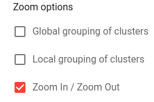

<h1>Scientific documentation of the research project</h1>
<h3>Topic: Optimization in visualization of knowledge graphs: Grouping of clusters.</h3>

Team members who contribute to the Knowledge Graph Visual Browser:
- Štěpán Stenchlák
  - Basic implementation as a bachelor's thesis
- Jiří Resler
  - [Faceted filtering](#https://github.com/JiriResler/knowledge-graph-browser-frontend)
- Oskar Razyapov
  - [Grouping of clusters](https://github.com/Razyapoo/knowledge-graph-browser-frontend-grouping-of-clusters)

Full implementation and basic principals used in the "Grouping of clusters" extension are described in the [technical](https://github.com/Razyapoo/KGBClusteringDocumentation/blob/main/technical_documentation.md) and [user](https://github.com/Razyapoo/KGBClusteringDocumentation/blob/main/user_documentation.md) documentations.

In this paper, we present several prototypes intended to optimize the visualization of knowledge graphs in a way so that they are both well-organized and easily understandable by ordinary users. These prototypes have been implemented by the student or identified through research of other papers. We also aim to compare these prototypes and implement at least one of them.  

Table of content:
- [Introduction](#introduction)
- [Motivation](#motivation)
- [Approaches](#approaches)
- [Grouping of clusters](#grouping-of-clusters-extension)
- [References](#references)

<h2 id="introduction">1. Introduction</h2>

A [knowledge graph](https://en.wikipedia.org/wiki/Knowledge_graph), also known as a semantic network, is a representation of a network of real-world entities - objects, events, situations, or concepts - and relationships between them. These entities are usually stored in a graph database and visualized as a graph [[1]](#references) #TODO (["What is a Knowledge Graph?"](https://www.ibm.com/cloud/learn/knowledge-graph), by IBM Cloud Education, April 12, 2021). The most common way to represent knowledge graphs is through the [RDF (Resource Description Framework) standard](https://en.wikipedia.org/wiki/Resource_Description_Framework).

However, non-specialists may find it difficult to study knowledge graphs due to the background technicalities involved. In order to solve this problem, the paper “Interactive and iterative visual exploration of knowledge graphs based on shared and reusable visual configurations” [[2]](#references) #TODO ([Interactive and iterative visual exploration of knowledge graphs based on shareable and reusable visual configurations](https://www.sciencedirect.com/science/article/pii/S1570826822000105#b2) by Martin Nečaský, Štěpán Stenchlák) introduces the [Knowledge Graph Visual browser](https://try.kgbrowser.opendata.cz/) - an interactive tool that allows non-specialists to explore knowledge graphs without knowing the underlying technical details.

<h2 id="motivation">2. Motivation</h2>

When working with large graphs, it can be challenging to effectively visualize and interpret the data shown due to the high volume of the information present. The big amount of detail can slow down the processing time and make it difficult to focus on the most important aspects of the graph. 

Other challenges include:

- Limited screen area: Large graph can be difficult to fit onto a single screen, making it hard to see the overall structure or identify patterns
- Overcrowding: When too many nodes or edges are present, the graph can become cluttered and difficult to read
- Link overlap: When there are many edges between nodes, it can lead to link overlap, making it hard to distinguish individual edges and understand the connectivity of the graph
- Lack of context: In big graphs, it can be hard to see the relationships between nodes or understand how they fit onto the overall structure 
- High-Dimensional data: When nodes and edges are associated with many attributes, handling and visualizing them can become challenging
- Scalability: Visualizing large graphs can be computationally expensive
  
A good visualization of a large graph should be able to reveal patterns that are of the value to the user. Such a visualization can be particularly useful for presentation purposes, as it help to convey important insights and trends in a clear and concise manner. It is important to choose strategies and techniques that will help to highlight the most relevant and meaningful aspects of the data.

<h2 id="approaches">3. Enhancing the visual perception of large graphs</h2>

There are several approaches that can be taken to improve the runtime and performance of large graph visualizations. One approach is focused on optimizing the internal methods used in the rendering phase, in order to reduce the time it takes to render the graph without reducing the amount of detail displayed. While this approach is effective, it falls outside the scope of this article.

Another approach is to optimize the layout phase in order to make the graph more readable and understandable for non-specialists. This can involve reducing the amount of detail, such as edges or nodes, or using a more efficient layout algorithm. As a result, this approach can help to improve the overall performance and efficiency of the visualization. 

The focus of this research work is on the second approach, which aim to enhance the visual perception of large graphs. 

According to the articles [[3]](#references) #TODO ([The 10 rules of great graph design](https://cambridge-intelligence.com/10-rules-great-graph-design/), by Corey Lanum, January 10, 2014) and [[4]](#references) #TODO ([Data Visualization Effectiveness Profile](http://perceptualedge.com/articles/visual_business_intelligence/data_visualization_effectiveness_profile.pdf), by Stephen Few, 2017), there are several criteria that can help to determine a good level of visual perception in a graph:

- Intuitiveness/perceptibility/easy navigation: The graph should be easy to navigate and understand, with a clear and intuitive layout. 
- Simplicity: The graph should be free of clutter. 
- Usefulness: The graph should be clear and useful to the user, and should provide valuable insights and information. 
- Highlighting key details: The graph should highlight the most important and relevant details, and should allow the user to easily focus on these aspects.

In order to improve the level of perception in a graph, it is also useful to consider the following criteria:

1. Nodes connected by an edge should be close to each other: This helps to clearly show the relationships between nodes and can make the graph easier to understand
2. There should be a minimum number of edge intersections or no intersections at all: Avoiding edge intersections can help to reduce clutter and improve the overall readability of the graph
3. A large number of nodes should be divided into chunks or clusters: This can help to organize the nodes and make it easier to understand the structure of the graph 
4. Clusters should contain related nodes: Grouping related nodes together can help to emphasize the relationships between them
5. The area of the graph shown should be small: A smaller, more focused area of the graph can help to improve the readability and clarity of the information
6. The overall graphical representation should present (tell) a good story in an understandable way.

Perceptibility and readability are necessary, but not sufficient criteria for quality graph visualization. In the paper [[5]](#references) #TODO ([On the faithfulness of graph visualizations](https://link.springer.com/chapter/10.1007/978-3-642-36763-2_55)), the authors introduced another criterion called *faithfulness*, which refers to the ability of the visualization to accurately represent the data being displayed. They found that reducing the amount of detail shown in a graph can improve readability, but can also reduce the level of confidence, or the visualization's ability to accurately represent the data.

To address the challenge of visualizing large graphs while maintaining both a good level of perception and faithfulness, recent works [[8]](#references) #TODO ([Graph Drawing and Network Visualization](https://link.springer.com/book/10.1007/978-3-030-35802-0#about-this-book), pp 272–286, Eades, P., Nguyen, Q., Hong, SH., 2018.), [[9]](#references) #TODO ([Proxy graph: visual quality metrics of big graph sampling](https://www.researchgate.net/publication/314028734_Proxy_Graph_Visual_Quality_Metrics_of_Big_Graph_Sampling), by Quan Hoang Nguyen at al, February 2017) have proposed the use of "proxy graphs" - smaller representatives of large graphs. Formally, a proxy graph can be defined as follows: given an input graph *G* and its drawing *D*, a proxy graph is a smaller graph *G'* with a drawing *D'*, such that if *G'* is a good approximation of the *G*, then *D'* is a good visualization of *G* in which the user can see all the structure of G. In other words, the main challenge is to find a proxy graph that balances the competing objectives of perception and faithfulness.  

In the rest of this section, we will describe and compare several techniques that can be used to find a proxy graph preserving a good level of perceptibility and faithfulness.

<h3 id="filtering">Filtering</h3>

Filtering is a useful technique for optimizing graph visualization when it is not necessary or practical to display the entire graph. By allowing users to select specific attributes or elements of interest, filtering can help to reduce visual clutter and improve the readability and clarity of the graph. As a result, users can create a small, informative graph that is tailored to their specific needs and interests, making it easier to extract valuable insights and information from data.

The advantage of filtering is that it can be applied at both the attribute level, where nodes are filtered based on the selected attributes, and the structural level, where users can directly select elements of interest on the graph and hide unrelated data. This is illustrated in Figure 1 below.  

     
    <em>Figure 1. Path filtering. A user selects "2" element (screenshot 1 to the left). The result is shown on the screenshot 2 to the right - algorithm shows only nodes connected to the selected element.</em>

However, it can be challenging for the ordinary user to identify the area of interest on the graph and select the appropriate elements of interest. Various algorithms can be used to analyze structural patterns in the graph and reveal such elements.  One such class of algorithms are centrality algorithms, which measure the relative importance of nodes within a graph based on structural properties.  

Well-known representatives are [[6]](#references) #TODO ([Centrality Algorithms](https://neo4j.com/developer/graph-data-science/centrality-graph-algorithms/)): 

- Eigenvector Centrality: Measures the influence of an element based on the influence of its neighbors, allowing it to identify elements that are connected to other influential elements 
- Closeness Centrality: Measures the distance of an element to all other elements in the graph, indicating its proximity to the rest of the graph
- Betweenness Centrality: Measures the number of shortest paths that pass through an element, indicating its importance as a bridge between other elements 
- Degree Centrality: Measures the number of incoming and outgoing relationships a node has in the graph

By using centrality algorithms, users can more easily identify elements of interest and focus on the most important or influential elements in the graph. There are also other techniques such as [PageRank](https://en.wikipedia.org/wiki/PageRank), [LeaderRank](https://www.centiserver.org/centrality/LeaderRank/#:~:text=Definition,the%20need%20of%20frequent%20calibration.), [HITS (Hyperlink-Induced Topic Search)](https://en.wikipedia.org/wiki/HITS_algorithm).

<h3 id="graph-sampling">Graph sampling</h3>

The goal of the graph sampling is to extract a small subset of the large graph that preserves its structure, patterns, and properties. The result of this approach is a graph induced by the selected set.

There are several methods for graph sampling, including: 

Random sampling

Random vertex and edge sampling are methods for selecting subsets of vertices and edges from a graph, respectively. The method works by randomly selecting a set of nodes or vertices from the graph according to a predefined probability distribution, such as uniform or degree-based probabilities. 

One of the main advantages of random sampling is that it is easy to implement and computationally efficient, making it suitable for processing large graphs. However, as the selection of vertices/edges is based on random choice, the result may not be representative of the overall graph and there is a possibility of missing important features and properties of the original graph. For example, random vertex method have problems matching degree distribution, since there are many high-degree nodes in the sample. Sampled graphs sampled using random edge sampling usually very sparsely connected and thus do not respect community structure [[]] #TODO ([Sampling from large graphs](https://www.academia.edu/2957458/Sampling_from_large_graphs), Jure Leskovec, Christos Faloutsos) [[]] #TODO [Proxy graph: visual quality metrics of big graph sampling](https://www.researchgate.net/publication/314028734_Proxy_Graph_Visual_Quality_Metrics_of_Big_Graph_Sampling), by Quan Hoang Nguyen at al, February 2017).

Another variations of random sampling are Random Vertex-Edge and Random Node-Edge samplings. They differ in how the subset of nodes and edges is selected: 

- In the *Random Vertex-Edge* sampling we first uniformly at random pick a node and then uniformly at random pick an edge incident to the node. This technique aims to reduce the bias to high-degree nodes that is present on the original random edge sampling. [[]] #TODO ([Sampling from large graphs](https://www.academia.edu/2957458/Sampling_from_large_graphs)

- In the *Random Node-Edge* sampling we select a node and an edge at random independently. In other words, we first select a node at random and then an edge at random without considering if the edge is connected to the randomly selected node or not.

The best way is to make a *Hybrid* approach [[]] #TODO [Reducing Large Internet Topologies for Faster Simulations](https://link.springer.com/chapter/10.1007/11422778_27), where with probability p we perform a step of random vertex-edge or random node-edge sampling and with probability 1 − p we perform a step of random edge sampling sampling.

Sampling by exploration

In this family of the sampling techniques we first choose a node uniformly at random and then explore nodes in its vicinity. These techniques include: 

- Breads-first search (BFS): This technique is inspired by well-known [breadth-first search](https://en.wikipedia.org/wiki/Breadth-first_search) algorithm. It starts at a randomly selected node and then visiting all of its neighbors before moving to the next node.
- Depth-first search (DFS): This technique is inspired by the depth-first search algorithm. It starts at random node and then follows a path of edges as deep as possible, then it performs backtracking and moves onto the next path. 
- Random walk [[]] #TODO ([Sampling from large graphs](https://www.academia.edu/2957458/Sampling_from_large_graphs)): This technique uniformly at random picks a starting node and then simulate a random walk on the graph. With the probability *c*, it revisits a strating node at every step and restarts the walk. The probability is usually set to a low value, such as 0.15, to ensure that the random walk explorers a large portion of the graph. However, random walk can get stuck if the starting vertex belongs to a small, isolated component. The graph structure in the sample is then distorted, as random walker remains inside a subgraph. To solve this drawback, some variations of random walk have been proposed, such as *lazy random walk*, where the probability c is set ot zero, or the *random jump*, where the random walker has a small probability *c = 0.15* to jump to a random vertex in the graph with the goal to explore different parts of the graph. 
- Random path: At each iteration method randomly chooses two nodes from the original vertex set, finds the shortest path between them, and adds all previously unselected nodes and edges in the path. The process is repeated until the desired sample size is obtained [[]] [[]] #TODO ([Proxy graph: visual quality metrics of big graph sampling](https://www.researchgate.net/publication/314028734_Proxy_Graph_Visual_Quality_Metrics_of_Big_Graph_Sampling))([Impact of Sampling Design in Estimation of Graph Characteristics](https://www.researchgate.net/publication/264543191_Impact_of_Sampling_Design_in_Estimation_of_Graph_Characteristics)). 

There are many other sampling techniques such as Random PageRank Vertex sampling, Random Degree Vertex, Snowball sampling etc. Sampling allows to overcome the scalability issues, it helps to identify and isolate subsets of the graph that are important and interesting to the user. 

<h3 id="nodes-edges-eliminations">Sparsification. Elimination of redundant edges</h3>

In the best case a large graph assumed to be sparse so that $|E| \leq c|V|$

Spectral sparsification is an approximation of a given graph by a graph with fewer edges [[7]](#references) #TODO ([Spectral sparsification of graphs: theory and algorithms](https://dl.acm.org/doi/10.1145/2492007.2492029), D. Spielman at al, pp87-94). In other words, the proxy graph *G'* is a sparsification of the original graph *G* if it is a subgraph of *G*, and its edge density is smaller than the edge density of *G*.

Two graphs *G* and *G'* are considered close if their Laplacian matrices are close as linear operators. Based on this, the spectrum (eigenvalues of the Laplacian matrices; see [[10]](#references) #TODO [Algebraic Graph Theory. Graduate Texts in Mathematics](https://link.springer.com/book/10.1007/978-1-4613-0163-9), Godsil, C.D., Royle, G.F., 2001) of a proxy graph *G'* should approximate the spectrum of the original graph *G*.  

An example is shown in Figure 1 below.

     
    <em>Figure 1. Sparsification.</em>

<h3 id="summarization">Summarization</h3>

Graph summarization transforms graphs into more compact representations while preserving structural patterns. They produce summary graphs in the form of supergraphs. Supergraphs are the most common representation, which consists of supernodes (represent aggregated original nodes) and original nodes that are connected by edges and superedges (represent aggregated original edges) [[11]](#references) #TODO ([NetworkX. Summarization](https://networkx.org/documentation/stable/reference/algorithms/summarization.html)).

This approach sums up the [clustering](#clustering) and [coarsening](#coarsening).

An example is shown in Figure 2 below.

     
    <em>Figure 2. Summarization.</em>

<h3 id="clustering">Clustering</h3>

Graph clustering is the process of grouping nodes into clusters, taking into account the structure of edges and nodes of the graph, so that there are several edges in each cluster and very few (or even no edges) between clusters [[12]](#references) #TODO ([Graph clustering](https://paperswithcode.com/task/graph-clustering)). Graph clustering clusters the nodes based on their similarity measure.

# 1. TODO Modularity

<h3 id="coarsening">Coarsening</h3>

The goal of this method is to replace the original graph by one which has fewer nodes, but whose structure and characteristics are similar to those of the original graph. Usually nodes with similar properties are grouped into a clusters. These similarity clusters form the new nodes of the coarsened graph and are hence termed as supernodes [[13]](#references) #TODO ([Coarsening Graphs with Neural Networks](https://karush27.github.io/posts/2012/08/blog-post-24/), October 11, 2021).

<h3 id="condensation">Condensation</h3>

Graph condensation returns a directed graph whose nodes represent the strong components of the original graph. This reduction provides a simplified view of the connectivity between components. 

The main advantage of this approach is that it simplifies the original graph so that the various algorithms that run on the graph become faster. 

The disadvantage of this method is that as its output we get a directed acyclic graph (DAG), in which each strongly connected component (SCC) does not take into account node similarities (for example classes) and consists of a mix of nodes. As an improvement, we can add a criterion that the SCC should only contain node having similar properties.

---

Let's find out what types of layouts exist that are used to present large graphs and can be useful in Knowledge Graph Visual browser.

<h3 id="sequential-layout">Sequential layout</h3>

Because in the Knowledge Graph Visual Browser we always expand the neighborhood of a node, it can be useful to use sequential layout.

     
    <em>Figure 3. Sequential layout</em>

The sequential layout (shown in the Figure 3 above) is designed to display data that contains a clear sequence of distinct levels of nodes. It takes multiple components into account and minimizes link crossings [[14]](#references) #TODO ([Sequential layout: the best way to handle tiered data](https://cambridge-intelligence.com/sequential-layout-the-best-way-to-handle-tiered-data/), by Julia Robson, June 15, 2022).

This layout meets 1, 2, and 5 criteria listed at the beginning of the [Layouts](#layouts) section. It satisfies the first criterion because we expand the neighborhood in the same direction (the direction must be determined at the beginning), so we can place nodes in the neighborhood close to the expanding node. It meets the second criterion because we are expanding the nodes in the same direction, so we have room to place its neighbors in such a way that there are no edge intersections. It also meets the fifth criterion because it is visually understandable to non-specialists.

However, this layout is only good if we always expand nodes that were not in the graph up to this point. Because otherwise we would have back edges leading in the opposite direction. It is also hard to make clusters of nodes. This requires node swapping that might be time and resource consuming.

<h3 id="visual-tricks">Visual tricks</h3>

There are many layouts with interesting features, but unfortunately they are not supported by the Cytoscape library. But we can still integrate the visual tricks used in these layouts into existing layouts already implemented in the Cytoscape library.

The main visual tricks:
- Background hiding
- Highlighting key nodes and edges
- Using node aggregation

<h4 id="background-hiding">Background hiding</h4>

This technique allows to show only those nodes that are of interest to the user. This method also hides redundant nodes (or background) or makes them less visible to the user. A possible implementation of such a technique is shown in Figure 4 below.

     
    <em>Figure 4. Hiding redundant nodes [15] #TODO ([Customer behavior analysis with data visualization](https://cambridge-intelligence.com/customer-behavior-analysis/), by Rosy Hunt, August 30, 2022).</em>

However, this technique has already been implemented in the Knowledge Graph Visual browser by Štěpán Stenchlák.

<h4 id="highlighting-key-nodes-and-edges">Highlighting key nodes and edges</h4>

The second approach is to highlight key nodes or areas (clusters) of nodes that may be of interest to the user. The most important nodes can also be larger than others. An example of such a representation is shown in Figure 5.

     
    <em>Figure 5. Node and edge highlighting [16] #TODO ([Pharma data visualization](https://cambridge-intelligence.com/use-cases/pharma/)).</em>

The disadvantage of this method is that it only improves visual perception, but does not simplify the graph and does not make it faster.

<h4 id="node-aggregation">Node aggregation</h4>

Node aggregation is an example of [graph coarsening](#coarsening). A coarsened graph consists of aggregated nodes. But this is not exactly what we want to do, because in this way we will lose other nodes and edges that may need to be restored (shown) in future. It would be much better to still be able to reveal nodes and edges hidden within aggregated nodes.

However, this can cause a problem in the Knowledge Graph Visual browser, because there are detailed queries that are used to display node details, and if we aggregate nodes, it will not be possible to display details of aggregated nodes because they will be auxiliary and will not exist in the database. The same can be said for expansion and preview queries. Thus, we may lose all the functionality that the Knowledge Graph visual browser provides.

To solve this problem, can use a trick: if the user clicks on the aggregated node, a browser will display the internals of that aggregated node. The Cambridge Intelligence call this approach as [combos](https://cambridge-intelligence.com/combos/). 

<h3 id="comparison">Comparison</h3>

To see which approach is preferable for possible non-specialist users, I chose different approaches and discussed them with work colleagues, school colleagues and a teacher (supervisor).

List of approaches: 
- [Filtering](#filtering)
- [Sparsification](#nodes-edges-eliminations)
- [Condensation](#condensation)
- [Summarization](#summarization) / [Node aggregation](#node-aggregation)
- [Sequential layout](#sequential-layout)
- [Background hiding](#background-hiding)
- [Highlighting key nodes and edges](#highlighting-key-nodes-and-edges)

As the result of discussions I can conclude following:

- [Filtering](#filtering) is a good approach, but to use it, the user must know the graph in advance so that he can filter the nodes he wants to see. This approach also correlates with the topic of another student (Jiří Resler), so my supervisor and I decided not to consider.
- Users didn't like [Sparsification](#nodes-edges-eliminations) approach because it removes all redundant edges, which can be helpful in understanding the story the graph represents.
- [Condensation](#condensation). This is the first technique implemented. I implemented it just to understand the Knowledge Graph Visual Browser implementation and how it works. The idea was to use the graph condensation method and create a new graph consisting of nodes that represent strongly connected components in the original graph. 
- [Summarization](#summarization) (also [Node aggregation](#node-aggregation)) sums up clustering and coarsening approaches. This approach was preferred by working colleagues with only the remark that it would be useful to add the possibility to restore the details.
- Personally, I did not like the [Sequential layout](#sequential-layout), but still wanted to receive feedbacks from colleagues. They said it is a very user-friendly layout, easy to understand and looks like "Tree of life". So I left it in case I didn't find a better solution.
- The [background hiding](#background-hiding) method has also received good reviews. However, this can only display the area of the graph that the user wants to see and does not make it easier to present the graph as a whole.
- I showed users the [node highlighting](#highlighting-key-nodes-and-edges) example shown in Figure 5. They found the graph too complex, but they liked that the clusters of nodes can be easily seen and that the key nodes are shown larger than the other nodes. 

# 2. TODO Draft
Filtering problem
A common problem when reducing large graphs or networks by filtering techniques is that users do not exactly know what they are looking for and, thus, require tools that assist them in identifying the critical elements.
https://www.yworks.com/pages/interactive-filtering-of-large-diagrams

Centrality 
 Except for degree, the
other two centrality measures, closeness and betweenness,
are prohibitively expensive to compute, and thus impractical
for large networks. On the other hand, although simple to
compute, degree centrality gives limited information since
it is based on a highly local view of the graph around each
node. We need a set of centrality measures that enrich our
understanding of very large networks, and are tractable to
compute
shortest-path or
random walk betweenness [6, 25] have complexity at least
O(n
3
) where n is the number of nodes in a graph
https://www.cs.cmu.edu/~ukang/papers/CentralitySDM2011.pdf

Based on the results of the survey, I convinced myself that the approach described in section "[Node aggregation](#node-aggregation)" is best suited. I presented this approach to my supervisor and two weeks later he told me that he had found a customer who is interested in this approach. The customer was the Charles University and the topic was "Departments and subjects".

After several studies, we can state the following several conceptual criteria:

- An aggregation node must be a cluster of related nodes (for example, nodes of the same class or similar property)
- An aggregation node must somehow show the user which nodes it has inside
- An aggregation node might have separate aggregation nodes internally representing the types of nodes it aggregates (in case it aggregates different types of nodes at the same time, such as universities and subjects) - **not implemented**.
- An aggregation node may display the number of nodes it has inside - **not implemented**.

But there are more questions:
- Based on what criteria to cluster nodes?
- How to name and represent the aggregation node?
- Can cluster have nodes of different equivalence classes (based on similarity)?
- How to represent edges between nodes that represent an aggregation of the original nodes (create only one aggregated edge, i.e. its thickness will show how many edges it combines, or show them all)?
- How to show the internals of an aggregation node?

---

The first draft of the approach is shown in the Figure 6 below.

     
    <em>Figure 6. First draft. It is a concept representing the main idea used in the final approach. It represents different hierarchies and hierarchical as well as non-hierarchical relationships.</em>

From this point on, we can introduce the term "[hierarchy](https://github.com/Razyapoo/KGBClusteringDocumentation/blob/main/user_documentation.md#hierarchical-relationship)" into use and formulate the following main criteria:
- There can be [hierarchical](https://github.com/Razyapoo/KGBClusteringDocumentation/blob/main/user_documentation.md#hierarchical-relationship) and [non-hierarchical](https://github.com/Razyapoo/KGBClusteringDocumentation/blob/main/user_documentation.md#non-hierarchical-relationship-) (ordinary, represented by an edge) relationships between nodes
- A parent node may be interpreted as an aggregation of child nodes placed inside
- The [hierarchical expansion](https://github.com/Razyapoo/KGBClusteringDocumentation/blob/main/user_documentation.md#hierarchical-expansions) (from the list of available expansions) must show the expansion [within (inside)](https://github.com/Razyapoo/KGBClusteringDocumentation/blob/main/user_documentation.md#hierarchical-relationship) the expanded node
- It should be possible in the configuration to determine if the relationship is hierarchical or non-hierarchical
- A non-hierarchical edge can lead between nodes placed in the different hierarchies, even if one of them or both contain child nodes inside
- Child nodes can be collapsed into parent nodes. In such case, all edges of child nodes are moved to the parent node (more in the [user documentation](user_documentation.md#edge_moving))
- Nodes having the same [hierarchical class](https://github.com/Razyapoo/KGBClusteringDocumentation/blob/main/user_documentation.md#hierarchical-class) must be place in the same [hierarchical group](https://github.com/Razyapoo/KGBClusteringDocumentation/blob/main/user_documentation.md#hierarchical-group). Here hierarchical class represents an equivalence class and hierarchical group contains only one equivalence class
- It should be possible to define [visual groups](https://github.com/Razyapoo/KGBClusteringDocumentation/blob/main/user_documentation.md#visual-group) - big clusters of nodes that might not belong to some hierarchy. Here visual class represents an equivalence class and visual group contains only one equivalence class

We also introduce the map-style zoom used in mapping platforms, so that when you zoom in, you see more detail in terms of nodes, and when you zoom out, you see less detail in terms of nodes. In analogy with maps, we introduce the concept of [hierarchical levels](https://github.com/Razyapoo/KGBClusteringDocumentation/blob/main/user_documentation.md#hierarchical-level). An example is shown in the Figure 7 below. 

     
    <em>Figure 7. Map-style zoom (screenshots 1-3). Czechia (google maps, screenshot 1, left), which is placed at the level 0, is an aggregation of cities placed at the level 1 (google maps, screenshot 2, left), and analogously, MFF (screenshot 1, right), which is placed at the level 0, is an aggregation of departments placed at the level 1 (screenshot 2, right). In case there are several different hierarchical groups, the highest abstract level will show the last ancestor of each hierarchy and they will not be grouped or collapsed (screenshots 3, left - google maps, countries and right - departments and subjects).</em>

The point is not to stick with the "Departments and Subjects" topic only, but to make it abstract and reusable with other topics.

The following section describes the final approach proposed in this paper.

<h2 id="grouping-of-clusters-extension">4. Grouping of clusters</h2>

This part (also available [here](https://github.com/Razyapoo/KGBClusteringDocumentation/blob/main/Research%20paper%20for%20Knowledge%20Graph%20Browser.docx)) is used as a contribution to [the original article](https://www.sciencedirect.com/science/article/pii/S1570826822000105#b2).

The "Grouping of clusters" algorithm first clusters the nodes into a [cluster](https://github.com/Razyapoo/KGBClusteringDocumentation/blob/main/user_documentation.md#cluster), and then collapses that cluster into a single group node. The clustering of nodes is determined based on the [hierarchical class](https://github.com/Razyapoo/KGBClusteringDocumentation/blob/main/user_documentation.md#hierarchical-class), the parent node, the [level of the hierarchy](https://github.com/Razyapoo/KGBClusteringDocumentation/blob/main/user_documentation.md#hierarchical-level) in which the node resides, and the visual class. Full description of the approach is available [here](https://github.com/Razyapoo/KGBClusteringDocumentation/blob/main/user_documentation.md#grouping-of-clusters).

The visual configuration is extended with [visual layout constraints](https://github.com/Razyapoo/KGBClusteringDocumentation/blob/main/technical_documentation.md#visual-layout-constraint) which can be used to restrict the way the knowledge graph is visualized. To support visual layout constraints, we extend the Knowledge Graph Visual Browser ontology with new terms.  

Figure 8 below shows the extension of the ontology as a UML class diagram. 

     
    <em>Figure 8. Extended Knowledge Graph Visual Browser ontology for defining extended visual configurations.</em>

In the visual configuration we extend every entity node with additional hierarchical and visual group classes, representing hierarchical and visual groups to which the node belongs, respectively. 

A [visual group](https://github.com/Razyapoo/KGBClusteringDocumentation/blob/main/user_documentation.md#visual-group) is a cluster of nodes assigned to the same visual group class and placed under the same pseudo-parent node.  

A [hierarchical group](https://github.com/Razyapoo/KGBClusteringDocumentation/blob/main/user_documentation.md#hierarchical-group) is a cluster of nodes related to each other by parent-child relationships and together forming a hierarchy. In a hierarchy, relationships are not represented as a line, but in such a way that the child node is placed inside the parent node. 

Expansion and preview queries defined in the visual configuration are extended with a new variable `?groupclass` that is bound to the visual class representing either the hierarchical or visual group class. It is common to consider a hierarchical class as a group class as well, because we can interpret a root ancestor node in a hierarchy as a pseudo-parent node. 

The visual knowledge graph 𝒱 is associated with two new functions 𝜎 and 𝜏 that map each entity node to a set of literals called visual group classes and hierarchical group classes, respectively. Entity node is placed under the [visual group](https://github.com/Razyapoo/KGBClusteringDocumentation/blob/main/technical_documentation.md#visual-group) of class defined by 𝜎. And similarly, entity node is placed in the [hierarchical group](https://github.com/Razyapoo/KGBClusteringDocumentation/blob/main/technical_documentation.md#hierarchical-group) of class defined by 𝜏. It is also possible that the node is not assigned to a visual group class or a hierarchical group class.  

A visual configuration extended with [visual layout constraints](https://github.com/Razyapoo/KGBClusteringDocumentation/blob/main/technical_documentation.md#visual-layout-constraint) is bounded to a concrete 𝒢. As for now, the Knowledge Graph Visual browser supports only “[visual group](https://github.com/Razyapoo/KGBClusteringDocumentation/blob/main/technical_documentation.md#visualgrouplayoutconstraint-class)”, “[hierarchical groups to cluster](https://github.com/Razyapoo/KGBClusteringDocumentation/blob/main/technical_documentation.md#hierarchicalgroupstoclusterlayoutconstraint-class)”, “[classes to cluster together](https://github.com/Razyapoo/KGBClusteringDocumentation/blob/main/technical_documentation.md#classestoclustertogetherlayoutconstraint-class)” and “[hierarchical parent-child or child-parent](https://github.com/Razyapoo/KGBClusteringDocumentation/blob/main/technical_documentation.md#childparentlayoutconstraint-and-parentchildlayoutconstraint-classes)" layout constraints.  

The “[visual group](https://github.com/Razyapoo/KGBClusteringDocumentation/blob/main/technical_documentation.md#visualgrouplayoutconstraint-class)” visual layout constraint defines the visual class, namely visual group class, that represents a [visual group](https://github.com/Razyapoo/KGBClusteringDocumentation/blob/main/technical_documentation.md#visual-group). The visual layout constraint is expressed as an instance of the `browser:VisualGroupLayoutConstraint` class. The visual group class is assigned to this class by the `browser:clusteringSelector` property. 

The “[hierarchical groups to cluster](https://github.com/Razyapoo/KGBClusteringDocumentation/blob/main/technical_documentation.md#hierarchicalgroupstoclusterlayoutconstraint-class)” visual layout constraint defines the visual class, namely hierarchical group class, that represents a [hierarchical group](https://github.com/Razyapoo/KGBClusteringDocumentation/blob/main/technical_documentation.md#hierarchical-group). All nodes within such a hierarchical group allowed to be clustered and grouped. All other nodes within other hierarchical groups cannot be clustered and grouped. The visual layout constraint is expressed as an instance of the `browser:HierarchicalGroupToClusterLayoutConstraint` class. The hierarchical group class is assigned to this class by the `browser:clusteringSelector` property.  

By default, grouping of clusters algorithm clusters nodes that only have the same visual class. The “[Classes to cluster together](https://github.com/Razyapoo/KGBClusteringDocumentation/blob/main/technical_documentation.md#classestoclustertogetherlayoutconstraint-class)” visual layout constraint defines a set of visual classes that can be clustered together and then grouped into one group. The visual layout constraint is expressed as an instance of the `browser:ClassesToClusterTogetherLayoutConstraint` class. Each visual class from a set is assigned to this class by the `browser:clusteringSelector` property. 

The “[parent-child](https://github.com/Razyapoo/KGBClusteringDocumentation/blob/main/technical_documentation.md#childparentlayoutconstraint-and-parentchildlayoutconstraint-classes)” (respectively “[child-parent](https://github.com/Razyapoo/KGBClusteringDocumentation/blob/main/technical_documentation.md#childparentlayoutconstraint-and-parentchildlayoutconstraint-classes)”) visual layout constraint defines the visual class of the node that plays the role of the parent (respectively child) node and the visual class of the edge, which should be rendered as a hierarchical transition between the parent and the child rather than a line. The visual layout constraint is expressed as an instance of the `browser:ParentChildLayoutConstraint` (respectively `browser:ChildParentLayoutConstraint`) class. The visual class of the parent node is assigned to this class with the `browser:parentNodeSelector` (respectively `browser:childNodeSelector`) property. The visual class of the edge is assigned to the class with the `browser:hierarchicalEdgeSelector` property. 

The stateless [server](https://github.com/linkedpipes/knowledge-graph-browser-backend) is extended with a new request handler that prepares visual layout constraints and sends them to the client, which then uses them to change the way the knowledge graph is visualized. 

<h3>Example</h3>

     
    <em>Figure 9. Choice of the configuration and starting node (screenshots 1-3).</em>

Let us demonstrate our extension on a visual knowledge graph about Matematicko-fyzikální fakulta. 

At the beginning, the user chooses the Charles Explorer meta-configuration (Figure 9, screenshot 1). The user then chooses the configuration supporting the [visual layout constraints](https://github.com/Razyapoo/KGBClusteringDocumentation/blob/main/technical_documentation.md#visual-layout-constraint) (Figure 9, screenshot 2). Not all the configurations support visual layout constraints. The user then chooses the starting node from the list of starting nodes, in our case it is Matematicko-fyzikální fakulta (Figure 9, screenshot 3). The client then visualizes the selected starting node (Figure 10 below) and reads layout constraints from the server. The rest of the visualization part is as usual. 

     
    <em>Figure 10. Choice of the configuration and starting node (screenshots 1-3).</em>

An interesting part happens when the user starts exploring a graph. When the user selects the node on the graph, the client loads the node’s preview. If the node has assigned a [hierarchical class](https://github.com/Razyapoo/KGBClusteringDocumentation/blob/main/user_documentation.md#hierarchical-class) (in the preview query) representing a [hierarchical group](https://github.com/Razyapoo/KGBClusteringDocumentation/blob/main/user_documentation.md#hierarchical-group) that is allowed to be clustered and grouped, the client shows this class labeled as hierarchical class in the preview section on the side panel (Figure 11 screenshot 1). 

     
    <em>Figure 11. A possible user’s scenario of exploring the knowledge graph with Matematicko-fyzikální fakulta in KGBrowser (screenshots 1-3).</em>

Expansions that expand the node with its neighborhood using hierarchical relationships are [hierarchical expansions](https://github.com/Razyapoo/KGBClusteringDocumentation/blob/main/user_documentation.md#hierarchical-expansions). There are hierarchical and non-hierarchical expansions (Figure 11, screenshot 2).  

The user selects the Podřazená pracoviště view and clicks the Expand button. The client then performs the expansion action. Since the expansion is hierarchical, the client connects the neighborhood of the node using hierarchical relationships (result is shown on the Figure 11, screenshot 3). Here the Matematicko-fyzikální fakulta node represents a parent node. 

     
    <em>Figure 12. A possible user’s scenario of exploring the knowledge graph with Matematicko-fyzikální fakulta in KGBrowser (screenshots 1-2).</em>

 

The user then selects the Matematicka sekce node, clicks Podřazená pracoviště expand button in the list of available views and selects Katedra algebry node (Figure 12, screenshot 1). 

The user then selects the Témata pracoviště view of the Katedra algebry node and clicks the Expand button. Now, the expansion is non-hierarchical, so the client connects the expanded neighborhood with a visual line (edge) (Figure 12, screenshot 2). 

This way, the user opens a group of nodes having tema visual class. The visual configuration specifies nodes assigned to tema visual class as a visual group. Therefore, the client creates the pseudo-parent node representing the tema visual group (Figure 12, screenshot 2, right side). 

     
    <em>Figure 13. Scaling options. The user selects “Grouping of clusters” option.</em>

The user then decides to utilize the “[Grouping of clusters](https://github.com/Razyapoo/KGBClusteringDocumentation/blob/main/user_documentation.md#grouping-of-clusters)” technique which brings the zoom approach used in mapping platforms to the Knowledge Graph Visual Browser. The user selects the “Grouping of clusters” option in the checkbox (Figure 13) and clicks the “minus” button. The client then groups nodes placed on the [current hierarchical level](https://github.com/Razyapoo/KGBClusteringDocumentation/blob/main/user_documentation.md#current-hierarchical-level) (Figure 14, screenshot 1). Then the user decides to go further and clicks multiple times the “minus” button. After a few iterations, the user gets the result shown on Figure 14, screenshot 2. The user clicks the “minus” button once again, and at this time the client collapses the child group into its Matematicka sekce parent node (Figure 14, screenshot 3). After a few more iterations with the “minus” button, the user gets to the state where the graph cannot be collapsed further (Figure 14, screenshot 4). This state represents the highest abstract level of the hierarchy. In this state, the graph shows the least amount of detail possible. 

     
    <em>Figure 14. A possible user’s scenario of exploring the knowledge graph with Matematicko-fyzikální fakulta in KGBrowser (screenshots 6-9).</em>

 

The user then decides to click the “plus” button multiple times. With each iteration, the user gradually returns to the state from which he started (Figure 12, screenshot 5). 

<h2 id="references">References</h2>

1. 
2. 
3. 
4. 
5. 
6. 
7. 
8. 
9.  
10. 
11. 
12. 
13. 
14. 
15. 
16. 
17. 
18. 