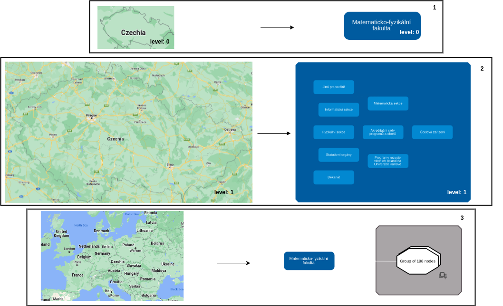

<h1>Scientific documentation of the research project</h1>
<h3>Topic: Optimization in visualization of knowledge graphs: Grouping of clusters.</h3>

Team members who contribute to the Knowledge Graph Visual Browser:
- Štěpán Stenchlák
  - Basic implementation as a bachelor's thesis
- Jiří Resler
  - [Faceted filtering](#https://github.com/JiriResler/knowledge-graph-browser-frontend)
- Oskar Razyapov
  - [Grouping of clusters](https://github.com/Razyapoo/knowledge-graph-browser-frontend-grouping-of-clusters)

Full implementation and basic principals used in the "Grouping of clusters" extension are described in the [technical](https://github.com/Razyapoo/KGBClusteringDocumentation/blob/main/technical_documentation.md) and [user](https://github.com/Razyapoo/KGBClusteringDocumentation/blob/main/user_documentation.md) documentations.

The focus of this research paper is to improve and optimize the visualization of knowledge graphs. The research will include the exploration of several prototypes, which have been created by the student or identified trough the research of other papers. The goal is to make large and complex knowledge graphs well-organized and easily understandable for non-specialists. This paper aims to compare the different existing prototypes and use them to implement own prototype.

Table of content:
- [Introduction](#introduction)
- [Motivation](#motivation)
- [Approaches](#approaches)
- [Grouping of clusters](#grouping-of-clusters-extension)
- [References](#references)

<h2 id="introduction">1. Introduction</h2>

A [knowledge graph](https://en.wikipedia.org/wiki/Knowledge_graph), also known as a semantic network, is a representation of a network of real-world entities - objects, events, situations, or concepts - and relationships between them. These entities are usually stored in a graph database and visualized as a graph [[1]](#references) #TODO (["What is a Knowledge Graph?"](https://www.ibm.com/cloud/learn/knowledge-graph), by IBM Cloud Education, April 12, 2021). The most common way to represent knowledge graphs is through the [RDF (Resource Description Framework) standard](https://en.wikipedia.org/wiki/Resource_Description_Framework).

However, non-specialists may find it difficult to study knowledge graphs due to the background technicalities involved. In order to solve this problem, the paper “Interactive and iterative visual exploration of knowledge graphs based on shared and reusable visual configurations” [[2]](#references) #TODO ([Interactive and iterative visual exploration of knowledge graphs based on shareable and reusable visual configurations](https://www.sciencedirect.com/science/article/pii/S1570826822000105#b2) by Martin Nečaský, Štěpán Stenchlák) introduces the [Knowledge Graph Visual browser](https://try.kgbrowser.opendata.cz/) - an interactive tool that allows non-specialists to explore knowledge graphs without knowing the underlying technical details.

<h2 id="motivation">2. Motivation</h2>

When working with large graphs, it can be challenging to effectively visualize and interpret the data shown due to the high volume of the information present. The big amount of detail can slow down the processing time and make it difficult to focus on the most important aspects of the graph. 

Main challenges include:

- Limited screen area: Large graph can be difficult to fit onto a single screen, making it hard to see the overall structure or identify patterns
- Overcrowding: When too many nodes or edges are present, the graph can become cluttered and difficult to read
- Link overlap: When there are many edges between nodes, it can lead to link overlap, making it hard to distinguish individual edges and understand the connectivity of the graph
- Lack of context: In big graphs, it can be hard to see the relationships between nodes or understand how they fit onto the overall structure 
- High-Dimensional, complex data: When nodes and edges are associated with many attributes, handling and visualizing them can become challenging
- Scalability: As mentioned, visualizing large graphs can be computationally expensive
- Dynamic data: Real data are usually dynamic and it may be challenging and expensive to run layout every time a new data appears on the graph area 
  
A good visualization of a large graph should be able to reveal patterns that are of the value to the user. Such a visualization can be particularly useful for presentation purposes, as it help to convey important insights and trends in a clear and concise manner. It is important to choose strategies and techniques that will help to highlight the most relevant and meaningful aspects of the data.

<h2 id="approaches">3. Enhancing the visual perception of large graphs</h2>

There are several approaches that can be taken to improve the runtime and performance of large graph visualizations. One approach is focused on optimizing the internal methods used in the rendering phase, in order to reduce the time it takes to render the graph without reducing the amount of detail displayed. While this approach is effective, it falls outside the scope of this article.

Another approach is to optimize the layout phase in order to make the graph more readable and understandable for non-specialists. This can involve reducing the amount of detail, such as edges or nodes, or using a more efficient layout algorithm. As a result, this approach can help to improve the overall performance and efficiency of the visualization. 

The focus of this research work is on the second approach, which aim to enhance the visual perception of large graphs. 

*Graph definition*. A *plain graph* $G$ is an abstract data type consisting of a finite set of vertices (nodes) $V$ and a set of edges (links) $E$ usually representing a relationship between nodes. In this paper, we support a general graph model, where every node has a set of associated attributes describing the features of an object that a node represents. A graph is often represented by its adjacency matrix $A$, which ca be binary, corresponding to whether there exists a relationship between two nodes, or numerical, corresponding to the strength of the relationship. In this article, the adjacency matrix is considered to be binary unless otherwise noted.

According to the articles [[3]](#references) #TODO ([The 10 rules of great graph design](https://cambridge-intelligence.com/10-rules-great-graph-design/), by Corey Lanum, January 10, 2014) and [[4]](#references) #TODO ([Data Visualization Effectiveness Profile](http://perceptualedge.com/articles/visual_business_intelligence/data_visualization_effectiveness_profile.pdf), by Stephen Few, 2017), there are several criteria that can help to determine a good level of visual perception in a graph:

- Intuitiveness/perceptibility/easy navigation: The graph should be easy to navigate and understand, with a clear and intuitive layout. 
- Simplicity: The graph should be free of clutter. 
- Usefulness: The graph should be clear and useful to the user, and should provide valuable insights and information. 
- Highlighting key details: The graph should highlight the most important and relevant details, and should allow the user to easily focus on these aspects.

In order to improve the level of perception in a graph, it is also useful to consider the following criteria:

1. Nodes connected by an edge should be close to each other: This helps to clearly show the relationships between nodes and can make the graph easier to understand
2. There should be a minimum number of edge intersections or no intersections at all: Avoiding edge intersections can help to reduce clutter and improve the overall readability of the graph
3. A large number of nodes should be divided into chunks or clusters: This can help to organize the nodes and make it easier to understand the structure of the graph 
4. Clusters should contain related nodes: Grouping related nodes together can help to emphasize the relationships between them
5. The area of the graph shown should be small: A smaller, more focused area of the graph can help to improve the readability and clarity of the information
6. The overall graphical representation should present (tell) a good story in an understandable way.

Perceptibility and readability are necessary, but not sufficient criteria for quality graph visualization. In the paper [[5]](#references) #TODO ([On the faithfulness of graph visualizations](https://link.springer.com/chapter/10.1007/978-3-642-36763-2_55)), the authors introduced another criterion called *faithfulness*, which refers to the ability of the visualization to accurately represent the data being displayed. They found that reducing the amount of detail shown in a graph can improve readability, but can also reduce the level of confidence, or the visualization's ability to accurately represent the data.

To address the challenge of visualizing large graphs while maintaining both a good level of perception and faithfulness, recent works [[8]](#references) #TODO ([Graph Drawing and Network Visualization](https://link.springer.com/book/10.1007/978-3-030-35802-0#about-this-book), pp 272–286, Eades, P., Nguyen, Q., Hong, SH., 2018.), [[9]](#references) #TODO ([Proxy graph: visual quality metrics of big graph sampling](https://www.researchgate.net/publication/314028734_Proxy_Graph_Visual_Quality_Metrics_of_Big_Graph_Sampling), by Quan Hoang Nguyen at al, February 2017) have proposed the use of "proxy graphs" - smaller representatives of large graphs. Formally, a proxy graph can be defined as follows: given an input graph $G$ and its drawing $D$, a proxy graph is a smaller graph $G'$ with a drawing $D'$, such that if $G'$ is a good approximation of the $G$, then $D'$ is a good visualization of $G$ in which the user can see all the structure of G. In other words, the main challenge is to find a proxy graph that balances the competing objectives of perception and faithfulness.  

It is worth mentioning that we can distinguish between *homogeneous* and *heterogeneous* graphs. In homogeneous graph all nodes have the same types and characteristics, while in heterogeneous graph all nodes and edges have different types and characteristics. Knowledge graphs are known representatives of heterogeneous graphs. 

A knowledge graph browser allows users to build and interact with a graph dynamically. *Static* graph simplification techniques create simplified version of a graph by analyzing its structure at a single point in time, after the graph is already built. *Dynamic* techniques, on the other hand, take into account changes in the graph over time. The simplest way to work with dynamic graphs is to treat them as a series of static graph snapshots. For the remainder of this paper, we will focus on working with a single static snapshot of a heterogeneous graph.

We can distinguish between *lossy* and *lossless* graph simplification techniques. Lossy techniques are used in situations where it is more important to reduce the complexity of the graph and make it more interpretable. On the other hand, lossless techniques are used in situations where it is essential to preserve all the information of the original graph.
# TODO Metrics to evaluate the goodness of the graph visualization

In the rest of this section, we will describe and compare several techniques that can be used to find a proxy graph preserving a good level of perceptibility and faithfulness.

<h3 id="filtering">Filtering</h3>

Filtering is a useful technique for optimizing graph visualization when it is not necessary or practical to display the entire graph. By allowing users to select specific attributes or elements of interest, filtering can help to reduce visual clutter and improve the readability and clarity of the graph. As a result, users can create a small, informative graph that is tailored to their specific needs and interests, making it easier to extract valuable insights and information from data.

The advantage of filtering is that it can be applied at both the attribute level, where nodes are filtered based on the selected attributes, and the structural level, where users can directly select elements of interest on the graph and hide unrelated data. This is illustrated in Figure 1 below.  

     
    <em>Figure 1. Path filtering. A user selects "2" element (screenshot 1 to the left). The result is shown on the screenshot 2 to the right - algorithm shows only nodes connected to the selected element.</em>

However, it can be challenging for the ordinary user to identify the area of interest on the graph and select the appropriate elements of interest. Various algorithms can be used to analyze structural patterns in the graph and reveal such elements.  One such class of algorithms are centrality algorithms, which measure the relative importance of nodes within a graph based on structural properties.  

Well-known representatives are [[6]](#references) #TODO ([Centrality Algorithms](https://neo4j.com/developer/graph-data-science/centrality-graph-algorithms/)): 

- Eigenvector Centrality: Measures the influence of an element based on the influence of its neighbors, allowing it to identify elements that are connected to other influential elements 
- Closeness Centrality: Measures the distance of an element to all other elements in the graph, indicating its proximity to the rest of the graph
- Betweenness Centrality : Measures the number of shortest paths that pass through an element, indicating its importance as a bridge between other elements 
- Degree Centrality: Measures the number of incoming and outgoing relationships a node has in the graph
  
By using centrality algorithms, users can more easily identify elements of interest and focus on the most important or influential elements in the graph. There are also other techniques such as [PageRank](https://en.wikipedia.org/wiki/PageRank), [LeaderRank](https://www.centiserver.org/centrality/LeaderRank/#:~:text=Definition,the%20need%20of%20frequent%20calibration.), [HITS (Hyperlink-Induced Topic Search)](https://en.wikipedia.org/wiki/HITS_algorithm).

However, centrality algorithms typically consider only one dimension of importance, such as degree, closeness, or betweenness, which can lead to the bias in the results. They often make an assumptions about the original graph, such as that it is connected. They are computationally expensive: except for degree centrality, they have the complexity at least $O(n^3)$ where $n$ is the number of nodes, which makes them usually impractical for large networks [[]] ([Centralities in Large Networks: Algorithms and Observations](https://www.researchgate.net/publication/220907224_Centralities_in_Large_Networks_Algorithms_and_Observations), U. Kang, S. Papadimitriou, J. Sun).

Filtering can be applied to both heterogeneous and homogeneous graphs. In a homogeneous graph, where all nodes and edges have the same type, filtering can be done based on certain properties or attributes of the nodes and edges. For example, filter can be applied to remove nodes with low centrality  or low degree. In a heterogeneous graph, on the other hand, where nodes and edges are of different types, filtering can be done based on the type of the node or edge, and also based on certain properties or attributes of the nodes and edges. 

Filtering can be lossless and lossy, depending on the goal of the filtered graph. Lossless filtering, for example, only hides redundant nodes, while lossy filtering removes them. The main advantage of filtering is that it simplifies the graph, according to the user's preferences, as the user defines the settings of the filter. However, to apply the filter, users must know the graph in advance and filtering can also lead to loss of information, ambiguity and inaccuracy, so it is important to carefully evaluate the quality of the filtering technique and the filtered graph.

<h3 id="graph-sampling">Graph sampling</h3>

The goal of the graph sampling is to extract a small subset of the large graph that preserves its structure, patterns, and properties. The result of this approach is a graph induced by the selected set.

There are several methods for heterogeneous and homogeneous graph sampling. Homogeneous graph sampling methods include: 

*Random sampling*. Random node and edge sampling are methods for selecting subsets of vertices and edges from a graph, respectively. The method works by randomly selecting a set of nodes or vertices from the graph according to a predefined probability distribution, such as uniform or degree-based probabilities. 

One of the main advantages of random sampling is that it is easy to implement and computationally efficient, making it suitable for processing large graphs. It might be useful to preserve an edge that plays a role of bridge between two communities or clusters. In the paper [[]] ([Graph Sparsification by Effective Resistances](https://www.academia.edu/14009496/Graph_Sparsification_by_Effective_Resistances), D.A. Spielman and N. Srivastava, SIAM Journal on Computing, 40(6):1913–1926, 2011.) Spielman and Srivastava show that we can achieve an approximation of the original graph with only $O(\epsilon^{-2}nlogn)$ edges. 

However, as the selection of vertices/edges is based on random choice, the result may not be representative of the overall graph and there is a possibility of missing important features and properties of the original graph. For example, random node sampling method have problems matching degree distribution, since there are many high-degree nodes in the sample. Also, sample graphs sampled using random edge sampling usually very sparsely connected and thus do not respect community structure [[]] #TODO ([Sampling from large graphs](https://www.academia.edu/2957458/Sampling_from_large_graphs), Jure Leskovec, Christos Faloutsos) [[]] #TODO [Proxy graph: visual quality metrics of big graph sampling](https://www.researchgate.net/publication/314028734_Proxy_Graph_Visual_Quality_Metrics_of_Big_Graph_Sampling), by Quan Hoang Nguyen at al, February 2017).

Another variations of random sampling are Random Node-Edge and Random Edge-Node samplings. They differ in how the subset of nodes and edges is selected: 

- In the *Random Edge-Node* sampling we first uniformly at random pick an edge and then uniformly at random pick a node incident to the edge.

- In the *Random Node-Edge* sampling we first uniformly at random pick a node and then uniformly at random pick an edge incident to the node. 

These techniques aim to reduce the bias to high-degree nodes that is present on the original random edge sampling. [[]] #TODO ([Sampling from large graphs](https://www.academia.edu/2957458/Sampling_from_large_graphs)

The best way is to make a *Hybrid* approach [[]] #TODO [Reducing Large Internet Topologies for Faster Simulations](https://link.springer.com/chapter/10.1007/11422778_27), where with probability p we perform a step of random edge-node or random node-edge sampling and with probability 1 − p we perform a step of random edge sampling.

*Sampling by exploration*. In this family of the sampling techniques we first choose a node uniformly at random and then explore nodes in its vicinity. These techniques include: 

- Breads-first search (BFS): This technique is inspired by well-known [breadth-first search](https://en.wikipedia.org/wiki/Breadth-first_search) algorithm. It starts at a randomly selected node and then visiting all of its neighbors before moving to the next node.
- Depth-first search (DFS): This technique is inspired by the depth-first search algorithm. It starts at random node and then follows a path of edges as deep as possible, then it performs backtracking and moves onto the next path. 
- Random walk [[]] #TODO ([Sampling from large graphs](https://www.academia.edu/2957458/Sampling_from_large_graphs)): This technique uniformly at random picks a starting node and then simulate a random walk on the graph. With the probability *c*, it revisits a strating node at every step and restarts the walk. The probability is usually set to a low value, such as 0.15, to ensure that the random walk explorers a large portion of the graph. However, random walk can get stuck if the starting node belongs to a small, isolated component. The graph structure in the sample is then distorted, as random walker remains inside a subgraph. To solve this drawback, some variations of random walk have been proposed, such as *lazy random walk*, where the probability c is set ot zero, or the *random jump*, where the random walker has a small probability *c = 0.15* to jump to a random node in the graph with the goal to explore different parts of the graph. 
- Random path: At each iteration method randomly chooses two nodes from the original node set, finds the shortest path between them, and adds all previously unselected nodes and edges in the path. The process is repeated until the desired sample size is obtained [[]] [[]] #TODO ([Proxy graph: visual quality metrics of big graph sampling](https://www.researchgate.net/publication/314028734_Proxy_Graph_Visual_Quality_Metrics_of_Big_Graph_Sampling))([Impact of Sampling Design in Estimation of Graph Characteristics](https://www.researchgate.net/publication/264543191_Impact_of_Sampling_Design_in_Estimation_of_Graph_Characteristics)). 

There are many other sampling techniques such as Random PageRank Vertex sampling, Random Degree Vertex, Snowball sampling etc. 

Another family of sampling methods includes methods that can be used to generate a smaller representative sample of a heterogeneous graph. Some representatives are:

- Multi-graph sampling[[]] #TODO ([Multigraph Sampling of Online Social Networks](http://www.minasgjoka.com/papers/jsac11_multigraph_sampling.pdf), Minas Gjoka, Carter T. Butts, Maciej Kurant, Athina Markopoulou, 2011): A multi-graph is a type of graph that can contain multiple edges between the same pair of nodes. Multi-graph sampling is taking into account the multiple edges between nodes and performing a random walk on the union multigraph, where union graph consists of union of simple homogeneous graphs.
- Type‐distribution preserving sampling [[]] #TODO ([On Sampling Type Distribution from Heterogeneous Social Networks](https://link.springer.com/chapter/10.1007/978-3-642-20847-8_10), Li, JY., Yeh, MY. (2011)): Given a graph $G$ and its proxy graph $G'$, the node type distribution of $G'$ is expected to be the same as in $G$. There are different way to perform type-distribution preserving sampling, including Stratified sampling: where different types are treated as separate strata, and a random sample is drawn from separate strata, Proportional sampling: where sample graph is created preserving a fixed proportion of nodes or edges fro each type, and Scoring-based sampling: where nodes or edges are assigned scores based on their types and sample graph is then created from the nodes and edges having the highest scores. 

A homogeneous graph is simpler and easier to analyze and draw than a heterogeneous graph because it contains less information. In general, graph sampling overcomes scalability issues, it helps to identify and isolate subsets of the graph that are important and of interest to the user.

The disadvantage of the graph sampling techniques is that it involves removing information from the graph, that can lead to loss of information that may be important for some applications. If sampling technique is not done randomly, it can introduce bias into the sample, which can affect the accuracy of the results.

<h3 id="nodes-edges-eliminations">Sparsification. Elimination of redundant edges</h3>

In the best case, a large graph is assumed to be sparse, so that $|E| \leq c|V|$ for some constant *c*. Sparse graphs are often easier to handle than dense graphs and allow to perform graph algorithms faster.

However, in practice, usually holds that $|E| = |V|^{1 + c}$ for a small constant like *c = 0.1*, or even *c = 0.5*. That is, the number of edges grows polynomially faster than the number of nodes. And it might be quiet challenging to visualize and analyze these dense graphs. 

Sparsification is a technique used to reduce the number of edges in a graph while retaining its structural properties. It is an approximation of a given graph by a graph with fewer edges [[7]](#references) #TODO ([Spectral sparsification of graphs: theory and algorithms](https://dl.acm.org/doi/10.1145/2492007.2492029), D. Spielman at al, pp87-94). In other words, the proxy graph $G'$ is a sparsification of the original graph $G$ if it is a subgraph of $G$, and its edge density is smaller than the edge density of $G$.

In the field of graph sparsification, we can distinguish between techniques that are designed for homogeneous and heterogeneous graphs.

*Homogeneous*. Sparsification techniques for homogeneous graphs can be divided into three types: stocahstic-based, heuristic-based and importance-based sampling. *Stochastic-based* sampling aimed to preserve the overall connectivity structure of the original graph. It is useful for cases when the degree distribution of the graph is more important than specific edges or nodes. These methods are investigated in the papers [[]]([Proxy graph: visual quality metrics of big graph sampling](https://www.researchgate.net/publication/314028734_Proxy_Graph_Visual_Quality_Metrics_of_Big_Graph_Sampling)) [[]] ([Evaluation of graph sampling: a visualization perspective](https://ieeexplore.ieee.org/document/7539318), Y. Wu, N. Cao, D. Archambault, Q. Shen, H. Qu and W. Cui, pp. 401-410, Jan. 2017). Some examples of stochastic sparsification techniques for homogeneous graphs include: RE/RV (Random Edge/Vertex) sampling, and sampling by exploration, such as RW (Random Walk), RNN (Random Node Neighbor), or RJ (Random Jump). *Heuristic-based* sampling selects a subset of edges and nodes using a simple, easily computable rule or an educated guess, without taking into account their relative importance. Examples of this type of methods are Edge and Vertex sampling. Another type is *importance-based* sampling that is aimed to preserve the most important edges or nodes in the graph, rather than a random subset. Its representatives are: Importance sampling: this method uses a measure of importance, such as degree centrality, or betweenness centrality, to assign scores to each edge or node in the graph, and then selects subset of edges and nodes having the highest scores; High-Dimensional Embedding [[]] ([Deep Recursive Embedding for High-Dimensional Data](https://www.computer.org/csdl/journal/tg/2022/02/09585419/1y11cQpf9nO), Z. Zhou, X. Zu, Y. Wang, B. Lelieveldt and Q. Tao, Feb. 2022, pp. 1237-1248, vol. 28): This method uses techniques such as t-SNE or multi-dimensional scaling to embed the graph to a low-dimensional space, preserving the most representative and important attributes, nodes and edges of the graph.

*Heterogeneous*. All methods used for homogeneous graphs can be applied on the heterogeneous graphs as well but with small changes.

It is worth to mention importance-based sparsification technique used for heterogeneous graph called spectral sparsification. This technique preserves spectral properties of the original graph. These properties are characterized by the eigenvalues and eigenvectors of the graph's Laplacian matrix, which is a difference of graph's degree and adjacency matrices.

A spectral sparsifier is a subgraph of the original graph whose Laplacian quadratic form is approximately the same as the that of the original graph [[]] #TODO ([Spectral Sparsification of Graphs](https://epubs.siam.org/doi/10.1137/08074489X), 4 (2011), 981–1025. Spielman, D.A., Teng, S.H.). Spectral sparsifiers use the information provided by the eigenvalue of the Laplacian matrix as a guide to preserve the spectral properties of a graph and reduce the number of edges. Some examples of spectral sparsifiers are the effective resistances [[]] ([Graph Sparsification by Effective Resistances](https://www.academia.edu/14009496/Graph_Sparsification_by_Effective_Resistances), D.A. Spielman and N. Srivastava, SIAM Journal on Computing, 40(6):1913–1926, 2011.), the normalized Laplacian [[]]([Spectral Sparsification of Graphs](https://epubs.siam.org/doi/10.1137/08074489X), 4 (2011), 981–1025. Spielman, D.A., Teng, S.H.) and the cut-sparsifier [[]] ([Benczúr, A.A., Karger, D.R. Approximating s-t minimum cuts in O(n2) time.](https://dl.acm.org/doi/abs/10.1145/237814.237827) In (1996), 47–55.).

The *adjacency matrix* of an *n*-vertex graph $G=(V, E)$ is the $n \times n$ matrix *A*, such that $A_{uv}=1$ if $u,v \in V$, $(u, v) \in E$ and $A_{uv} = 0$ otherwise. The *degree matrix Deg* of $G$ is the diagonal matrix, where a value in the $i^{th}$ diagonal entry corresponds to the degree of node $i$. The *Laplacian* of $G$ is $L=Deg-A$. The *spectrum* of $G$ is the list $\lambda_1, \lambda_2, \dots, \lambda_n$ of eigenvalues of *L*, such that $\lambda_i \geq 0$, $i \in \{1, n\}$ and $\lambda_1 = 0$. #TODO [[]] (Chung, F.: Spectral Graph Theory. American Maths Society (1997)). 

The spectrum of a graph is closely related to many structural properties of the graph, including:

- Connectivity: The eigenvalues of the graph's Laplacian matrix can provide information about the connectivity of the graph. The number of connected components of $G$ is largest $i$, such that $\lambda_i = 0$ #TODO [[]] (Chung, F.: Spectral Graph Theory. American Maths Society (1997)), in other words the number of zero-eigenvalues corresponds to the number of components in a graph. The smallest eigenvalue is always 0 corresponding to the main component. The second smallest eigenvalue is known as *algebraic connectivity of the graph G* [[]]([Handbook of Graph Theory.](https://doi.org/10.1201/9780203490204), CRC Press, Boca Raton (2004)), or spectral gap, which gives a notion of the density of the graph. It measures how connected the graph is and how "well-connected" the different components are.
- Clustering: Spectral clustering is a technique that relies on the eigenvectors corresponding to the smallest eigenvalues of the Laplacian matrix. These eigenvectors capture the low-dimensional structure of the graph and can be used to find the best way to divide the graph into clusters. Such eigenvalues are also known as Fiedler values [[]] #TODO ([Algebraic connectivity](https://en.wikipedia.org/wiki/Algebraic_connectivity)).

Suppose that $G$ is a an *n*-vertex graph with Laplacian *L*, and $G'$ is an *n*-vertex proxy graph of $G$ with Laplacian *L'*. If there is an $\epsilon \gt 0$ such that for every $x \in R^n$:

$$
\begin{equation}
(1-\epsilon)\frac{x^TL'x}{x^Tx} \leq \frac{x^TLx}{x^Tx} \leq (1+\epsilon)\frac{x^TL'x}{x^Tx} 
\end{equation}
$$

then $G'$ is an $\epsilon$-spectral approximation of $G$. 

Using the Courant-Fischer Theorem #TODO [[]] (Chung, F.: Spectral Graph Theory. American Maths Society (1997)) with (1), it is possible to prove that if a proxy graph $G'$ is an $\epsilon$-spectral approximation of $G$, then the eigenvalues and eigenvectors of $G'$ are close to those of $G$, which means that $G'$ preserves structural properties of the original graph $G$. Also, Spielman and Teng showed that every *n*-vertex graph with a probability $\frac{1}{2}$ has an $\epsilon$-spectral approximation with $O(\frac{1}{\epsilon}nlogn)$ edges, where $\frac{1}{\sqrt{n}} \leq \epsilon \leq 1$.

An example is shown in Figure 1 below.

     
    <em>Figure 1. Sparsification.</em>

The most common technique of spectral sparsification is Effective Resistance Sampling #TODO [[]] ([Graph Sparsification by Effective Resistances](https://www.academia.edu/14009496/Graph_Sparsification_by_Effective_Resistances), Daniel A. Spielman, Nikhil Srivastava, November 18, 2009). This method is based on the concept of the effective resistance, which is related to the eigenvectors and eigenvalues of the Laplacian matrix. The effective resistance is the measure of how difficult it is to travel from one node to another through the edges of the graph, or in other words, it is the measure of the resistance to current flow between two nodes in a graph. The calculation of the effective resistance of an edge can be done by using the Kirchhoff's Current Law (KCL) which states that the sum of the current entering a node is equal to the sum of the current leaving the node.  Edges with higher effective resistance can be then removed without affecting the eigenvalues and eigenvectors of the Laplacian matrix.

<h3 id="clustering">Clustering</h3>

Clustering techniques are aimed to identify natural groupings or communities of nodes that have similar properties such as structural characteristics or attributes. The goal is to minimize the cross-cluster edges and focus on the connectivity patterns of the nodes, i.e., to group together nodes that are more densely connected to one another than to the rest of the graph.  #TODO ([Graph clustering](https://paperswithcode.com/task/graph-clustering)).

Clustering techniques take into account the distance/similarity between nodes, that can be based on:

- Structural properties: These measures take into account the topological structure of the graph, such as the number of common neighbors, the shortest-path length, or similarity of the node degrees. Some representatives are: Common neighbors, which counts the number of neighbors that two nodes has in common, or [Jaccard coefficient](https://en.wikipedia.org/wiki/Jaccard_index), which defined as the ration of common neighbors of two nodes to the number of their total neighbors, [Betweenness centrality](#betweenness-centrality), which defined as the number of shortest paths between any two nodes that pass through a given node, because nodes with high betweenness similarity are more likely to be in the same community.
- Attributes: These measures use attributes of the nodes, such as node labels or features, to measure their similarity. Some representatives are: [Euclidean distance](https://en.wikipedia.org/wiki/Euclidean_distance), which measures the distance between two nodes based on their attributes as the squared root of the sum of the squared differences between the attributes of two nodes, [Manhattan distance](https://en.wikipedia.org/wiki/Taxicab_geometry), which is similar to Euclidean distance, but the distance between two nodes is calculated as the sum of the absolute differences between the attributes of two nodes, and other measures like [Minkowski Distance](https://en.wikipedia.org/wiki/Minkowski_distance), [Jaccard Similarity](https://en.wikipedia.org/wiki/Jaccard_index), [Levenshtein distance](https://en.wikipedia.org/wiki/Levenshtein_distance), etc.
- Hybrid approach: These measures combine structural and attribute similarity to take into account both the topological structure of the graph and the attributes of the nodes. They are based on the idea that similar nodes should have similar connectivity patterns in a graph.

Common node clustering techniques group similar nodes together, resulting in communities that can overlap, meaning that a single node can belong to multiple communities. However, there is also a variation of clustering techniques called node partitioning, which divides a graph into non-overlapping subsets of nodes, where a node can only belong to one community. 

In the homogeneous graphs, methods that focus on the connectivity pattern of the nodes, such as [community detection](#community-detection) or modularity optimization, tend to be more efficient, while in heterogeneous graphs it is better to use methods that focus on the attributes of the nodes, such as k-means, k-medoids or hierarchical agglomerative clustering. 

In general, we can distinguish between two types of clustering algorithms: agglomerative and divisive. Agglomerative clustering is a bottom-up approach starting with a set of individual elements, such as empty or single element clusters or forest having only nodes without edges, and then it iteratively adds new elements to an existing sets of elements, for example, it adds new nodes to a cluster, or edges to a forest of nodes. On the other hand, divisive clustering is a top-down approach starting with a single element that represents the whole, such as a whole graph, and then it splits the whole into smaller parts, e.g. clusters, or iteratively removes edges from a graph.

<em id="community-detection">Community detection.</em> A community refers to a set of entities that are more closely connected to one another in comparison to other entities within dataset. The level of connection or proximity between the entities within a community can be quantified using similarity or distance measure #TODO [[]] ([Community detection in social networks](https://www.researchgate.net/publication/295395520_Community_detection_in_social_networks), Bedi, Punam & Sharma, Chhavi. (2016)). 

A comprehensive survey of community detection has been done in many researches such as #TODO [[]] ([Community detection in graphs](https://www.sciencedirect.com/science/article/pii/S0370157309002841), Physics Reports 2010, Fortunato S.), [[]] ([A classification for community discovery methods in complex networks](https://dl.acm.org/doi/abs/10.1002/sam.10133), Coscia M, Giannotti F, Pedreschi D., 2011), [[]] ([Community structure in graphs](https://link.springer.com/referenceworkentry/10.1007/978-1-4614-1800-9_33), Fortunato S, Castellano C., 2012), [[]] ([Community detection and graph partitioning](https://www.researchgate.net/publication/236878828_Community_detection_and_graph_partitioning), Newman M, May 2013).   

Girvan and Newman #TODO [[]] ([Community structure in social and biological networks](https://pubmed.ncbi.nlm.nih.gov/12060727/), M. Girvan, M. E. J. Newman, 2002 Jun 11 ), [[]] ([Finding and Evaluating Community Structure in Networks](https://www.researchgate.net/publication/7659762_Finding_and_Evaluating_Community_Structure_in_Networks), M. Girvan, M. E. J. Newman, 2004 July) proposed a divisive method based on [betweenness centrality](#betweenness-centrality), which focuses on those edges that are least central. If a network or graph contains communities that are only loosely connected by a few inter-group edges, then all shortest paths between different communities must go along one of these edges. Such edges then have high betweenness centrality. By removing these edges iteratively, we separate groups from one another and so reveal the underlying community structure of the graph #TODO [[]] ([Community structure in social and biological networks](https://pubmed.ncbi.nlm.nih.gov/12060727/), M. Girvan, M. E. J. Newman, 2002 Jun 11 ). This algorithms is, however, sensitive to the resolution parameter, which is a measure of the number of groups of nodes that are not connected to each other. The worst-case time complexity of the edge betweenness algorithm is $O(m^2n)$ and is $O(n^3)$ for sparse graphs, where $m$ denotes the number of edges and $n$ is the number of vertices. The beauty of this algorithm is that it can handle large and complex graphs, identify overlapping communities and it is robust to outliers. Many recent works uses this approach as a base, such as #TODO [[]] ([An algorithm to find overlapping community structure in networks](https://dl.acm.org/doi/10.5555/3120747.3120761), Steve Gregory, 2017), [[]] ([Self-similar community structure in a network of human interactions](https://www.academia.edu/es/14480330/Self_similar_community_structure_in_a_network_of_human_interactions), Francesc Giralt, Alex Arenas, 2003), [[]] ([Community analysis in social networks](https://www.academia.edu/14514794/Community_analysis_in_social_networks), Arenas A, Danon L, Diaz-Guilera A, Gleiser PM, Guimera R. 2004), [[]] ([Email as Spectroscopy: AutomatedDiscovery of Community Structurewithin Organizations](https://www.academia.edu/en/18178198/Email_as_Spectroscopy_Automated_Discovery_of_Community_Structure_within_Organizations), Joshua R. Tyler, Dennis M. Wilkinson, Bernardo A. Huberman, 2005), [[]] ([Defining and identifying communities in networks](https://www.pnas.org/doi/10.1073/pnas.0400054101), Radicchi F, Castellano C, Cecconi F, Loreto V, Parisi D., 2004).

Another popular algorithm used for community detection is a *Louvain algorithm* proposed in #TODO [[]] ([Fast unfolding of communities in large networks](https://www.academia.edu/1382204/Fast_unfolding_of_communities_in_large_networks), Blondel VD, Guillaume JL, Lambiotte R, Lefebvre E.) by Blondel et al, which is based on a greedy optimization approach. The algorithm works by iteratively optimizing a quality function called modularity, which is a measure of the density of edges within communities as compared to edges between communities. The modularity value ranges between -0.5 and 1, with higher values indicating a better community structure. The algorithm starts by assigning each node to its own community and then searches for the highest modularity gain of moving a node from one community to another. Then the algorithm updates the community assignments of the nodes based on the best possible move found in the first step. These last two steps are continuously repeated until no further improvement in the modularity value can be obtained #TODO [[]] ([Fast unfolding of communities in large networks](https://www.academia.edu/1382204/Fast_unfolding_of_communities_in_large_networks), Blondel VD, Guillaume JL, Lambiotte R, Lefebvre E.). 

*SCAN (Structural Clustering Algorithm for Networks)* [[]] ([SCAN: A Structural Clustering Algorithm for Networks](https://dl.acm.org/doi/10.1145/1281192.1281280), Xiaowei Xu, Nurcan Yuruk, Zhidan Feng, Thomas A. J. Schweiger, August 2007). This algorithm was proposed by Xiaowei Xu et al and is aimed to identify densed subgrahps, hubs (vertices that bridge clusters) and outliers (vertices that are marginally connected to clusters) within a graph by using the structure and the connectivity of the verticies as clustering criteria. For example, outliers have alittle or no impact, and may be isolated as noise in the data. The SCAN algorithm starts by identifying dense regions in the graph, and then it recursively expands these regions by adding the neighboring nodes that satisfy a density threshold. The algorithm stops when no more nodes can be added to the clusters. Time complexity is $O(m)$, where m is the number of edges in a graph, which is pretty good complexity in comparison to other community detection algorithms. 

<em id="scc">Strongly connected components (SCC) [[]] ([Strongly connected component](https://en.wikipedia.org/wiki/Strongly_connected_component))</em>. The SCC algorithms finds the connected components in a directed graph, where each component is a group of nodes that are strongly connected to each other, i.e., there is a directed path between any two nodes in the component in both directions. The algorithm can be used to identify communities in directed graph, where a community is defined as a group of strongly connected nodes, which are "strongly" connected among themselves and "lightly" with the rest of the graph.

<em id="hierarchical-clustering">Hierarchical clustering</em>. Communities often have a hierarchical structure, where communities at lower levels of the hierarchy are more cohensive, and nodes within these communities are located close to each other. Small and cohensive communities are nested into larger and less cohensive communities in hierarchical manner [[]] ([A survey on hierarchical community detection in large-scale complex networks](https://ajmc.aut.ac.ir/article_4913_b27d5315a5e853db2e5b555dd2b915f8.pdf), M. Rezvani, F. S. Kazemian AUT J. Math. Com., 3(2) (2022) 173-184 DOI: 10.22060/AJMC.2022.21715.1103, September 2022).

This method builds a hierarchy of clusters by successivly merging or splitting existing clusters. Such hierarchy is often represented as a tree-like structure called *dendogram*, that shows the progression of the clustering process and the similarity of the nodes at each level of the hierarchy [[]] ("Hierarchical Clustering of Complex Networks: Structural Clustering Algorithms and Applications", Zhi-Qiang Liu, Hong-Xing Yu) [[]] ("Hierarchical Community Detection in Complex Networks: A Survey", C. Cattuto, A. Chessa, V. Latora, A. Cardillo). 

*Agglomerative clustering (AC)*. This is a type of clustering algorithm that starts with each node as it own cluster, and then iteratively merges the most similar clusters until a stopping criterion is met. The similarity between clusters can ne defined using different similarity measures, such as single linkage, complete likage, average linkage, or Ward linkage [[]] ([https://www.semanticscholar.org/paper/Hierarchical-Agglomerative-Graph-Clustering-in-Time-Dhulipala-Eisenstat/cef585ee17dfc400009444dc76fdb602f08a4a18](https://www.semanticscholar.org/paper/Hierarchical-Agglomerative-Graph-Clustering-in-Time-Dhulipala-Eisenstat/cef585ee17dfc400009444dc76fdb602f08a4a18), L. Dhulipala, D. Eisenstat, J. Lacki, V. Mirrokni, J. Shi, 18–24 Jul 2021, pp. 2676–2686). The specific choice of the linkage measure affects both the clustering quality and the computational complexity of the agglomerative clustering algorithm. For example, single linkage tends to create elongated clusters, when some nodes are close to each other, and the rest of the points are far away, even if all of them at the end will belong to the same cluster. On the other hand, complete linkage tends to create more compact clusters, where nodes that are far away from each other will be in the different clusters. Ward linkage tries to minimize the variance of the distances between points in different clusters.

*Hierarchical agglomerative clustering (HAC)* is a type of clustering algorithm that builds a hierarchy of clusters by iteratively merging smaller clusters into larger ones. The difference between AC and HAC is that HAC creates a hierarchy of clusters, where each cluster is a sunset og the previous one and the final cluster represents the whole data set wheares agglomerative filtering ends with a clustering that is a flat partition of the data set, and it does not create hierarchy of clusters. 

*Divisive hierarchical clustering*. The divisive algorithms utilize a similarity measure to iteratively split a cluster and create more fine-grained clusters by removing edges connecting nodes with low similarity. They are tend to increase the cohesiveness of a community. In general, divisive clustering algorithms start with all nodes placed in one cluster, then they identify the criterion for splitting into two or more smaller clusters, and then they assign each node to one of the new clusters based on the criterion used for splitting. Last two steps are repeated until a stopping criterion is met, which can be a fixed number of clusters or a certain threshold for the similarity. As a final step, they assign nodes to the final clusters based on the criterion used for splitting #TODO [[]] (, pp. 253-279, Kaufman, L.; Rousseeuw, P.J. (2009) [1990].). The hierarchical divisive algorithms are not widely used in practice, but are still being studied and researched. 

<em id="partitional-clustering">Partitional clustering</em>. This is a family of clustering algorithms that divide a graph into a fixed number of smaller clusters which have specific properties. The goal of partitional clustering is to iteratively find the best partition of set of nodes of a graph into $k$ clusters, where $k$ is the number of clusters. Some representatives are: 

- K-Means #TODO [[]] ([k-means clustering](https://en.wikipedia.org/wiki/K-means_clustering)): This algorithm takes into account different characteristics and properties of a set of nodes and aims to partition that set into $k$ clusters, such that it minimizes within-cluster variance. Each cluster is associated with its own centroid that represents a mean of a cluster. The goal is to iteratively minimize the sum of distances between the nodes and the centroid of the cluster they belong to. First of all, the graph is represented as an attribute matrix, where each row represents a node and each column represents an attribute of the node, such as its degree, or community memebership. Then, the algorithm is applied to the attribute matrix. At the beginning, centroids are chosen randomly from the attribute matrix, or computed by an aggregation function from attributes of several randomly chosen nodes. The iterative part begins when the algorithm assigns each node to the closest centroid based on the attribute matrix, and then updates the centroids by moving them to the mean of the attribute values of the nodes in the cluster. The last two steps are repeated until the centroids no longer changes or a stopping criterion is met. The algorithm can be sensitive to the initial conditions and can get stuck in a local minimum. This can be solved by running the algorithm multiple times with different initial centroids and choosing the best solution. It is also sensitive to the scale of the data, so it is recommended to normalize the data before applying the algorithm.  
- K-Medoids [[]] ([k-medoids](https://en.wikipedia.org/wiki/K-medoids)): This algorithm is a variation of the K-Means with a slight difference. Instead of centroids or means, it uses medoids, which are real nodes from a set of nodes in a graph. In the iteration step, instead of computing the mean of a cluster, it selectes a new node as a medoid such that it minimizes the sum of distances between the nodes and the medoid within a cluster. This algorithm has an advantage that it is more robust to the outliers and noise in the data, and it is less sensitive to the scale of the data. However, it is computationally more expensive than K-Means and it is sensitive to the initial conditions. This can be solved by running the algorithm multiple times with different initial medoids and choosing the best solution.   

*Spectral clustering*

Spectral clustering can be used to detect clusters of nodes that are densly connected internally and have fewer connections with the rest of the graph, and based on the eigenvalues of the Laplacian matrix of the graph, which encodes the connectivity information of the graph. It can be applied to both homogeneous and heterogeneous graphs. In comparison to K-Means and K-Medoids, spectral clustering is useful for detecting clusters in graphs that have a non-convex structure, overlapping clusters, or where a number of clusters is not known in advance and may have different sizes. It is also less sensitive to initial settings. For homogeneous graphs, the algorithm assigns $n$ node to $k$ clusters as follows #TODO [[]] ([Spectral Clustering in Heterogeneous Information Networks](https://www.researchgate.net/publication/332606853_Spectral_Clustering_in_Heterogeneous_Information_Networks), Li, Xiang & Kao, Ben & Ren, Zhaochun & Yin, Dawei. (2019)):

1. Given the ajacency matrix $A$ and degree matrix $D$, calculate Laplacian matrix as $L=D^{-1/2}AD^{-1/2}$
2. Find $k$ orthonormal eigenvectors $X_1, \dots, X_k$ corresponding to $k$ largest in absolute value eigenvalues of the Laplacian matrix $L$ 
3. Perform K-Means clustering on matrix $X=[X_1,\dots,X_k]$
4. assign $i^{th}$ node to $k^{th}$ cluster if the $i^{th}$ raw was assigned to $k^{th}$ cluster in step 3.

For a $t$-typed heterogeneous graph, it is possible to find $tk$ clusters by performing similar algorithm as for homogeneous graphs, but considering $t$ simultaneous, separate K-Means clustering procedures. In the heterogeneous spectral clustering, the eigenvectors of the Laplacian matrix are used to map the graph into a low-dimensional attribute space, where each type of nodes is separatelly clustered by K-Means algorithm. These clusters are then mapped back to the original graph to assign the nodes to clusters. 

#TODO add lossy and lossless 

<h3 id="summarization">Summarization</h3>

Graph summarization transforms graphs into more compact summary representations while preserving structural patterns and properties. This is a broad term that encompasses different techniques that can be used to create a simplified graph, like clustering, graph sparsification, sampling, or a combination of them. One example of a summary graph that is commonly used is a condensed graph, alos known as a directed acyclic graph (DAG), which is the result of applying a strongly [connected component (SCC) algorithm](#scc). 

One of the main challendges of graph summariztion, is to create a summary graph from which we can restore the original graph.

Graph summarization methods can be categorized based on the type of information or property of the graph that it captures [[]] #TODO ([Graph Summarization Methods and Applications: A Survey](https://www.researchgate.net/publication/326028431_Graph_Summarization_Methods_and_Applications_A_Survey), Liu, Yike & Safavi, Tara & Dighe, Abhilash & Koutra, Danai, 2018, 1-34.): 

- *Static or Dynamic*: Despite the prevalence of large dynamic graphs, only a small number of researches are aimed at their efficient summarization like #TODO [[]] ([Dynamic network summarization using convex optimization](https://www.researchgate.net/publication/261462106_Dynamic_network_summarization_using_convex_optimization), Ali Yener Mutlu, Selin Aviyente, 2012) or [[]] ([Efficient online summarization of large scale dynamic networks in social network](https://www.academia.edu/82684328/Efficient_online_summarization_of_large_scale_dynamic_networks_in_social_network), Deepa Parasar, 2018). Dynamic graph summarization techniques include online and incremental algorithms, which continuously update the summary of the graph in response to its changes over time. Some examples of these techniques include: Sliding window, which involves dividing the dynemic graph into a series of fixed-size windows, and summarizing the graph within each window. Some previously stated techniques such as Random Walks, K-Means or hierarchical clustering, or [community detection](#community-detection) are also applicable to dynemic graphs.

# TODO delete?
- *Homogeneous or Heterogeneous*: Homogeneous summarization methods assume that an input graph is homogeneous. These methods create summary of the graph based on a single criterion, such as node degree on edge weight. On the other hand, heterogeneous summarization methods assume that an input graph is heterogeneous. These methods create summary based on the multiple criteria and take into account the different types and properties of nodes and edges.

The summarization result can vary as follows:

- *Summary type*: It can be (i) a *supergraph*, consisting of supernodes and/or original nodes, and superedges and/or original edges; (ii) a *list* of nodes and edges that have the most significant influence on the overall structure of the graph. The shape of the summary can be (a) flat, with nodes simply grouped into supernodes, and (b) hierarchical, with multiple levels of abstraction.
- *Overlapping and non-overlapping nodes*: Each node can belong only to one summary element such as supernode and/or supergraph; or it can belong to multiple supernodes and/or supergraphs at the same time.

Graph summarization methods employ a set of core techniques, including [[]] #TODO ([Graph Summarization Methods and Applications: A Survey](https://www.researchgate.net/publication/326028431_Graph_Summarization_Methods_and_Applications_A_Survey), Liu, Yike & Safavi, Tara & Dighe, Abhilash & Koutra, Danai, 2018, 1-34.):

<em id="grouping-and-aggregation-summarization">Grouping/aggregation based techniques</em> 

These methods are aimed to identify and combine similar nodes/edges into a supernodes/superedges based on their structural and attribute similarities. In the case of gouping, the resulting node representing a cluster of nodes is typically given by the most important node and its attributes from a set of nodes in a cluster. This is done, for example, by identifying the node with the highest centrality, such as degree centrality or betweenness centrality. On the other hand, in the case of aggregation, the resulting node representing a cluster of nodes is a new node that is created by aggregating the attributes of the nodes in the cluster using an aggregation function. This can be done, for example, by taking average, sum, or median of the attributes of the nodes in the cluster. The resulting node is not necessarily the most important node in the cluster.  

We distinguish two main types of the grouping-based graph summarization techniques: (i) node-grouping and (ii) edge-grouping.

*Node-grouping methods*. This technique is aimed to group similar nodes in a graph. This can be done by identifying [clusters](#clustering) or [communities](#community-detection) of nodes in the graph that are more densly connected to each other than to the rest of the graph. Each such community is considered to be a summary of a group (cluster) of nodes in the original graph. 

<em id="edge-grouping">Edge-grouping methods</em>. 

Unlike node-grouping methods that group similar nodes together into supernodes, edge-grouping methods aggregate edges into edge-compressors or node-compressors (also called virtual nodes) to reduce the number of edges in a graph in either lossless or lossy maner. Lossless techniques allow for an accurate reconstruction of the original graph, while lossy techniques require less space to store the summary graph, but are not so as accurate in reconstructing the original graph.

Lossless edge-grouping techniques often use a compressor function taht compresses a set of similar edges into a single, representative edge. The compressed edges can be decompressed to exactly reconstruct the original graph.

Lossy edge-grouping techniques often use virtual nodes, representing a group of edges. These virtual nodes are used to represent the edges in the group in the summary graph. The information loss is a trade-off to make the graph more readable.

Usually large graphs have lots of high-degree nodes, which can be useful to compress. Maccioni and Abadi proposed a lossless comression technique, called dedensification #TODO [[]] ([Scalable Pattern Matching over Compressed Graphs via Dedensification](https://dl.acm.org/doi/10.1145/2939672.2939856), Maccioni, A., & Abadi, D. J. (2016, August)), which identifies high-degree nodes in the graph and compresses the neighborhoods around them by replacing them with virtual nodes. These virtual nodes summarize multiple edges of the same type, which reduces the number of edges and makes graph more compact.

The main advantage of graph summarization is that it produces a summary graph that is again graph which can be further compressed.

An example is shown in Figure 2 below.

     
    <em>Figure 2. Summarization.</em>

<h3 id="coarsening">Coarsening</h3>

This technique replaces the original graph by one which has fewer nodes, but whose structure and characteristics are similar to those of the original graph. The nodes with similar properties are grouped into a clusters, called supernodes [[13]](#references) #TODO ([Coarsening Graphs with Neural Networks](https://karush27.github.io/posts/2012/08/blog-post-24/), October 11, 2021).

The main goal of the coarsening it to create a smaller representation of the original graph for the purpose of improving the efficiency and scalability of graph-based computations. It is very similar to the graph summarization, which is aimed, in turn, to make a graph more simpler to understand, while preserving the important information of the graph structure.  

Coarseining is often used as a preprocessing step for multi-level algorithms [[]] ([HARP: Hierarchical Representation Learning for Networks](https://www.researchgate.net/publication/317930440_HARP_Hierarchical_Representation_Learning_for_Networks), H. Chen, B. Perozzi, Y. Hu, and S. Skiena, 2018), [[]] ([MILE: A Multi-Level Framework for Scalable Graph Embedding](https://www.researchgate.net/publication/323444008_MILE_A_Multi-Level_Framework_for_Scalable_Graph_Embedding), J. Liang, S. Gurukar, and S. Parthasarathy, 2018), which iteratively compress a graph into smaller, more manageable graphs in a multi-level setting. The multilevel algorithm is an iterative process that repeatedly applies a specific operation, such as graph partitioning or clustering, on current-level graph. Graph partitioning is a computationally expensive task, especially for large graphs, so coarsening is often used as a preprocessing step to reduce the size of the graph and make it more manageable for the partitioning algorithm. The processs typically starts by replacing the original graph $G$ with a coarse approximation $G_c$, which is then partitioned into smaller subgraphs, called partitions. The partition of $G_c$ then used to create a rough partition of $G$, by mapping the supernodes of $G_c$ back to the original nodes of $G$ [[]]([A Multi-Level Algorithm For Partitioning Graphs](https://www.researchgate.net/publication/4118126_A_Multi-Level_Algorithm_For_Partitioning_Graphs), B. Hendrickson, R. Leland February 1995), [[]] ([A Fast and High Quality Multilevel Scheme for Partitioning Irregular Graphs](https://www.researchgate.net/publication/242479489_Kumar_V_A_Fast_and_High_Quality_Multilevel_Scheme_for_Partitioning_Irregular_Graphs_SIAM_Journal_on_Scientific_Computing_201_359-392), G. Karypis, V. Kumar, January 1999). In the case if partition is still big, the whole process can be applied recursively. 

---

<h3 id="visual-tricks">Visual tricks</h3>

Visual tricks are techniques used to improve the readability and perseptability of large graphs, such as knowledge graphs.

Some examples of visual tricks include:
- [Highlighting key nodes and edges](#highlighting-key-nodes-and-edges)
- [Grouping/Aggregation of similar nodes or edges](#node-grouping-and-aggregation)
- [Combination of different layouts](#layout-combination)
- [Zooming and panning](#zooming-and-panning)
- [Using tooltips](#tooltips)

<em id="highlighting-key-nodes-and-edges">Highlighting key nodes and edges</em>. Highlighting key nodes or areas of the graph can be a very useful technique for drawing attention to the most important or relevant parts of the graph, and making them more easily identifiable. This can be done using different visual cues, such as color, size, shape, or transparency.

Highlighting can be used in conjunction with filtering, which can be used to show only those nodes that are of the interest to the user, while hiding the rest of the graph, or making it less visible.

#TODO add picture example

<em id="node-grouping-and-aggregation">Grouping similar nodes and edges</em>. This combines different approaches like [clustering](#clustering) and [summarization](#summarization).

By grouping similar nodes together, we can reduce clutter and make it easier to udertand the overall structure of the graph. This can be done based on various criteria such as node properties, attributes, or relationships, and it can be applied to both homogeneous and heterogeneous graphs. 

A popular approach to improve the level of losslessness of graph summarization is the use of [compound nodes](https://cambridge-intelligence.com/combos/), which are often used to represent clusters of nodes or subgraphs within a single visual element. The main advantage of such nodes is that they can be collpsed or expanded to show individual nodes inside the cluster. This allows users to navigate and explore the graph at different levels of detail, while preserving the context and the relationships among the nodes.

Compound nodes allow to show more detailed information when zoomed in and more general information when zoomed out. When the graph is zoomed out, the compound nodes are shown as single node, which can be used to represent a group or a cluster of similar nodes. This can help to reduce the clutter and make it easier to understand the overall structure of the graph. When the graph is zoomed in, the compound nodes can be expanded to show the individual nodes inside the cluster, which can be used to show more detailed information.

<em id="layout-combination">Combination of different layout algorithms</em>. By using different layout algorithms for different parts of the graph it is possible to improve the level of perceptability and readability of the graph and it can help to reveal different aspects of the graph. Different layout algorithms can be used to emphasize different features of the graph.

It may also be useful to change the layout depending on the zoom level, for example, at each zoom-in level it may be useful to use different layouts. This can help to adjust the level of detail and the level of abstraction of the graph, depending on the user's needs and preferences. For example, when the graph is zoomed out, it may be useful to use layout taht emphasizes the overal structure of the graph, and when the graph is zoomed in, it may be useful to use layout that emphasizes the details of the graph.

<em id="zooming-and-panning">Graph zooming and panning</em>. This allows users to zoom in and out of the graph to focus on specific parts of the graph.

<em id="tooltips">Tooltips</em>. This allow users to get more information about a specific node or edge by hovering it. Tooltips are small boxes that appears when the user hovers over the element or clicks on a specific element, such as a node or an edge in a graph. They are used to provide additional information or context about the element. 

<h2> 4. Proposed algorithm: Grouping of clusters</h2>

After conducting a survey of different graph simplification techniques and evaluating the benefits they provide, it may be determined that using a combination of these techniques is the best approach. 

Our algorithm specificially focuses on the use of compound nodes, because they provide many benefits and improvements to the large knowledge graphs visualization process, such as:

- Improved reasonong and query capabilities: Compound nodes can serve as clusters of nodes, which can help to reduce the size of a knowledge graph by grouping together related nodes, making the graph more manageable and easier to work with, while also enabling more powerful reasonong and querying capabilities. For example, instead of travesring a graph and collecting elements as an answer to the query, one can simply return the compound node having all necessary elements inside.
- Losslessness: Compund nodes can be expanded and collapsed as needed, making it easier to restore the original graph.
- Improved perceptability and readability: Compound nodes can make a knowledge graph more understandable for humans, making it easier to understand the relationships and connections between different entities, while also preserving the level of faithfulness of the graph. 

Important remark: compound nodes are usually represented as additional visual elements containing inside a cluster of nodes. Our proposed algorithm combines the use of compound nodes with the idea used in graph sparsification, specificially edge reduction. In many large heterogeneous networks, there are relationships that can be interpretted as hierarchical. For example, parents have children, or cities are part of states. Classifications in social and biological fields are also based on hierarchical relationships. 

We propose a lossless process of edge reduction that aims to efficiently and accuratelly represent hierarchical relationships in a knowledge graph by eliminating edges that represent these relationships and replacing them with compound nodes. Specificially, the parent node in a hierarchy is represented as a larger node, while child nodes are represented as samller nodes inside the parent compound node. This approach has the benefit of reducing the size of the graph while improving the reasoning and querying capabilities of the graph. The concept of using hierarchical compound nodes can be applied recursively, which means that a compound node can contain other compound nodes within it. This allows for multi-level representation of hierarchies, and further reduction of the graph while preserving its level of faithfulness. We call this multi-level representation *hierarchical group*. 

However, not all nodes in a knowledge graph may have hirarchical relationships with other nodes. In this case, it is still usefull to group similar nodes together and improve manageability of the graph. To accomplish this, we can use compound nodes as a means of encapsulating a cluster of similar nodes. In this way, compound nodes can be used to improve the overall manageability of the graph, regardless of the type of relationships present between nodes. We call these compound nodes *visual groups*, as they serve as a visual representation of a cluster of related nodes.

Our proposed algorithm also incorporates the use of supernodes and superedges, which are commonly used in the node-grouping and edge-grouping approaches of graph summarization. The main idea behind this is that compound nodes allow for the collapse of cluster of nodes into a single supernode. We also use the idea of edge-compressor, which is an edge that is used to represent a compressed set of edges. As we are working with heterogeneous graphs, it is important to note that a compressed set of edges must consist of edges of the same type. This implies that in the resulting hraph, between two supernodes, there would be a set of edges, each representing a set of edges of the same type in the original graph.

The combination of compound nodes and supernodes/superedges provides a powerful tool for simplifying large and complex heterogeneous graphs by taking into account the hierarchical structure of relationships between entities and compressing nodes and edges. By grouping related nodes together and reducing the number of edges, our algorithm makes the graph more manageable to work with while also preserving the original information. 

There are several questions tha need to be considered:

- Which nodes to cluster: One of the main questions to consider is which nodes should be grouped together. In some cases, it may be clear that node of a certain type should be grouped together (e.g. all species in an animal family), while in other cases it may be less clear. Additionally, it is important to consider if nodes of different types can be grouped together. 
- How to cluster: Once it has been determined which nodes to group together, next question to consider is how to group them. There are several clustering techniques that can be used here, such as [k-means](#partitional-clustering), [agglomerative](#hierarchical-clustering), or other clustering techniques. The best technique to use depends on the specific attributes of the nodes and the desired outcome.
- How to represent supernodes: After a group of nodes has been collapsed into a supernode, it is important to consider how to represent this supernode in the graph. For example, supernode can be represented as a single node that represents a group of nodes, or it can be represented as a compound node that can be collapsed and expanded as needed. 
- How to represent superedges: In the same way as representing a supernode. For example, thickness can show how many edges a superedge aggregates.
- How to represent the content of supernodes/superedges: It is important to provide to the user content of a collapsed node or edge. For example, it could be represented by listing the nodes/edges that are contained within, or by providing a summary of the information contaied within, such as the total number of nodes within. This can help users understand the contents of the supernodes/superedges and make it easier to navigate the graph.   
- How to handle changes in a graph: As the graph changes over time, it is important to consider how to handle these changes to the graph and ensure that the compound nodes, supernodes and hierarchical groups continue to accurately represent the original story that the graph represents.
- How to handle supernode/superedge attributes: When creating supernodes and superedges, it is important to consider how to handle its attributes. For example, should the attributes be aggregated or should a supernode or a superedge have its own attributes.
- How to handle multiple levels of the hierarchy: When dealing with multiple levels of hierarchy, it is important to consider how to handle different levels and ensure that the supernodes, compound nodes and hierarchical groups accuratelly represent the relationships between nodes.
- How to handle the scalability of the algorithm: As the graph evolves over time, it is important to consider how the algorithm will scale and ensure that it can still accurately and efficiently simplify a graph.
- How to handle the complexity of the algorithm: It is important to consider the complexity of the algorithm and ensure that it is not too computationally expensive to run on large graphs.
- How to handle "noise" in the graph: Some knowledge graphs may contain noise, which can make it more difficult to create accurate compound nodes and hierarhical groups. It is important to consider how to handle these issues and ensure that they do not negatively impact the readability, interpretability and manageability of the graph.
- How to handle user preferences: The users may have different preferences on how the graph should be simplified, such as level of detail shown, or the number of compound nodes. It is important to consider how to handle these user preferences and ensure that the simplified graph meets them.

---

The first draft of the approach is shown in the Figure 6 below.

     
    <em>Figure 6. First draft. It is a concept representing the main idea used in the final approach. It represents different hierarchies and hierarchical as well as non-hierarchical relationships.</em>

We can answer the above questions in the following way:

- We distinguish between hierarchical and non-hierarchical relationships, where hierarchical relationships have a parent-child structure and non-hierarchical relationships are represented by an edge.
- In the same way, we distinguish between hierarchical expansions, which will expand node's neighborhood in a paren-child structure, and non-hierarchical expansions, thich will expand the neighborhood connected to the expanded node by edges. The type of expansion is set in the visual configuration file.
- We represent hierarchy in an efficient manner, including the ability to expand and collapse the hierarchy and handle multiple hierarchies.
- We allow to set non-hierarchical relationships between nodes placed on different levels of hierarchy.
- We cluster nodes that have certain type. We allow to cluster nodes of different types. Which types are allowed to be clustered together must be predefined in the configuration file.
- There are several ways how to group similar nodes together and which clustering technique to use. For example, one can cluster nodes based on their names using Jaccard similarity measure, or  
-   
- When child nodes are collapsed into parent node, all their non-hierarchical relationships represented by edges are moved to the parent node  

From this point on, we can introduce the term "[hierarchy](https://github.com/Razyapoo/KGBClusteringDocumentation/blob/main/user_documentation.md#hierarchical-relationship)" into use and formulate the following main criteria:
- There can be [hierarchical](https://github.com/Razyapoo/KGBClusteringDocumentation/blob/main/user_documentation.md#hierarchical-relationship) and [non-hierarchical](https://github.com/Razyapoo/KGBClusteringDocumentation/blob/main/user_documentation.md#non-hierarchical-relationship-) (ordinary, represented by an edge) relationships between nodes
- A parent node is a node playing role of parent in hierarchical relationship and it is common for all child nodes.
- The [hierarchical expansion](https://github.com/Razyapoo/KGBClusteringDocumentation/blob/main/user_documentation.md#hierarchical-expansions) (from the list of available expansions) must show the expansion [within](https://github.com/Razyapoo/KGBClusteringDocumentation/blob/main/user_documentation.md#hierarchical-relationship) the expanded node representing a parent node
- It should be possible in the configuration to determine if the relationship is hierarchical or non-hierarchical
- A non-hierarchical edge can lead between nodes placed in the different hierarchies, even if one of them or both contain child nodes inside
- Child nodes can be collapsed into parent nodes. In such case, all edges of child nodes are moved to the parent node (more in the [user documentation](user_documentation.md#edge_moving))
- Nodes having the same [hierarchical class](https://github.com/Razyapoo/KGBClusteringDocumentation/blob/main/user_documentation.md#hierarchical-class) must be place in the same [hierarchical group](https://github.com/Razyapoo/KGBClusteringDocumentation/blob/main/user_documentation.md#hierarchical-group). Here hierarchical class represents an equivalence class and hierarchical group contains only one equivalence class. Hierarchical class may differ from visual class of a node.
- It should be possible to define [visual groups](https://github.com/Razyapoo/KGBClusteringDocumentation/blob/main/user_documentation.md#visual-group) - big clusters of nodes that might not belong to some hierarchy. Here visual class represents an equivalence class and visual group contains only one equivalence class

We also introduce the map-style zoom used in mapping platforms, so that when you zoom in, you see more detail in terms of nodes, and when you zoom out, you see less detail in terms of nodes. In analogy with maps, we introduce the concept of [hierarchical levels](https://github.com/Razyapoo/KGBClusteringDocumentation/blob/main/user_documentation.md#hierarchical-level). An example is shown in the Figure 7 below. 

     
    <em>Figure 7. Map-style zoom (screenshots 1-3). Czechia (google maps, screenshot 1, left), which is placed at the level 0, is an aggregation of cities placed at the level 1 (google maps, screenshot 2, left), and analogously, MFF (screenshot 1, right), which is placed at the level 0, is an aggregation of departments placed at the level 1 (screenshot 2, right). In case there are several different hierarchical groups, the highest abstract level will show the last ancestor of each hierarchy and they will not be grouped or collapsed (screenshots 3, left - google maps, countries and right - departments and subjects).</em>

The point is not to stick with the "Departments and Subjects" topic only, but to make it abstract and reusable with other topics.

The following section describes the final approach proposed in this paper.

<h3 id="grouping-of-clusters-extension">Implementation</h3>

This part (also available [here](https://github.com/Razyapoo/KGBClusteringDocumentation/blob/main/Research%20paper%20for%20Knowledge%20Graph%20Browser.docx)) is used as a contribution to [the original article](https://www.sciencedirect.com/science/article/pii/S1570826822000105#b2).

The "Grouping of clusters" algorithm first clusters the nodes into a [cluster](https://github.com/Razyapoo/KGBClusteringDocumentation/blob/main/user_documentation.md#cluster), and then collapses that cluster into a single group node. The clustering of nodes is determined based on the [hierarchical class](https://github.com/Razyapoo/KGBClusteringDocumentation/blob/main/user_documentation.md#hierarchical-class), the parent node, the [level of the hierarchy](https://github.com/Razyapoo/KGBClusteringDocumentation/blob/main/user_documentation.md#hierarchical-level) in which the node resides, and the visual class. Full description of the approach is available [here](https://github.com/Razyapoo/KGBClusteringDocumentation/blob/main/user_documentation.md#grouping-of-clusters).

The visual configuration is extended with [visual layout constraints](https://github.com/Razyapoo/KGBClusteringDocumentation/blob/main/technical_documentation.md#visual-layout-constraint) which can be used to restrict the way the knowledge graph is visualized. To support visual layout constraints, we extend the Knowledge Graph Visual Browser ontology with new terms.  

Figure 8 below shows the extension of the ontology as a UML class diagram. 

     
    <em>Figure 8. Extended Knowledge Graph Visual Browser ontology for defining extended visual configurations.</em>

In the visual configuration we extend every entity node with additional hierarchical and visual group classes, representing hierarchical and visual groups to which the node belongs, respectively. 

A [visual group](https://github.com/Razyapoo/KGBClusteringDocumentation/blob/main/user_documentation.md#visual-group) is a cluster of nodes assigned to the same visual group class and placed under the same pseudo-parent node.  

A [hierarchical group](https://github.com/Razyapoo/KGBClusteringDocumentation/blob/main/user_documentation.md#hierarchical-group) is a cluster of nodes related to each other by parent-child relationships and together forming a hierarchy. In a hierarchy, relationships are not represented as a line, but in such a way that the child node is placed inside the parent node. 

Expansion and preview queries defined in the visual configuration are extended with a new variable `?groupclass` that is bound to the visual class representing either the hierarchical or visual group class. It is common to consider a hierarchical class as a group class as well, because we can interpret a root ancestor node in a hierarchy as a pseudo-parent node. 

The visual knowledge graph 𝒱 is associated with two new functions 𝜎 and 𝜏 that map each entity node to a set of literals called visual group classes and hierarchical group classes, respectively. Entity node is placed under the [visual group](https://github.com/Razyapoo/KGBClusteringDocumentation/blob/main/technical_documentation.md#visual-group) of class defined by 𝜎. And similarly, entity node is placed in the [hierarchical group](https://github.com/Razyapoo/KGBClusteringDocumentation/blob/main/technical_documentation.md#hierarchical-group) of class defined by 𝜏. It is also possible that the node is not assigned to a visual group class or a hierarchical group class.  

A visual configuration extended with [visual layout constraints](https://github.com/Razyapoo/KGBClusteringDocumentation/blob/main/technical_documentation.md#visual-layout-constraint) is bounded to a concrete 𝒢. As for now, the Knowledge Graph Visual browser supports only “[visual group](https://github.com/Razyapoo/KGBClusteringDocumentation/blob/main/technical_documentation.md#visualgrouplayoutconstraint-class)”, “[hierarchical groups to cluster](https://github.com/Razyapoo/KGBClusteringDocumentation/blob/main/technical_documentation.md#hierarchicalgroupstoclusterlayoutconstraint-class)”, “[classes to cluster together](https://github.com/Razyapoo/KGBClusteringDocumentation/blob/main/technical_documentation.md#classestoclustertogetherlayoutconstraint-class)” and “[hierarchical parent-child or child-parent](https://github.com/Razyapoo/KGBClusteringDocumentation/blob/main/technical_documentation.md#childparentlayoutconstraint-and-parentchildlayoutconstraint-classes)" layout constraints.  

The “[visual group](https://github.com/Razyapoo/KGBClusteringDocumentation/blob/main/technical_documentation.md#visualgrouplayoutconstraint-class)” visual layout constraint defines the visual class, namely visual group class, that represents a [visual group](https://github.com/Razyapoo/KGBClusteringDocumentation/blob/main/technical_documentation.md#visual-group). The visual layout constraint is expressed as an instance of the `browser:VisualGroupLayoutConstraint` class. The visual group class is assigned to this class by the `browser:clusteringSelector` property. 

The “[hierarchical groups to cluster](https://github.com/Razyapoo/KGBClusteringDocumentation/blob/main/technical_documentation.md#hierarchicalgroupstoclusterlayoutconstraint-class)” visual layout constraint defines the visual class, namely hierarchical group class, that represents a [hierarchical group](https://github.com/Razyapoo/KGBClusteringDocumentation/blob/main/technical_documentation.md#hierarchical-group). All nodes within such a hierarchical group allowed to be clustered and grouped. All other nodes within other hierarchical groups cannot be clustered and grouped. The visual layout constraint is expressed as an instance of the `browser:HierarchicalGroupToClusterLayoutConstraint` class. The hierarchical group class is assigned to this class by the `browser:clusteringSelector` property.  

By default, grouping of clusters algorithm clusters nodes that only have the same visual class. The “[Classes to cluster together](https://github.com/Razyapoo/KGBClusteringDocumentation/blob/main/technical_documentation.md#classestoclustertogetherlayoutconstraint-class)” visual layout constraint defines a set of visual classes that can be clustered together and then grouped into one group. The visual layout constraint is expressed as an instance of the `browser:ClassesToClusterTogetherLayoutConstraint` class. Each visual class from a set is assigned to this class by the `browser:clusteringSelector` property. 

The “[parent-child](https://github.com/Razyapoo/KGBClusteringDocumentation/blob/main/technical_documentation.md#childparentlayoutconstraint-and-parentchildlayoutconstraint-classes)” (respectively “[child-parent](https://github.com/Razyapoo/KGBClusteringDocumentation/blob/main/technical_documentation.md#childparentlayoutconstraint-and-parentchildlayoutconstraint-classes)”) visual layout constraint defines the visual class of the node that plays the role of the parent (respectively child) node and the visual class of the edge, which should be rendered as a hierarchical transition between the parent and the child rather than a line. The visual layout constraint is expressed as an instance of the `browser:ParentChildLayoutConstraint` (respectively `browser:ChildParentLayoutConstraint`) class. The visual class of the parent node is assigned to this class with the `browser:parentNodeSelector` (respectively `browser:childNodeSelector`) property. The visual class of the edge is assigned to the class with the `browser:hierarchicalEdgeSelector` property. 

The stateless [server](https://github.com/linkedpipes/knowledge-graph-browser-backend) is extended with a new request handler that prepares visual layout constraints and sends them to the client, which then uses them to change the way the knowledge graph is visualized. 

<h3>Example</h3>

     
    <em>Figure 9. Choice of the configuration and starting node (screenshots 1-3).</em>

Let us demonstrate our extension on a visual knowledge graph about Matematicko-fyzikální fakulta. 

At the beginning, the user chooses the Charles Explorer meta-configuration (Figure 9, screenshot 1). The user then chooses the configuration supporting the [visual layout constraints](https://github.com/Razyapoo/KGBClusteringDocumentation/blob/main/technical_documentation.md#visual-layout-constraint) (Figure 9, screenshot 2). Not all the configurations support visual layout constraints. The user then chooses the starting node from the list of starting nodes, in our case it is Matematicko-fyzikální fakulta (Figure 9, screenshot 3). The client then visualizes the selected starting node (Figure 10 below) and reads layout constraints from the server. The rest of the visualization part is as usual. 

     
    <em>Figure 10. Choice of the configuration and starting node (screenshots 1-3).</em>

An interesting part happens when the user starts exploring a graph. When the user selects the node on the graph, the client loads the node’s preview. If the node has assigned a [hierarchical class](https://github.com/Razyapoo/KGBClusteringDocumentation/blob/main/user_documentation.md#hierarchical-class) (in the preview query) representing a [hierarchical group](https://github.com/Razyapoo/KGBClusteringDocumentation/blob/main/user_documentation.md#hierarchical-group) that is allowed to be clustered and grouped, the client shows this class labeled as hierarchical class in the preview section on the side panel (Figure 11 screenshot 1). 

     
    <em>Figure 11. A possible user’s scenario of exploring the knowledge graph with Matematicko-fyzikální fakulta in KGBrowser (screenshots 1-3).</em>

Expansions that expand the node with its neighborhood using hierarchical relationships are [hierarchical expansions](https://github.com/Razyapoo/KGBClusteringDocumentation/blob/main/user_documentation.md#hierarchical-expansions). There are hierarchical and non-hierarchical expansions (Figure 11, screenshot 2).  

The user selects the Podřazená pracoviště view and clicks the Expand button. The client then performs the expansion action. Since the expansion is hierarchical, the client connects the neighborhood of the node using hierarchical relationships (result is shown on the Figure 11, screenshot 3). Here the Matematicko-fyzikální fakulta node represents a parent node. 

     
    <em>Figure 12. A possible user’s scenario of exploring the knowledge graph with Matematicko-fyzikální fakulta in KGBrowser (screenshots 1-2).</em>

 

The user then selects the Matematicka sekce node, clicks Podřazená pracoviště expand button in the list of available views and selects Katedra algebry node (Figure 12, screenshot 1). 

The user then selects the Témata pracoviště view of the Katedra algebry node and clicks the Expand button. Now, the expansion is non-hierarchical, so the client connects the expanded neighborhood with a visual line (edge) (Figure 12, screenshot 2). 

This way, the user opens a group of nodes having tema visual class. The visual configuration specifies nodes assigned to tema visual class as a visual group. Therefore, the client creates the pseudo-parent node representing the tema visual group (Figure 12, screenshot 2, right side). 

     
    <em>Figure 13. Scaling options. The user selects “Grouping of clusters” option.</em>

The user then decides to utilize the “[Grouping of clusters](https://github.com/Razyapoo/KGBClusteringDocumentation/blob/main/user_documentation.md#grouping-of-clusters)” technique which brings the zoom approach used in mapping platforms to the Knowledge Graph Visual Browser. The user selects the “Grouping of clusters” option in the checkbox (Figure 13) and clicks the “minus” button. The client then groups nodes placed on the [current hierarchical level](https://github.com/Razyapoo/KGBClusteringDocumentation/blob/main/user_documentation.md#current-hierarchical-level) (Figure 14, screenshot 1). Then the user decides to go further and clicks multiple times the “minus” button. After a few iterations, the user gets the result shown on Figure 14, screenshot 2. The user clicks the “minus” button once again, and at this time the client collapses the child group into its Matematicka sekce parent node (Figure 14, screenshot 3). After a few more iterations with the “minus” button, the user gets to the state where the graph cannot be collapsed further (Figure 14, screenshot 4). This state represents the highest abstract level of the hierarchy. In this state, the graph shows the least amount of detail possible. 

     
    <em>Figure 14. A possible user’s scenario of exploring the knowledge graph with Matematicko-fyzikální fakulta in KGBrowser (screenshots 6-9).</em>

 

The user then decides to click the “plus” button multiple times. With each iteration, the user gradually returns to the state from which he started (Figure 12, screenshot 5). 

<h2 id="references">References</h2>

1. 
2. 
3. 
4. 
5. 
6. 
7. 
8. 
9.  
10. 
11. 
12. 
13. 
14. 
15. 
16. 
17. 
18. 