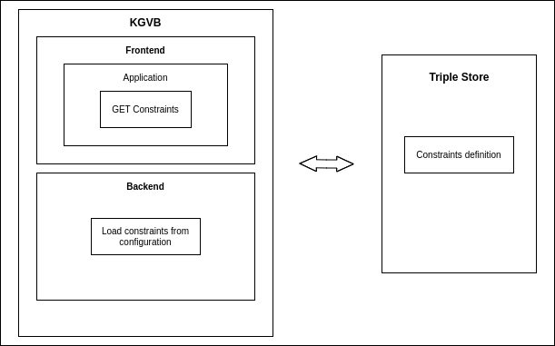
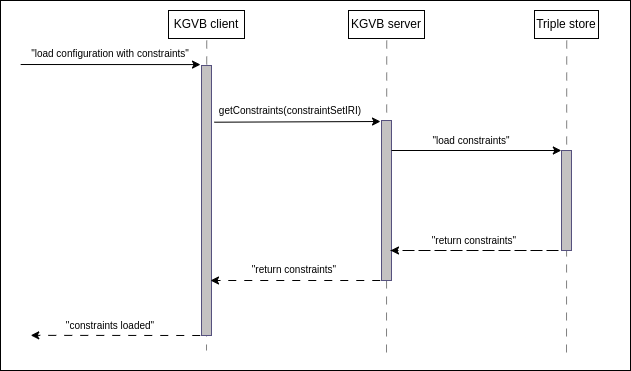
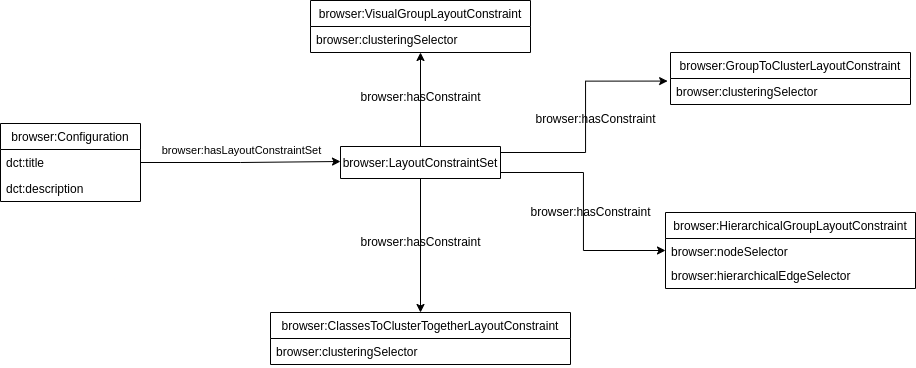

# Grouping of clusters

_This page describes how the "Grouping of Clusters" approach is implemented in the Knowledge Graph Browser._

---
# Table of Contents

- Knowledge Graph browser
  - [Architecture](#architecture)
  - [Frontend](#frontend)
    - [Implementation](#frontend-implementation)
  - [Backend](#backend)
    - [Backend server](#backend-server)
      - [Implementation](#frontend-implementation)
    - [Visual Configuration](#visual-configuration)

<h1 id="architecture">Architecture</h1>

The following diagram shows the different parts of the Knowledge Graph Visual Browser that are involved when working with visual constraints:

<p align="center">
    <br/>
</p>

<h2 id="frontend">Frontend</h2>

The following diagram shows how the different components interact during runtime when the tool loads constraints from the triple store:

<p align="center">
    <br/>
</p>

1. The user initializes loading of the configuration with constraints.
2. The KGVB frontend sends a request via `getConstraints` to the server, including the IRI of the set of visual layout constraints as an argument.
3. The server loads the constraints as a set of triples from the triple store.
4. The server processes the loaded constraints into JSON and sends them to the frontend.
5. The frontend applies the loaded constraints to the graph.

It is important to note that constraints are predefined by a technician in the visual configuration file, and are only loaded once, during the initial loading of the configuration.

<h3 id="grouping-of-clusters-technical-documentation">Grouping of clusters</h3>

The implementation of the grouping of clusters type of zooming is divided among multiple components, with the main function being the [`groupingOfClustersManager`](https://github.com/Razyapoo/knowledge-graph-browser-frontend-grouping-of-clusters/blob/5ee77643da16800807253298f984bcf5b13ec336/src/graph/GraphAreaManipulator.ts#L124). This function is used for both global and local grouping of clusters. It takes a boolean argument, indicating whether the zooming action is set to zoom in or out, and performs clustering and grouping operations on a set of nodes, resulting in an updated graph visualization that reflects the amount of detail corresponding to the [current zooming (hierarchical) level](glossary.md#current-hierarchical-level). This includes an update of the visual elements such as compound nodes and supernodes to ensure a seamless transition when zooming in or out.

<h3 id="local-zooming">Local version of grouping of clusters</h3>

The `groupingOfClustersManager` works with a predefined set of nodes. In the case of a global grouping, the set consists of all nodes on the graph area, while in the case of a local grouping, it consists of the selected nodes and all their descendants (if any).

The algorithm for grouping and clustering has undergone changes to handle local grouping. In previous version, supporting only global grouping of clusters, grouping was performed sequentially with respect to the hierarchical level, that is, in each subsequent iteration of the algorithm, nodes were taken from the current hierarchical level or the next (+/- 1) level. However, this method cannot be used with local grouping as the user can select any node on which to perform local grouping, which may differ from the current hierarchical level. The current version addresses this by adjusting the logic of the current hierarchical level and searching for the current level in each iteration of the cluster grouping. 

Furthermore, the algorithm is able to handle gaps in the sequence of hierarchical levels, for example, when nodes at specific levels were deleted and no longer exist on the graph. In this case, the algorithm can understand the gap in the sequence and looks for the next existing level.

<h3 id="working-with-groups">Working with groups</h3>

The extension allows for the grouping of nodes without breaking existing groups apart, as opposed to previous implementations which would always break a group before adding it to another group. This brings the ability of a more fine-grained control over the grouping of nodes in the graph. It allows to keep certain groups intact while still being able to group them with other nodes, resulting in more intuitive and flexible way of exploring the graph.

A newly proposed group compact mode allows to recursively explore the internal structure of groups. It is only allowed to be enabled on a group node, and when enabled, the group is detached from its parent.

This mode makes all types of zooming unavailable and reduces the visibility of the rest of the graph, showing only selected groups. It also utilizes compound nodes to allow the user to explore the internals of the group. When the mode is disabled, the graph returns to its original state, with the group node reconnecting to its parent, if it had one.

Additionally, the original compact mode is modified so that the node on which it is activated detaches from its parent and releases all children, and similarly, when the mode is disabled, the original state of the graph is restored.

<h3 id="frontend-implementation">Implementation</h3>

Implementation of the frontend is available [here](https://github.com/Razyapoo/knowledge-graph-browser-frontend-grouping-of-clusters).

<h2 id="backend">Backend</h2>

This section of the documentation is split into two parts: 

- [Backend server](#backend-server)
- [Visual configuration](#visual-configuration)

<h2 id="backend-server">Backend server</h2>

The original stateless [backend server](#https://github.com/martinnec/knowledge-graph-browser) is extended to include a new request handler for layout constraints. This handler reads a specific set of layout constraints from the triple store that is defined by `constraintSetIRI` parameter taken as argument from the frontend.

The output of the request handler is a JSON object containing all the constraints.

<h3 id="backend-implementation">Implementation</h3>

Implementation of the backend server is available [here](https://github.com/Razyapoo/knowledge-graph-browser-backend).

<h2 id="visual-configuration">Visual configuration</h2>

We introduce the new term "visual layout constraint" as a rule applied to a graph to change how it is displayed or arranged visually. To support this, we have extended the Knowledge Graph Visual Browser ontology with new terms, as depicted in the UML class diagram below:

<p align="center">
    <br/>
</p>

In addition to the standard visual classes of a node, we also include information about the hierarchical and visual group that the node belongs to. It is important to note that a hierarchical class is often considered a visual group class as well, as the root ancestor node in a hierarchy can be seen as a visual element that encompasses a cluster of child nodes.

In the rest of this document, we use the prefix `browser:` as a shorthand for the namespace `https://linked.opendata.cz/ontology/knowledge-graph-browser/`.

Here is an example of how to define a specific set of layout constraints in the configuration file:

```
@prefix browser: <https://linked.opendata.cz/ontology/knowledge-graph-browser/> .

<https://linked.opendata.cz/resource/knowledge-graph-browser/configuration/wikidata/animal-classification> a browser:Configuration ;
  browser:hasLayoutConstraintSet <https://linked.opendata.cz/resource/knowledge-graph-browser/layout-constraints/wikidata/animal-classification> .

<https://linked.opendata.cz/resource/knowledge-graph-browser/layout-constraints/wikidata/animal-classification> a browser:LayoutConstraintSet ;
  browser:hasConstraint <https://linked.opendata.cz/resource/knowledge-graph-browser/layout-constraints/visual-groups/wikidata/animal-classification/region> .

<https://linked.opendata.cz/resource/knowledge-graph-browser/layout-constraints/visual-groups/wikidata/animal-classification/region> a browser:VisualGroupLayoutConstraint .
```
This example defines a "region" visual group layout constraint.
- A set of visual layout constraints is assigned to the visual configuration using the `browser:hasLayoutConstraintSet` predicate, and is expressed as an instance of the `browser:LayoutConstraintSet` class. 

- Each individual visual layout constraint is assigned to a set of visual layout constraints using the `browser:hasConstraint` predicate, and is expressed as an instance of a specific layout constraint class. 

Supported visual layout constraints: `browser:VisualGroupLayoutConstraint`, `browser:HierarchicalGroupLayoutConstraint`, `browser:GroupToClusterLayoutConstraint`, and `browser:ClassesToClusterTogetherLayoutConstraint`.

The next few sections describe each layout constraint class in more details. 

<h3 id="hierarchical-group-layout-constraint">"HierarchicalGroupLayoutConstraint" class</h3>

A visual layout constraint defining [hierarchical relationships](#hierarchical-relationships-glossary) is expressed as an instance of the `browser:HierarchicalGroupLayoutConstraint` class. A hierarchical class of the node is assigned to the hierarchical group layout constraint via `browser:nodeSelector` predicate. A class of an edge, which will be treated as hierarchical, is assigned using the `browser:hierarchicalEdgeSelector` predicate.

Each pair of node and edge selectors must be assigned to a separate instance of the `browser:HierarchicalGroupLayoutConstraint` class. If you want to add more edge selectors with the same node selector, make each pair of the edge selector and the node selector as a separate instance of the `browser:HierarchicalGroupLayoutConstraint` class.

<h3 id="visual-group-layout-constraint">"VisualGroupLayoutConstraint" class</h3>

A visual layout constraint defining [visual group](#visual-group-glossary) is expressed as an instance of the `browser:VisualGroupLayoutConstraint` class. A visual group class is assigned to the visual group layout constraint via `browser:clusteringSelector` predicate.

Each specific visual group must be expressed as a separate instance of `browser:VisualGroupLayoutConstraint` class.

<h3 id="group-to-cluster-layout-constraint">"GroupToClusterLayoutConstraint" class</h3>

A visual layout constraint that determines [hierarchical group](#hierarchical-group-glossary) or [visual group](#visual-group-glossary), in which nodes can be grouped, is expressed as an instance of the `browser:HierarchicalGroupLayoutConstraint` class. The [class](#hierarchical-class-glossary) is assigned using the `browser:clusteringSelector` predicate. 

<h3 id="classes-to-cluster-together-layout-constraint">"ClassesToClusterTogetherLayoutConstraint" class</h3>

By default, the algorithm only groups clusters of nodes of the same visual class (different from the hierarchical class). But it is possible to define which different visual classes can be clustered and grouped together.

A visual layout constraint that defines classes to cluster and group together is expressed as an instance of the `browser:ClassesToClusterTogetherLayoutConstraint` class. Classes are assigned using the `browser:clusteringSelector` predicate.

Use this layout constraint only if you want to group nodes of different classes together. Place all the desired classes under one instance of the `browser:ClassesToClusterTogetherLayoutConstraint` class.


<h3 id="backend-configuration-implementation">Implementation</h3>

See a visual configuration example [here](https://github.com/linkedpipes/knowledge-graph-browser-configurations/blob/main/configurations/university-topic-map-with-constraints.ttl) ([basic configuration](https://github.com/linkedpipes/knowledge-graph-browser-configurations/blob/main/configurations/university-topic-map.ttl)).

<h2 id="possible-improvements">Possible improvements</h2>

1. Add possibility for the user to:
- Choose which hierarchical groups to cluster (user interface)
- Delete/add pseudo-parent for a visual group (user interface)

1. Place nodes of different hierarchical classes under the same pseudo-parent node.
2. Cluster nodes based on attributes other than their positions.
3. Predefine maximal and minimal sizes of clusters in the configuration file.
4. Switching between hierarchical and normal views.
5. Fix the position of the pseudo-parent when moving (not currently supported due to limitations of the Cytoscape library).