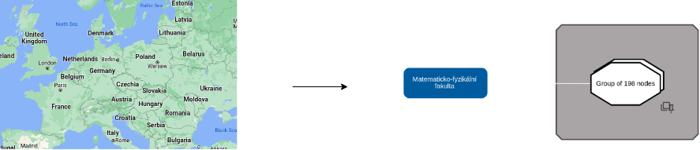

# Grouping of clusters

_This page describes how the "Grouping of Clusters" approach is implemented in the Knowledge Graph Browser._

---
### Table of Contents

- Knowledge Graph browser
  - [Frontend](#frontend)
  - [Backend](#backend)
  - [Configuration](#configuration)

---

<h1 id="implementation">Implementation</h1>

The implementation of "Grouping of clusters" extension is split into two parts: 

- [Backend](#backend)
  - [Visual configuration](#visual-configuration)
  - [Backend server](#backend-server)
- [Frontend](#frontend)

<h2 id="architecture">Architecture</h2>

The following diagram shows the different parts of the Knowledge Graph Visual Browser that are involved when working with visual constraints:

<p align="center">
    <br/>
</p>

<h2 id="frontend">Frontend</h2>

> **Note** \
> The code is also enriched with descriptive comments

The following diagram shows how the different components interact during runtime when the tool loads constraints from the triple store:

<p align="center">
    <br/>
</p>

1. The user initializes the loading of the configuration with constraints.
2. The KGVB frontend sends a request via `getConstraints` to the server, including the IRI of the set of visual layout constraints as an argument.
3. The server retrieves the constraints as a set of triples.
4. The server processes the loaded constraints into JSON and sends them to the frontend.
5. The client applies the loaded constraints to the graph.

It is important to note that constraints are predefined by a technician in the visual configuration file, and are only loaded once, during the initial loading of the configuration.


<h3 id="extension-of-the-grapharea">Extension of the GraphArea.vue</h3>

The original GraphArea component is extended with a [checkbox](user_documentation.md#checkbox-glossary) that allows the user to choose whether to zoom or to run the "[grouping of clusters](#grouping-of-clusters-KCluster)" algorithm.

<h3 id="extension-of-the-graphareastylesheetmixin">Extension of the GraphAreaStylesheetMixin.ts</h3>

The original component is extended with visual styles for the parent node. 

When a node becomes a parent, having at least one child node placed inside, its visual style changes so that its label appears at the top and center, and the shape of the node becomes octagonal.

<h3 id="extension-of-the-graphelementedge">Extension of the GraphElementEdge.ts</h3>

This component is augmented with a check to see if the end nodes of an edge placed in the same [hierarchical group](#hierarchical-group-glossary). If so, an arrow-shaped [non-hierarchical](#non-hierarchical-relationships-glossary) edge between the parent and child nodes should not be created.

<h3 id="extension-of-the-graphelementnode">Extension of the GraphElementNode.ts</h3>

This component is extended with method `setHierarchicalInfo` which establishes a [hierarchical class](#hierarchical-class-glossary), a [hierarchical level](#hierarchical-level-glossary) and a pseudo-parent (see [visual group](#visual-group-glossary) for more information) of a node and updates `globalHierarchicalDepth` attribute if a node is opened at a new [hierarchical level](#hierarchical-level-glossary) lower than the [current hierarchical level](#current-hierarchical-level-glossary).

<h3 id="extension-of-the-graphelementnodemixin">Extension of the GraphElementNodeMixin.ts</h3>

By default (property of [Cytoscape](https://js.cytoscape.org/) library) selection of a child node triggers selection of its parent.

Therefore, before selecting a node, it is necessary to make all its ancestor nodes unselectable, and after selecting a node, make ancestor nodes selectable again.

The [Cytoscape](https://js.cytoscape.org/) library uses the "parent" property of an element to visualize the [parent-child](#parent-child-or-child-parent-hierarchical-relationship-glossary) hierarchy. Therefore, when expanding a parent node from a child node, it is necessary to explicitly specify a parent for a Cytoscape element that represents a child node.

<h3 id="extension-of-the-detailpanel">Extension of the DetailPanel.ts</h3>

This component is extended to handle the case when a node is hidden. It might be the case that hidden node is the only child of the "pseudo-parent" node. In such case, pseudo-parent node is also hidden.

Detail panel is extended with new section showing the nodes' [hierarchical class](#hierarchical-class-glossary) if exists.

<h3 id="extension-of-the-listpanel">Extension of the ListPanel.ts</h3>

The original component is extended with the new method `groupManually` that handles manual grouping and special prohibited cases which can occur during manual grouping. 

Remove method is also extended to handle the case with a "pseudo-parent" node.

<h3 id="extension-of-the-configuration">Extension of the Configuration.ts</h3>

The original component is extended with a new attribute showing whether the expansion is hierarchical one. It is used to decide what nodes need to be shown in the graph.

<h3 id="extension-of-the-configuration">Extension of the Configuration.ts</h3>

The original component is extended with a new attribute `constraints` that is used to store the IRI representing a [set of visual layout constraints](#set-of-visual-constraints-glossary) to be loaded.

<h3 id="extension-of-the-application">Extension of the Application.vue</h3>

This component is extended with the new method `loadConstraints` which is used to load [visual layout constraints](#visual-layout-constraint-glossary) from the server. New `isHierarchicalView` and `constraintRulesLoaded` attributes are used to indicate whether a visual style of a parent node need to be changed (for more information, see "[Extension of the ViewOptions.ts](#extension-of-the-view-options)" section) and whether constraints are loaded from the server successfully.

<h3 id="extension-of-the-edge">Extension of the Edge.ts</h3>

Edge is extended with a new `isEdgeFromChild` attribute indicating whether an edge is coming from a child node.

<h3 id="extension-of-the-graph-area-manipulator">Extension of the GraphAreaManipulator.ts</h3>

When you zoom in at a specific point on the mapping platforms, at each zoom level you see more and more details about the region you zoom in, and when you zoom out, some details disappear.  

The same principle is used in the "Grouping of clusters" extension, namely, when you zoom in, you see more detail in terms of nodes, and when you zoom out, you see less detail in terms of nodes. This can be achieved by choosing both "Zoom" and "Grouping of clusters" options in the [checkbox](user_documentation.md#checkbox-glossary).

The original component is extended with a new private `groupingOfClustersManager` method that filters nodes to be first clustered and then grouped, ungroups existing groups of nodes, collapses child nodes into their parent nodes or shows child nodes collapsed in their parent nodes. The component is also extended with the `globalHierarchyDepth` attribute, whose value indicates the [current hierarchical level](#current-hierarchical-level-glossary).

When grouping ("Grouping of clusters" is selected in the [checkbox](user_documentation.md#checkbox-glossary) and "minus" button is clicked), first of all, nodes must be clustered, therefore, the `groupingOfClustersManager` algorithm filters all the nodes that have a [hierarchical group class](#hierarchical-class-glossary) that is allowed to be clustered and grouped in the visual configuration (more in [Hierarchical groups to cluster](#hierarchical-groups-to-cluster-layout-constraint) section). Then it filters out of all previously filtered nodes only those that reside at the [current hierarchical level](#current-hierarchical-level-glossary) (based on the value of the `globalHierarchyDepth` attribute). 

> **Note** \
> Value of the `globalHierarchyDepth` attribute does not show the deepest hierarchical level that has been achieved in the graph during the research, but the deepest level of nodes that are still visible on the graph area.

From now on, the algorithm clusters all filtered nodes, but based on the parent and visual classes (may differ from the [hierarchical class](#hierarchical-class-glossary) of a node).

As the map (in the mapping platforms) scales down and details disappear, new correlated details appear in their place that generalize the disappeared details. In our case, the parent node is such a generalization. Therefore, the next condition for clustering must be to cluster nodes that have the same parent node.

After all nodes that have the same parent node are filtered out, the algorithm filters out nodes that have the same visual class, unless multiple visual classes to be clustered together are explicitly specified in the visual configuration (for more information see "[Classes to cluster together](#classes-to-cluster-together-layout-constraint)" section).

Two cases can occur at the end of filtering:

- In the first case (an example is shown in the Figure 6 below), at the end of the filtering there are several nodes that can be clustered and grouped (within same parent). The algorithm then calls the `groupingOfClusters` method, which performs the clustering and grouping of the filtered nodes. This function is described in more detail in the [KCluster](#KCluster) section.

<p align="center">
    <br/>
    <em>Figure 6. Grouping of clusters (use-case of several child nodes per parent)</em>
</p>

- In the second case, only one child node (per parent) remains at the end of the filtering (an example is shown in the Figure 7 below). 

  <p align="center">
      <br/>
      <em>Figure 7. Grouping of clusters (use-case of one child node per parent)</em>
  </p>

  This child node can represent a single child node or a group containing all of the parent's child nodes. In this case, the remaining child node (in each parent) should be collapsed into the parent node, but this should only happen when all the child nodes having [current hierarchical level](#current-hierarchical-level-glossary) are the only child nodes of their parents (as shown in the Figure 7 above).

  > **Note** \
  > After collapsing child nodes, the algorithm switches the [current hierarchical level](#current-hierarchical-level-glossary) one level higher (`globalHierarchyDepth` attribute value is decreased by one). During this operation, all [non-hierarchical](#non-hierarchical-relationships-glossary) edges from child nodes are moved to the parent node.

During ungrouping operation ("Grouping of clusters" is selected in the [checkbox](user_documentation.md#checkbox-glossary) and "plus" button is clicked), only nodes at the [current hierarchical level](#current-hierarchical-level-glossary) can be ungrouped.

There are two cases:

- In the first case, there is at least one group at the [current hierarchical level](#current-hierarchical-level-glossary). 
  > **Warning** \
  > In such case, algorithm ungroups either all groups or random number of random groups (determined by `ungroupRandomly` variable). 

- In the second case, there are only parent nodes which contain inside collapsed child nodes. In such case, algorithm shows collapsed child nodes.

    > **Note** \
    > In such case the [current hierarchical level](#current-hierarchical-level-glossary) increases by 1.


In case there are several different hierarchical groups, the highest abstract level will show the last ancestor of each hierarchy and they will not be grouped or collapsed (Figure 8).

<p align="center">
    <br/>
    <em>Figure 8. Map style zoom highest abstract level. Left side - an example from google maps. Right side - an example from Knowledge Graph Visual Browser.</em>
</p>

<h3 id="extension-of-the-graph-manipulator">Extension of the GraphManipulator.ts</h3>

In this component, only group management methods are extended to set a parent node, a [hierarchical level](#hierarchical-level-glossary), and a [hierarchical group](#hierarchical-group-glossary). 

> **Warning** \
> When you ungroup a group, you must remove that group from the parent list of child nodes. \
> When you group a set of nodes, you must remove them from the parent list of child nodes, and add the newly created group as a child node.

<h3 id="extension-of-the-node">Extension of the Node.ts</h3>

The new `mountedFromGroup` attribute is added to indicate that the node is mounted in graph area after ungroup operation.

After removal of a node, all its descendant nodes in the hierarchy must also be removed, as this may violate the principle of the hierarchy.

An extension of this component is the `remove` method, which is extended to handle the recursive removal of child nodes (including nodes and groups).

<h3 id="extension-of-the-node-common">Extension of the NodeCommon.ts</h3>

The NodeCommon.ts component is extended with attributes that set the hierarchical attributes of a node, namely a parent node, child nodes, a [hierarchical group](#hierarchical-group-glossary), [hierarchical level](#hierarchical-level-glossary).

The new `isMountedInHierarchy` is also added to indicate that the node is mounted in hierarchy. This is used when a node collapses into its parent and gets unmounted in the graph area. If the node is collapsed, it should not be shown during expansion caused by its parent node.

<h3 id="extension-of-the-node-group">Extension of the NodeGroup.ts</h3>

The `remove` method is changed to handle node hierarchy.

The new `classesOfNodes` attribute is added. It contains all classes of the nodes inside a group (different from hierarchical class).

<h3 id="extension-of-the-node-view">Extension of the NodeView.ts</h3>

The `expand` method is changed to handle [child-parent/parent-child relation layout constraint](#child-parent-or-parent-child-layout-constraint). 

> **Warning** \
> At the moment, the implementation only supports [child-parent relationships](#parent-child-or-child-parent-hierarchical-relationship-glossary), but it's easy to add support for [parent-child relationship](#parent-child-or-child-parent-hierarchical-relationship-glossary) as well.

<h3 id="extension-of-the-view-options">Extension of the ViewOptions.ts</h3>

This component is extended with the `isHierarchicalView` attribute to indicate if the visual style of the parent node needs to be changed. See [Extension of the GraphAreaStylesheetMixin.ts](#extension-of-the-graphareastylesheetmixin) for more details.

<h3 id="extension-of-the-cola-layout">Extension of the ColaLayout.ts</h3>

The `onExpansion` method is changed to handle node hierarchy.

<h3 id="extension-of-the-layouts">Extension of the Layouts.ts</h3>

The Layouts.ts and all its descendant components are extended with boolean `supportsHierarchicalView` and `constraintRulesLoaded` attributes. The first one indicates whether the layout supports a hierarchical view. The `constraintRulesLoaded` attribute indicates whether layout constraints were successfully loaded.

<h3 id="extension-of-the-layout-manager">Extension of the LayoutManager.ts</h3>

The `switchToLayout` method is extended to handle the case when the current layout changes to a different one, so that all loaded constraint rules are preserved.

<h3 id="extension-of-the-remote-server">Extension of the RemoteServer.ts</h3>

This component is extended with the requestor, which receives layout constraints from the [visual configuration](#visual-configuration) (via [backend server](#backend-server)).

<h3 id="extension-of-the-response-interfaces">Extension of the ResponseInterfaces.ts</h3>

This component is extended with a new interfaces used for layout constraints.

<h3 id="grouping-of-clusters-KCluster">New KCluster.ts component</h3>

The new KCluster.ts component is added to the main application. This component contains a `groupingOfClusters` method which performs clustering of filtered nodes and their grouping. As a parameter it accepts a set of nodes filtered in [groupingOfClustersManager](#extension-of-the-graph-area-manipulator) method.

The `groupingOfClusters` algorithm first clusters the nodes into a [cluster](#cluster-glossary), and then collapse that [cluster](#cluster-glossary) into a single group node. Which nodes to cluster and then group into a single group node is determined by an algorithm based on position of the nodes. This algorithm uses well-known clustering methods: k-Means clustering [1] and k-Medoids clustering [2] (what method to use is defined by the technician).

The basic approach of the algorithm is that it creates several centroids, generates from them an empty group (k-Means clustering [1]) or a group consisting of a single node (k-Medoids clustering [2]), and then adds surrounding nodes to the closest group.

The `groupingOfClusters` method is explained in more detail in the code comments. For more information, see the implementation of [groupingOfClusters](https://github.com/Razyapoo/knowledge-graph-browser-frontend/blob/master/src/cluster/clusters/KMeans/KMeans.ts).

<h2 id="visual-configuration">Visual configuration</h2>

We introduce the new term "visual layout constraint" as a rule applied to a graph to change how it is displayed or arranged visually. To support this, we have extended the Knowledge Graph Visual Browser ontology with new terms, as depicted in the UML class diagram in Figure.

> **Note**
> In the rest of this document, we use the prefix `browser:` as a shorthand for the namespace `https://linked.opendata.cz/ontology/knowledge-graph-browser/`.

A set of visual layout constraints is assigned to the visual configuration using the `browser:hasLayoutConstraints` predicate, and is expressed as an instance of the `browser:LayoutConstraintSet` class. Each individual visual layout constraint is assigned to a set of visual layout constraints using the `browser:hasConstraint` predicate, and is expressed as an instance of a specific layout constraint class, as shown below:

```
@prefix browser: <https://linked.opendata.cz/ontology/knowledge-graph-browser/> .

<https://linked.opendata.cz/resource/knowledge-graph-browser/configuration/wikidata/animal-classification> a browser:Configuration ;
  browser:hasLayoutConstraintSet <https://linked.opendata.cz/resource/knowledge-graph-browser/layout-constraints/wikidata/animal-classification> .

<https://linked.opendata.cz/resource/knowledge-graph-browser/layout-constraints/wikidata/animal-classification> a browser:LayoutConstraintSet ;
  browser:hasConstraint <https://linked.opendata.cz/resource/knowledge-graph-browser/layout-constraints/visual-groups/wikidata/animal-classification/region> .

<https://linked.opendata.cz/resource/knowledge-graph-browser/layout-constraints/visual-groups/wikidata/animal-classification/region> a browser:VisualGroupLayoutConstraint .
```

Supported visual layout constraints: `browser:VisualGroupLayoutConstraint`, `browser:HierarchicalGroupLayoutConstraint`, `browser:GroupToClusterLayoutConstraint`, and `browser:ClassesToClusterTogetherLayoutConstraint`.

The next few sections describe each layout constraint class in more details. 

<h3 id="hierarchical-group-layout-constraint">"HierarchicalGroupLayoutConstraint" class</h3>

A visual layout constraint defining [hierarchical relationships](#hierarchical-relationships-glossary)) is expressed as an instance of the `browser:HierarchicalGroupLayoutConstraint` class. A hierarchical class of the node is assigned to the hierarchical group layout constraint via `browser:nodeSelector` predicate. A class of an edge, which will be treated as hierarchical, is assigned using the `browser:hierarchicalEdgeSelector` predicate.

> **Warning** \
> Each pair of node and edge selectors must be assigned to a separate instance of the `browser:HierarchicalGroupLayoutConstraint` class. \
> If you want to add more edge selectors with the same node selector, make each pair of the edge selector and the node selector as a separate instance of the `browser:HierarchicalGroupLayoutConstraint` class.

<h3 id="visual-group-layout-constraint">"VisualGroupLayoutConstraint" class</h3>

A visual layout constraint defining [visual group](#visual-group-glossary) is expressed as an instance of the `browser:VisualGroupLayoutConstraint` class. A visual group class is assigned to the visual group layout constraint via `browser:clusteringSelector` predicate.

> **Warning** \
> Each specific visual group must be expressed as a separate instance of `browser:VisualGroupLayoutConstraint` class.

<h3 id="group-to-cluster-layout-constraint">"GroupToClusterLayoutConstraint" class</h3>

A visual layout constraint that determines [hierarchical group](#hierarchical-group-glossary) or [visual group](#visual-group-glossary), in which nodes can be grouped, is expressed as an instance of the `browser:HierarchicalGroupLayoutConstraint` class. The [class](#hierarchical-class-glossary) is assigned using the `browser:clusteringSelector` predicate. 

<h3 id="classes-to-cluster-together-layout-constraint">"ClassesToClusterTogetherLayoutConstraint" class</h3>

By default, the algorithm only groups clusters of nodes of the same visual class (different from the hierarchical class). But it is possible to define which different visual classes can be clustered and grouped together.

A visual layout constraint that defines classes to cluster and group together is expressed as an instance of the `browser:ClassesToClusterTogetherLayoutConstraint` class. Classes are assigned using the `browser:clusteringSelector` predicate.

> **Warning** \
> Use this layout constraint only if you want to group nodes of different classes together. Place all the desired classes under one instance of the `browser:ClassesToClusterTogetherLayoutConstraint` class.


<h3 id="backend-configuration-implementation">Implementation</h3>

See a visual configuration example [here](https://github.com/linkedpipes/knowledge-graph-browser-configurations/blob/main/configurations/university-topic-map-with-constraints.ttl) ([basic configuration](https://github.com/linkedpipes/knowledge-graph-browser-configurations/blob/main/configurations/university-topic-map.ttl)).

<h2 id="backend">Backend</h2>

This section of the documentation is split into two parts: 

- [Backend server](#backend-server)
- [Visual configuration](#visual-configuration)

<h2 id="backend-server">Backend server</h2>

The original [backend server](#https://github.com/martinnec/knowledge-graph-browser) is extended to include a new request handler called `layout-constraints`. This handler reads layout constraints from the database based on requests received from the frontend.

The output of the request handler is a JSON object containing all the constraints.

<h3 id="backend-implementation">Implementation</h3>

Implementation of the backend server is available [here](https://github.com/Razyapoo/knowledge-graph-browser-backend).

---

<h1 id="what-to-do-next">What to do next?</h1>

1. Add possibility for the user to:
- Choose which hierarchical groups to cluster (user interface)
- Delete/add pseudo-parent for a visual group (user interface)

1. Place nodes of different hierarchical classes under the same pseudo-parent node.
2. Cluster nodes based on attributes other than their positions.
3. Switching between hierarchical and normal views.
4. Fix the position of the pseudo-parent when moving (not currently supported due to limitations of the Cytoscape library).

<h1 id="references">References</h1>

[1] https://en.wikipedia.org/wiki/K-means_clustering

[2] https://en.wikipedia.org/wiki/K-medoids