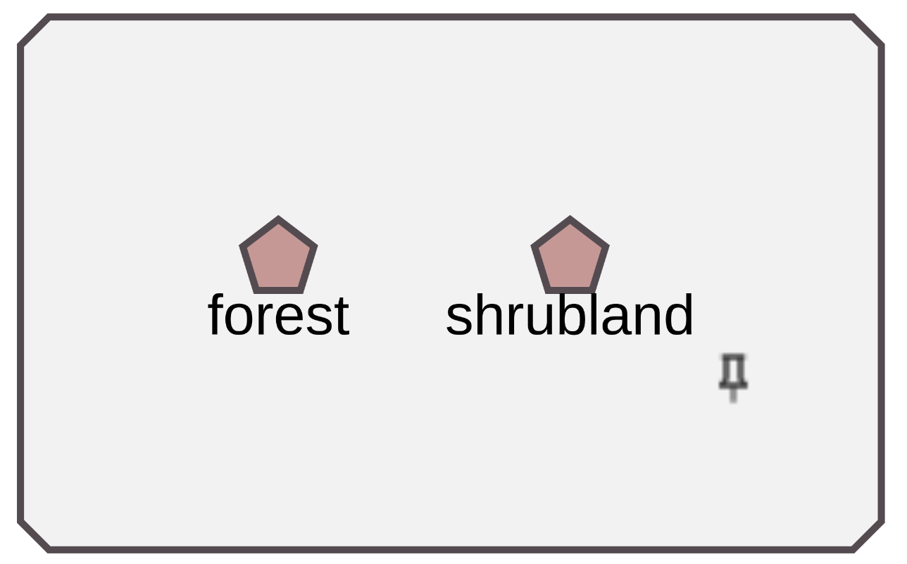

# Grouping of clusters

_This page describes how the [grouping of clusters](#grouping-of-clusters-glossary) approach is implemented in the Knowledge Graph Browser._

---
### Table of Contents

- [Main goal](#main-goal)
- [Glossary](#glossary)
- Knowledge Graph browser
  - [Frontend](#frontend)
  - [Backend](#backend)
  - [Configuration](#configuration)

---
 
<h1 id="main-goal">Main goal</h1>

So far, in the Knowledge Graph browser, it was only possible to group nodes in such a way that the user selects a couple of nodes and makes a group out of them manually. But in many cases it is more efficient and easier for the user to escape such work and allow the application to automatically group nodes based on similar attribute values.

The main purpose of the implemented [grouping of clusters](#grouping-of-clusters-glossary) approach is to make a large graph more user-friendly, i.e. more readable and understandable. 

Original knowledge graph exploration is proposed in a research paper ["Iteractive and iterative visual exploration of knowledge graphs based on shareable and reusable visual configurations"](https://www.sciencedirect.com/science/article/pii/S1570826822000105). Its implementations is available [here](https://github.com/martinnec/knowledge-graph-browser-website)

<h1 id="glossary">Glossary</h1>

This part of the documentation contains necessary terms that are used later in the documentation. They will help you understand the basic principle of how the extension works.

Terms described here may differ from usual terms you may be familiar with. This glossary is slightly different from the [glossary in the user documentation](user_documentation.md#glossary).

You can skip this section for now and go to [Implementation](#implementation) section.

<h3 id="grouping-of-clusters-glossary">Grouping of clusters</h3>

> **Definition** \
> Grouping of clusters is the process of creating clusters of nodes with the same or similar attribute values ​​and then combining them into a single group.

<h3 id="visual-layout-constraint-glossary">Visual layout constraint</h3>

> **Definition** \
> A visual layout constraint is a rule (constraint) applied to a graph to change a way it is visualized.

<h3 id="set-of-visual-constraints-glossary">Set of visual layout constraints</h3>

> **Definition** \
> A visual layout constraint set is a set of [visual layout constraints](#visual-layout-constraint-glossary) to be applied to a graph.

<h3 id="parent-child-or-child-parent-hierarchical-relationship-glossary">Parent-child or child-parent hierarchical relationship</h3>

Typically, nodes in a graph are related to each other, for example, a company has employees, university has scientists, scientist has awards, scientist writes scientific papers, university has departments, and many other examples. 

One possible way to visualize such relationships is to create an edge between parent and child. But there is also another way, namely adding a hierarchy between nodes. In such case, parent node is visualized as a larger node containing child nodes inside.

Figure 1 below shows an example with universities and departments. A university can be thought of as a larger node (blue) containing child nodes (light blue) inside, representing departments: 

     
    <em>Figure 1. Parent-child relationship</em>

Each such node hierarchy represents a [hierarchical group](#hierarchical-group-glossary).

> **Warning** \
> Hierarchical relationships are predefined by a technician in the [visual configuration](#child-parent-or-parent-child-layout-constraint).

Expansion query can be triggered from a parent node (expand child nodes) as well as form a child node (expand parent node). In both cases it may use same predicate in SPARQL CONSTRUCT, for example `skos:broader`.

[Non-hierarchical](#non-hierarchical-relationships-glossary) relationships are also possible. 

<h3 id="non-hierarchical-relationships-glossary">Non-hierarchical relationship </h3>

> **Definition** \
> Non-hierarchical relationships are represented by edge between nodes.

For example, "the department teaches the subject" relationship can be visualized as non-hierarchical. An example is shown in the Figure 2 below.

     
    <em>Figure 2. Non-hierarchical edge</em>

> **Note** \
> Non-hierarchical relationships are all relationships other than [hierarchical](#parent-child-or-child-parent-hierarchical-relationship-glossary).

<h3 id="hierarchical-class-glossary">Hierarchical class</h3>

> **Definition** \
> A hierarchical class is a visual class that defines which [hierarchical group](#hierarchical-group-glossary) a node belongs to. A node can only be assigned to one hierarchical class.

A hierarchical class, if it exists, is shown along with a label of a node on the detail panel. See Figure 3 below for more details.

     
    <em>Figure 3. Hierarchical class</em>

> **Note** \
> A hierarchical class (or hierarchical group class) is a common class for all nodes to be placed in a same [hierarchical group](#hierarchical-groups). It is assigned to a node in a SPARQL CONSTRUCT query in the same way as a visual class, i.e. using the `browser:class` predicate. 

> **Warning** \
> Each node must be assigned to some hierarchical group class in case it needs to be placed in any hierarchy.

<h3 id="hierarchical-level-glossary">Hierarchical level</h3>

> **Definition** \
> A hierarchical level of a node indicates the depth of a hierarchy at which a node resides.

The amount of detail displayed on maps (in mapping platforms) depends on a zoom level. [Grouping of clusters](#grouping-of-clusters-glossary) approach uses the same idea. At the deepest (highest) level of the hierarchy, the graph shows all possible details. And at the lowest level of the hierarchy, the graph shows only those single nodes that are representatives of hierarchies themselves. 

<h3 id="current-hierarchical-level-glossary">Current hierarchical level</h3>

> **Definition** \
> A current hierarchical level is the deepest [hierarchical level](#hierarchical-level-glossary) shown in the graph area.

At the moment when child nodes collapse into their parents, the current hierarchical level decreases by 1, and when child nodes with a hierarchical level higher (deeper) by 1 than the current hierarchical level appear, the current hierarchical level increases by 1.

The `globalHierarchyDepth` attribute value indicates the current hierarchical level.

<h3 id="hierarchical-group-glossary">Hierarchical group</h3>

> **Definition** \
> A hierarchical group is a cluster of nodes that are related to each other by [parent-child relationships](#parent-child-or-child-parent-hierarchical-relationship-glossary). 

Each node in a hierarchical group must have the [hierarchical class](#hierarchical-class-glossary) which represents that hierarchical group.

An example of one such hierarchical group is shown in Figure 1 above.

> **Warning** \
> A hierarchical group is predefined by a technician in the [visual configuration](#hierarchical-groups-to-cluster-layout-constraint).

<h3 id="visual-group-glossary">Visual group</h3>

> **Definition** \
> A visual group is a cluster of nodes located in the same area on a graph. Nodes that belong to the same visual group are placed under the same "pseudo-parent" node representing the visual group itself.

An example of a visual group is shown in the Figure 4 below. The "pseudo-parent" node is a gray node with white nodes inside.

     
    <em>Figure 4. Visual group</em>

> **Warning** \
> A visual group is predefined by a technician in the [visual configuration](#visual-group-layout-constraint).

Each node in a visual group must have an additional visual group class representing that visual group. It can be identical to the hierarchical class.

> **Note** \
> Hierarchical groups themselves can be interpreted as visual groups. In such a case, there is no need for a "pseudo-parent".

An example of two visual groups "pracovisteVisualGroup" and "tema" is shown in Figure 5 below (later on we will use "pracovisteVisualGroup" as the visual group).

     
    <em>Figure 5. Visual groups. To the left is "pracovisteVisualGroup" visual group and to the right is "tema" visual group</em>

> **Note** \
> The main advantage of visual groups is that you can easily move all the nodes that belong to the same group across the entire graph area at the same time. This way they won't be scattered all over the graph area. 

<h1 id="implementation">Implementation</h1>

The implementation of "Grouping of clusters" extension is split into two parts: 

- [Backend](#backend)
  - [Backend server](#backend-server)
  - [Visual configuration](#visual-configuration)
- [Fronted](#frontend)

<h2 id="backend">Backend</h2>

This section of the documentation is split into two parts: 

- [Backend server](#backend-server)
- [Visual configuration](#visual-configuration)

<h2 id="backend-server">Backend server</h2>

The original ["kgserver.js" backend server](#https://github.com/martinnec/knowledge-graph-browser) is extended with a new request handler `layout-constraints`.

This handler sends a query defined in the visual configuration to a SPARQL endpoint and receives [visual layout constraints](#visual-layout-constraint-glossary) to apply in the main application.

The output of the request handler is a JSON object containing all the constraints.

<h3 id="backend-implementation">Implementation</h3>

See the implementation of the backend server [here](https://github.com/Razyapoo/knowledge-graph-browser-backend).

<h2 id="visual-configuration">Visual configuration</h2>

The original visual configuration is extended with a [set of visual layout constraints](#set-of-visual-constraints-glossary) that are assigned using the `browser:hasLayoutConstraints` predicate. 

A [set](#set-of-visual-constraints-glossary) is expressed as an instance of the `browser:LayoutConstraintSet` class. 

Each [visual layout constraint](#visual-layout-constraint-glossary) must be expressed as an instance of an individual layout constraint class and assigned to a set of visual layout constraints using the `browser:hasConstraint` predicate. 

Next few sections describe each layout constraint class in more details. It is expected that each node has a [hierarchical class](#hierarchical-class-glossary) assigned. 

<h3 id="visual-group-layout-constraint">"VisualGroupLayoutConstraint" class</h3>

A [visual layout constraint](#visual-layout-constraint-glossary) defining [visual group](#visual-group-glossary) is expressed as an instance of the `browser:VisualGroupLayoutConstraint` class. A visual group class is assigned to the visual group layout constraint via `browser:clusteringSelector` predicate. It is usually identical to the [hierarchical class](#hierarchical-class-glossary), so there is no need for an extra visual group class.

> **Warning** \
> Each visual group class must be assigned to a separate instance of `browser:VisualGroupLayoutConstraint` class.

<h3 id="hierarchical-groups-to-cluster-layout-constraint">"HierarchicalGroupsToClusterLayoutConstraint" class</h3>

> **Note** \
> It can be useful not to group clusters of nodes that belong to the same [hierarchical group](#hierarchical-group-glossary) (or [visual group](#visual-group-glossary)). For example, group only clusters that belong to the "tema" visual group, but do not belong to the "pracovisteVisualGroup" visual group (shown in Figure 5 above).

A [visual layout constraint](#visual-layout-constraint-glossary) that determines [hierarchical groups](#hierarchical-group-glossary), in which we can group clusters, is expressed as an instance of the `browser:HierarchyGroupToClusterLayoutConstraint` class. The [hierarchical (group) class](#hierarchical-class-glossary) is assigned using the `browser:clusteringSelector` predicate. 

> **Warning** \
> Each hierarchical group class must be assigned to a separate instance of the `browser:HierarchyGroupToClusterLayoutConstraint` class.

<h3 id="classes-to-cluster-together-layout-constraint">"ClassesToClusterTogetherLayoutConstraint" class</h3>

By default, the algorithm only groups clusters of nodes of the same visual class (usually different from the hierarchical class). But it is possible to define which visual classes can be clustered and grouped together (within the parent node).

A [visual layout constraint](#visual-layout-constraint-glossary) that defines classes to cluster and group together is expressed as an instance of the `browser:ClassesToClusterTogetherLayoutConstraint` class. Classes are assigned using the `browser:clusteringSelector` predicate.

> **Warning** \
> The classes to cluster together are defined by a technician in the visual configuration. \
> Use this layout constraint only if you want to create groups containing nodes of different classes. Put all classes you want to cluster and group together in the one instance of the `browser:ClassesToClusterTogetherLayoutConstraint` class.

<h3 id="child-parent-or-parent-child-layout-constraint">"ChildParentLayoutConstraint" and "ParentChildLayoutConstraint" classes</h3>

A [visual layout constraint](#visual-layout-constraint-glossary) defining [child-parent](#parent-child-or-child-parent-hierarchical-relationship-glossary) (resp. [parent-child](#parent-child-or-child-parent-hierarchical-relationship-glossary)) relationships is expressed as an instance of the `browser:ChildParentLayoutConstraint` (resp. `browser:ParentChildLayoutConstraint`) class. Classes playing a child role (resp. parent role) are assigned using the `browser:childNodeSelector` (resp. `browser:parentNodeSelector`) predicate. An expansion predicate (e.g. `skos:broader`) in the expansion SPARQL query is selected using the `browser:hierarchyEdgeSelector` predicate.

> **Warning** \
> Each pair of node and edge selectors must be assigned to a separate instance of the `browser:ChildParentLayoutConstraint` (resp. `browser:ParentChildLayoutConstraint`) class. 

> **Note** \
> If you want to add more edge selectors with the same node selector, place each pair of an edge selector and the node selector in a separate instance of the `browser:ChildParentLayoutConstraint` (resp. `browser:ParentChildLayoutConstraint`) class.

<h3 id="backend-configuration-implementation">Implementation</h3>

See a visual configuration example [here](https://github.com/linkedpipes/knowledge-graph-browser-configurations/blob/main/configurations/university-topic-map-with-constraints.ttl) ([basic configuration](https://github.com/linkedpipes/knowledge-graph-browser-configurations/blob/main/configurations/university-topic-map.ttl)).

---

<h2 id="frontend">Frontend</h2>

We all know how zoom in/out works on mapping platforms such as [google maps](https://maps.google.com), maps.cz, etc. Zoom is used to increase or decrease the zoom level at a specific point and show more or less detail on a map.

The "grouping of clusters" extension is inspired by such mapping platforms.

> **Note** \
> Zoom feature from mapping platforms can be achieved by choosing both "Zoom" and "Grouping of clusters" options in the [checkbox](user_documentation.md#checkbox-glossary).

The next few sections describe extensions to the main components of the source code. 

> **Warning** \
> Implementation of each component extension is described in more details in the code comments.

<h3 id="extension-of-the-grapharea">Extension of the GraphArea.vue</h3>

The original GraphArea component is extended with a [checkbox](user_documentation.md#checkbox-glossary) that allows the user to choose whether to zoom or to run the "[grouping of clusters](#grouping-of-clusters-KCluster)" algorithm.

<h3 id="extension-of-the-graphareastylesheetmixin">Extension of the GraphAreaStylesheetMixin.ts</h3>

The original component is extended with visual styles for the parent node. 

When a node becomes a parent, having at least one child node placed inside, its visual style changes so that its label appears at the top and center. Also, the shape of the node becomes octagonal.

<h3 id="extension-of-the-graphelementedge">Extension of the GraphElementEdge.ts</h3>

This component is extended by the condition whether the end nodes of the edge are in a [parent-child relationship](#parent-child-or-child-parent-hierarchical-relationship-glossary). If so, an arrow-shaped [non-hierarchical](#non-hierarchical-relationships-glossary) edge between the parent and child nodes should not be created.

<h3 id="extension-of-the-graphelementnode">Extension of the GraphElementNode.ts</h3>

This component is extended with method `setHierarchicalInfo` which establishes a [hierarchical class](#hierarchical-class-glossary), a [hierarchical level](#hierarchical-level-glossary) and a pseudo-parent (see [visual group](#visual-group-glossary) for more information) of a node and updates `globalHierarchicalDepth` attribute if a node is opened at a new [hierarchical level](#hierarchical-level-glossary) lower than the [current hierarchical level](#current-hierarchical-level-glossary).

<h3 id="extension-of-the-graphelementnode">Extension of the GraphElementNode.ts</h3>

This component is extended with method `setHierarchicalInfo` which establishes a [hierarchical class](#hierarchical-class-glossary), a [hierarchical level](#hierarchical-level-glossary) and a pseudo-parent (see [visual group](#visual-group-glossary) for more information) of a group node and updates `globalHierarchicalDepth` attribute if a group node is opened at a new [hierarchical level](#hierarchical-level-glossary) lower than the [current hierarchical level](#current-hierarchical-level-glossary).

<h3 id="extension-of-the-graphelementnodemixin">Extension of the GraphElementNodeMixin.ts</h3>

By default (property of [Cytoscape](https://js.cytoscape.org/) library) selection of a child node triggers selection of its parent.

Therefore, before selecting a node, it is necessary to make all its ancestor nodes unselectable, and after selecting a node, make the ancestor nodes selectable again.

The [Cytoscape](https://js.cytoscape.org/) library uses the "parent" property of the element to visualize a [parent-child](#parent-child-or-child-parent-hierarchical-relationship-glossary) hierarchy. Therefore, when expanding a parent node from a child node, it is necessary to explicitly specify a parent for a Cytoscape element that represents a child node.

<h3 id="extension-of-the-configuration">Extension of the Configuration.ts</h3>

The original component is extended with a new attribute `constraints` that is used to store the IRI representing a [set of visual layout constraints](#set-of-visual-constraints-glossary) to be loaded.

<h3 id="extension-of-the-application">Extension of the Application.vue</h3>

This component is extended with a new method `loadConstraints` which is used to load [visual layout constraints](#visual-layout-constraint-glossary) from the server. New `isHierarchyView` and `constraintRulesLoaded` attributes are used to indicate whether a visual style of a parent node need to be changed (for more information, see "[Extension of the ViewOptions.ts](#extension-of-the-view-options)" section) and whether constraints are loaded from the server successfully.

<h3 id="extension-of-the-edge">Extension of the Edge.ts</h3>

Edge is extended with a new `isEdgeFromChild` attribute indicating whether an edge is coming from a child node.

<h3 id="extension-of-the-graph-area-manipulator">Extension of the GraphAreaManipulator.ts</h3>

When you zoom in at a specific point on the mapping platforms, at each zoom level you see more and more details about the region you zoom in, and when you zoom out, some details disappear.  

The same principle is used in the "Grouping of clusters" extension, namely, when you zoom in, you see more detail in terms of nodes, and when you zoom out, you see less detail in terms of nodes. This can be achieved by choosing both "Zoom" and "Grouping of clusters" options in the [checkbox](user_documentation.md#checkbox-glossary).

The original component is extended with a new private `groupingOfClustersManager` method that filters nodes to be first clustered and then grouped, ungroups existing groups of nodes, collapses child nodes into their parent nodes or shows child nodes collapsed in their parent nodes. The component is also extended with the `globalHierarchyDepth` attribute, whose value indicates the [current hierarchical level](#current-hierarchical-level-glossary).

When grouping ("Grouping of clusters" is selected in the [checkbox](user_documentation.md#checkbox-glossary) and "minus" button is clicked), first of all, nodes must be clustered, therefore, the `groupingOfClustersManager` algorithm filters all the nodes that have a [hierarchical group class](#hierarchical-class-glossary) that is allowed to be clustered and grouped in the visual configuration (more in [Hierarchical groups to cluster](#hierarchical-groups-to-cluster-layout-constraint) section). Then it filters out of all previously filtered nodes only those that reside at the [current hierarchical level](#current-hierarchical-level-glossary) (based on the value of the `globalHierarchyDepth` attribute). 

> **Note** \
> Value of the `globalHierarchyDepth` attribute does not show the deepest hierarchical level that has been achieved in the graph during the research, but the deepest level of nodes that are still visible on the graph area.

From now on, the algorithm clusters all filtered nodes, but based on the parent and visual classes (may differ from the [hierarchical class](#hierarchical-class-glossary) of a node).

As the map (in the mapping platforms) scales down and details disappear, new correlated details appear in their place that generalize the disappeared details. In our case, the parent node is such a generalization. Therefore, the next condition for clustering must be to cluster nodes that have the same parent node.

After all nodes that have the same parent node are filtered out, the algorithm filters out nodes that have the same visual class, unless multiple visual classes to be clustered together are explicitly specified in the visual configuration (for more information see "[Classes to cluster together](#classes-to-cluster-together-layout-constraint)" section).

Two cases can occur at the end of filtering:

- In the first case (an example is shown in the Figure 6 below), at the end of the filtering there are several nodes that can be clustered and grouped (within same parent). The algorithm then calls the `groupingOfClusters` method, which performs the clustering and grouping of the filtered nodes. This function is described in more detail in the [KCluster](#KCluster) section.

     
    <em>Figure 6. Grouping of clusters (use-case of several child nodes)</em>

- In the second case, only one child node (per parent) remains at the end of the filtering (an example is shown in the Figure 7 below). 

  

       
      <em>Figure 7. Grouping of clusters (use-case of one child node)</em>
  

  This child node can represent a single child node or a group containing all of the parent's child nodes. In this case, the remaining child node (in each parent) should be collapsed into the parent node, but this should only happen when all the child nodes having [current hierarchical level](#current-hierarchical-level-glossary) are the only child nodes of their parents (as shown in the Figure 7 above).

  > **Note** \
  > After collapsing child nodes, the algorithm switches the [current hierarchical level](#current-hierarchical-level-glossary) one level lower (`globalHierarchyDepth` attribute value is decreased by one). During this operation, all [non-hierarchical](#non-hierarchical-relationships-glossary) edges from child nodes are moved to the parent node.

When ungrouping ("Grouping of clusters" is selected in the [checkbox](user_documentation.md#checkbox-glossary) and "plus" button is clicked), only nodes at the [current hierarchical level](#current-hierarchical-level-glossary) can be ungrouped.

There are two cases:

- In the first case, there is at least one group at the [current hierarchical level](#current-hierarchical-level-glossary). 
  > **Warning** \
  > In such case, algorithm ungroups random number of random groups. 

- In the second case, there are only parent nodes which contain inside collapsed child nodes. In such case, algorithm shows collapsed child nodes.

    > **Note** \
    > In such case the [current hierarchical level](#current-hierarchical-level-glossary) increases by 1.

<h3 id="extension-of-the-graph-manipulator">Extension of the GraphManipulator.ts</h3>

In this component, only group management methods are extended to set a parent node, a [hierarchical level](#hierarchical-level-glossary), and a [hierarchical group](#hierarchical-group-glossary). 

> **Warning** \
> When you ungroup a group, you must remove that group from the parent list of child nodes. \
> When you group a set of nodes, you must remove them from the parent list of child nodes, and add the newly created group as a child node.

<h3 id="extension-of-the-node">Extension of the Node.ts</h3>

When you remove a node, you must also remove all its descendant nodes in the hierarchy, as this may violate the principle of the hierarchy.

An extension of this component is the `remove` method, which is extended to handle the recursive removal of child nodes (including nodes and groups).

<h3 id="extension-of-the-node-common">Extension of the NodeCommon.ts</h3>

The NodeCommon.ts component is extended with attributes that set the hierarchical attributes of a node, namely a parent node, child nodes, a [hierarchical group](#hierarchical-group-glossary), [hierarchical level](#hierarchical-level-glossary).

<h3 id="extension-of-the-node-group">Extension of the NodeGroup.ts</h3>

The `remove` method is changed to handle node hierarchy.

<h3 id="extension-of-the-node-view">Extension of the NodeView.ts</h3>

The `expand` method is changed to handle [child-parent/parent-child relation layout constraint](#child-parent-or-parent-child-layout-constraint). At the moment, the implementation only supports [child-parent relationships](#parent-child-or-child-parent-hierarchical-relationship-glossary), but it's easy to add support for [parent-child relationship](#parent-child-or-child-parent-hierarchical-relationship-glossary) as well.

<h3 id="extension-of-the-view-options">Extension of the ViewOptions.ts</h3>

This component is extended with the `isHierarchyView` attribute to indicate if the visual style of the parent node needs to be changed. See [Extension of the GraphAreaStylesheetMixin.ts](#extension-of-the-graphareastylesheetmixin) for more details.

<h3 id="extension-of-the-cola-layout">Extension of the ColaLayout.ts</h3>

The `onExpansion` method is changed to handle node hierarchy.

<h3 id="extension-of-the-layouts">Extension of the Layouts.ts</h3>

The Layouts.ts and all its descendant components are extended with boolean `supportsHierarchicalView` and `constraintRulesLoaded` attributes. The first one indicates whether the layout supports a hierarchical view. The `constraintRulesLoaded` attribute indicates whether layout constraints were successfully loaded.

<h3 id="extension-of-the-layout-manager">Extension of the LayoutManager.ts</h3>

The `switchToLayout` method is extended to handle the case when the current layout changes to a different one, so that all loaded constraint rules are preserved.

<h3 id="extension-of-the-remote-server">Extension of the RemoteServer.ts</h3>

This component is extended with the requestor, which receives layout constraints from the [visual configuration](#visual-configuration) (via [backend server](#backend-server)).

<h3 id="extension-of-the-response-interfaces">Extension of the ResponseInterfaces.ts</h3>

This component is extended with a new interfaces used for layout constraints.

<h3 id="grouping-of-clusters-KCluster">New KCluster.ts component</h3>

The new KCluster.ts component is added to the main application. This component contains a `groupingOfClusters` method which performs clustering of filtered nodes and their grouping. As a parameter it accepts a set of nodes filtered in [groupingOfClustersManager](#extension-of-the-graph-area-manipulator) method.

The `groupingOfClusters` algorithm must first cluster the nodes into a [cluster](#cluster-glossary), and then collapse this [cluster](#cluster-glossary) into a single group node. Which nodes to cluster and then group into a single group node is determined by an algorithm based on position of the nodes. This algorithm uses well-known clustering methods: k-Means clustering [1] and k-Medoids clustering [2] (what method to use is defined by the technician).

The basic approach of the algorithm is that it creates several centroids, generates from them an empty group (k-Means clustering [1]) or a group consisting of a single node (k-Medoids clustering [2]), and then adds surrounding nodes to the closest group.

The `groupingOfClusters` method is explained in more detail in the code comments. For more information, see the implementation of [groupingOfClusters](https://github.com/Razyapoo/knowledge-graph-browser-frontend/blob/master/src/cluster/clusters/KMeans/KMeans.ts).

<h1 id="what-to-do-next">What to do next?</h1>

1. Add possibility for the user to:
- Choose which hierarchical groups to cluster (user interface)
- Delete/add pseudo-parent for a visual group (user interface)

2. Place nodes of different hierarchical classes under the same pseudo-parent node.
3. Cluster nodes based on attributes other than their positions.
4. Switching between hierarchical and normal views.
5. Fix the position of the pseudo-parent when moving (not currently supported due to limitations of the Cytoscape library).

<h1 id="references">References</h1>

[1] https://en.wikipedia.org/wiki/K-means_clustering

[2] https://en.wikipedia.org/wiki/K-medoids