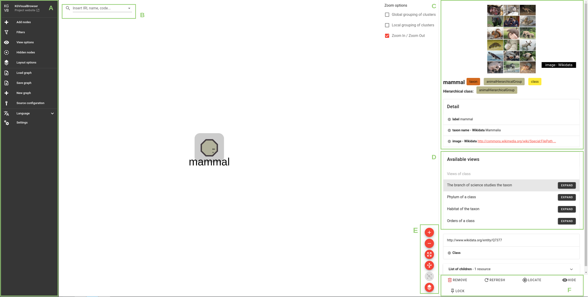
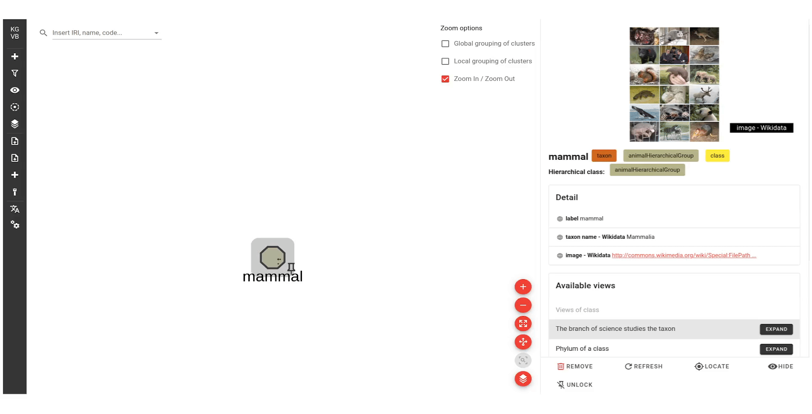
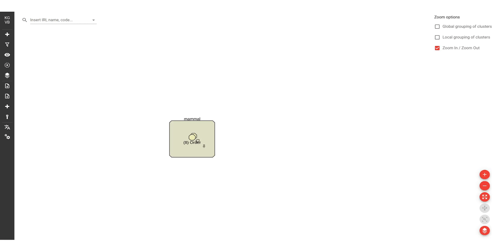
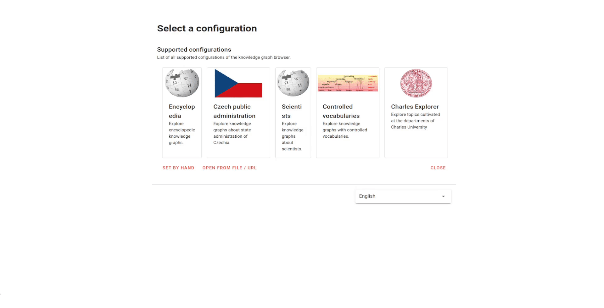
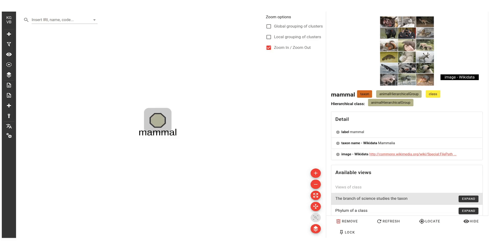

### Table of Contents

- [Motivation](#motivation)
- [How to use the extension?](#how-to-use-the-extension)
  - [Configuration selection](#configuration-selection)
  - [Begin Your Graph Exploration](#get-started-with-graph-exploration)

---

<h1 id="motivation">Motivation</h1>

The grouping of clusters is a powerful built-in tool that allows to effectively work with large amounts of data in a clear and intuitive way. This extension provides a new way of interacting with the graph by allowing to combine different simplification techniques, that can improve the user's experience of working with a large graph. 

The extension takes into account [hierarchical relationships](glossary.md#hierarchical-relationships-glossary) and utilizes the concept of multi-level hierarchy, which is achieved through the use of [compound nodes](glossary.md#compound-node). These nodes can be expanded and collapsed, creating smaller representations of the original graph, and making it easier to restore the original graph without losing any information. Additionally, the extension supports map-style [zooming](glossary.md#zooming), which allows to easily adjust the necessary level of detail displayed and focus only on the data of interest.

Furthermore, the extension provides a group compact mode, which allows to uncover the internals of the groups without cluttering the graph. This mode allows to easily view the nodes within a group and recursively explore inner groups, helping to focus on specific groups and understand their structure.

Another useful feature of the extension is the ability to move clusters of nodes around the graph area as a [visual group](glossary.md#visual-group-glossary), making it easier to reorganize and rearrange the data. 

Overall, the grouping of clusters is a valuable tool for anyone working with large and complex networks, providing a range of features that help to understand and manipulate the data, without losing important information.

<h1 id="how-to-use-the-extension">How to use the extension?</h1>

<h2 id="configuration-selection">Configuration selection</h2>

**1.** Select the "Encyclopedia" meta-configuration, as shown in Figure 1.

     
    <em>Figure 1. Meta-Configuration selection</em>

**2.** Choose the "Animal classification" configuration, as shown in Figure 2.

     
    <em>Figure 2. Meta-Configuration selection</em>

**3.** Select a starting node from the list of available starting nodes as shown in Figure 3.

     
    <em>Figure 3. Starting node</em>

<h2 id="begin-your-graph-exploration">Begin Your Graph Exploration</h2>

<h3 id="starting-node">Basic operations on graph</h3>

To interact with the graph, the tool provides the following options:

     
    <em>Figure 4. Basic operations on graph.</em>

A) A settings menu for adjusting the graph and its settings \
B) A search bar for locating a specific node \
C) Detail panel displaying information about a selected node \
D) "Available views" list for incrementally exploring the neighborhood of a selected node \
E) Basic operations for manipulating graph area \
F) Basic operations for manipulating nodes 

<h3 id="hierarchical-expansions">Hierarchical expansions</h3>

Expansions, placed under the "Available views" label, can be either hierarchical or non-hierarchical in relation to the selected node. By hovering over an expansion, you can display a tooltip indicating whether the expansion is hierarchical or non-hierarchical. You can refer to Figure 5 for an example. 

- Hierarchical expansions:
  - "Phylum of a class"
  - "Orders of a class"

- Non-hierarchical expansions:
  - "The branch of science studies the taxon"
  - "Habitat of the taxon"

     
    <em>Figure 5. Hierarchical and non-hierarchical expansions</em>

<h3 id="zooming-guide">Zooming</h3>

With help of [checkbox](glossary.md#checkbox-glossary) you can choose whether to apply global or local grouping of clusters, traditional zooming, or combine these options together. Note that [map-style zooming](glossary.md#zooming) is achieved by combination of traditional zooming with any variation of grouping of clusters zooming.

Each option in the checkbox brings its own functionality: 
- Zoom In / Zoom Out: This option allows you to adjust the magnification of the graph
- Global grouping of clusters: This option allows you to globally change the detail displayed, without changing the overall size or magnification of the graph
- Local grouping of clusters: This option allows you to apply grouping of clusters locally, only on selected nodes

Use +/- buttons or mouse wheel to apply zooming on the graph

<h3 id="group-compact-mode-guide">Group compact mode</h3>

This [mode](glossary.md#group-compact-mode) is only available for group nodes. To enable it, click the "Group compact mode" button. Then you can recursively explore inner groups by clicking on them. To exit this mode, click anywhere outside the group, or by using the "Group compact mode" button. A visual representation of how to enter and exit the group compact mode is depicted in Figure 6.

     
    <em>Figure 6. How to enter and exit the group compact mode.</em>

<h2 id="restrictions">Restrictions on a graph</h2>

1. It is not possible to group nodes placed in different [hierarchical groups](glossary.md#hierarchical-groups-glossary), [hierarchical levels](glossary.md#hierarchical-level-glossary), visual classes, or having different parent node. It is not possible to include a pseudo-parent node within a group.
2. It is not possible to manually delete a pseudo-parent node. It will be automatically deleted when the last node inside will be deleted.
3. It is not possible to expand node's children if some of its descendants have already been collapsed.
4. If a node;s children were previously expanded and then collapsed, attempting to expand the node again will not display its children since they are already present in the graph in a collapsed state. In this case, you can reveal them by using grouping of clusters zooming and mouse wheel or the "+" button.
5. The "+" button or mouse wheel ungroup all groups placed at the [current hierarchical level](#current-hierarchical-level-glossary). To ungroup a specific group, select it and double click on it, or use the "break" button.
6. When the group compact mode is enabled, it is not possible to expand any nodes.

<h2>Example</h2>

Let us demonstrate our approach on a visual knowledge graph about "Animal kingdom". The Knowledge Graph Visual browser is available at https://try.kgbrowser.opendata.cz/. 

The Knowledge Graph Visual browser has a start page that displays different meta-configurations, which are logically organized by topic. Each meta-configuration then represents a set of specific configurations. For example, "Encyclopedia" meta-configuration lists configurations for exploring encyclopedic knowledge graphs.

Our extension requires the use of visual layout constraints that define the way how the graph is visualized. These constraints are defined in a visual configuration file, which is specific for each configuration. In this case, we have chosen the "Animal classification" configuration, which supports visual layout constraints. Each configuration provides a list of starting nodes, which serve as entry points for exploring the knowledge graphs. When a starting node is chosen, it is displayed as a single node on the graph area and is automatically selected. Whenever a node is selected, the client loads a preview detail of the node and displays it in the upper part of the detail panel. If the node belongs to a hierarchical group, the detail panel will display that group as well (Figure 7). 

     
    <em>Figure 7. The visual representation of the selection of the configuration and the starting node.</em>

Knowledge Graph Visual browser allows for dynamic exploration of knowledge graphs through the use of expansions, which can be found in the detail panel. Our selected configuration supports both: hierarchical and non-hierarchical expansions. We can distinguish between them by using a tooltip which, when hovered over a field, indicates whether the expansions is hierarchical or non-hierarchical. When a hierarchical expansion is chosen, for example "Orders of a class", the neighborhood of the expanded node will be displayed in a hierarchical structure using compound nodes. This way, "mammal" node serves as a parent node. Additionally, the list of its child nodes is displayed in the detail panel (Figure 8).  

     
    <em>Figure 8. The visual representation of the hierarchical expansion.</em>

Let's follow the steps: select the "Carnivora" node within the "(72) Order" group and detach it from there -> expand its "Families of an order" view -> select the "Felidae" node within the "(23) Family" group and detach it from there -> expand its "Genera of a family" view -> select the "Panthera" node within the "(45) Genus" group and detach it from there -> expand its "Species of a genus" view -> select the "Leopard" node within the "(17) Species" group and detach it from there -> expand its "Habitat of the taxon" view. The last expansion, "Habitat of the taxon", is non-hierarchical, resulting in a neighborhood connected by edges. All nodes in this neighborhood are of the class "region" and, as defined in the configuration, are encased in a pseudo-parent node. A visual representation of the complete process can be found in Figure 9.

     
    <em>Figure 9. The visual representation of the multiple hierarchical expansions and non-hierarchical expansion.</em>

Zooming

To demonstrate how the zooming features work, let's use the "Global grouping of clusters" type of zoom and start by zooming out first. To do this, we need to select "Global grouping of clusters" option in the checkbox. By using the "-" button (or the mouse wheel), we can group together nodes that are located at the deepest level of each hierarchy. In our example, these nodes are the child nodes of the "Panthera" compound node, and the "forest" and "shrubland" nodes placed inside a pseudo-parent node. By continuing to click, we can gradually reach a state where the group is the only remaining child node within the "Panthera" compound node. If we click the "-" button once again, the "Panthera" node will collapse. Note that the visual group representing nodes of class "region" will not collapse, as it is a visual element that encompasses a cluster of nodes. By continuing to click the “-” button a few more times, we can gradually reach a state where the graph can no longer be collapsed any further. This state represents the highest level of abstraction in the hierarchy and shows the least amount of detail possible. A visual representation of the complete process can be found in Figure 10. Note that different hierarchical and visual groups cannot be grouped together. 

     
    <em>Figure 10. The visual representation of the zooming out feature.</em>

The process of zooming in is similar to zooming out. By repeatedly clicking the “+” button, we can gradually return to the initial state from which we started. This can be seen in Figure 13. Local grouping of clusters works in a similar way. Map-style zooming can be enabled by selecting the local or global grouping of clusters in combination with the "Zoom In / Zoom Out" option.

Group compact mode

Let us demonstrate how the group compact mode works. We can activate it on the group node by clicking on the "group compact mode" button. Once the mode is activated, we can recursively explore the nodes inside the group by navigating through the inner groups. Note that it also possible to jump between different levels in the structure. This mode is a view mode, and when it is turned off, the graph returns to the state where it was activated. To exit this mode, we can click anywhere outside the group, or by using the specific button. A visual representation of the complete process can be found in Figure 11.

     
    <em>Figure 11. The visual representation of the group compact mode.</em>

