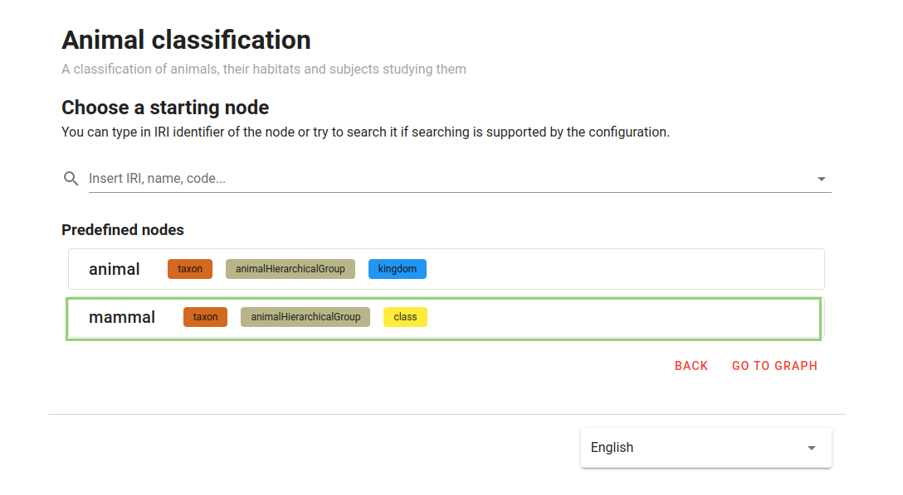
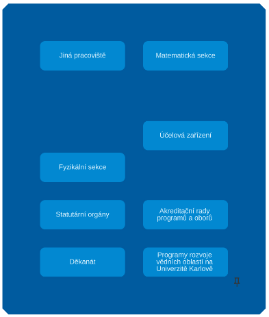

### Table of Contents

- [Motivation](#motivation)
- [Glossary](#glossary)
- [How to use the extension?](#how-to-use-the-extension)
  - [Configuration selection](#configuration-selection)
  - [Get started with graph exploration](#get-started-with-graph-exploration)

---

<h1 id="motivation">Motivation</h1>

The grouping of clusters is a powerful built-in tool that allows to effectively work with large amounts of data in a clear and intuitive way. This extension provides a new way of interacting with the graph by allowing to group clusters of similar nodes, and interact with them in a more manageable and intuitive way. 

The extension takes into account hierarchical relationships and utilizes the concept of multi-level hierarchy, which is achieved through the use of compound nodes. These nodes can be expanded and collapsed, creating smaller representations of the original graph, and making it easier to restore the original graph without losing any information. Additionally, the extension supports map-style zooming, which allows to easily adjust the necessary level of detail displayed and focus only on the data of interest.

Furthermore, the extension provides a group compact mode, which allows to uncover the internals of the groups without cluttering the graph. This mode allows to easily view the nodes within a group and recursively explore inner groups, helping to focus on specific groups and understand their structure.

Another useful feature of the extension is the ability to move clusters of nodes around the graph area as a group, making it easier to reorganize and rearrange the data. This feature helps to keep the graph area clean and without clutter. 

To bring more flexibility in controlling the amount of detail displayed and help to focus on the data of the interest, our extension provides options for global, local and inverse local zooming. 

Overall, the grouping of clusters is a valuable tool for anyone working with large and complex networks, providing a range of features that help to understand and manipulate the data, without losing important information.

<h1 id="how-to-use-the-extension">How to use the extension?</h1>

<h2 id="configuration-selection">Configuration selection</h2>

**1.** Select the "Charles Explorer" meta-configuration, as shown in Figure 1.

     
    <em>Figure 1. Meta-Configuration selection</em>

**2.** Choose the "Browsing topics cultivated at Charles University (with constraints)" configuration, as shown in Figure 2.

     
    <em>Figure 11. Meta-Configuration selection</em>

**3.** Select a starting node from the list of available starting nodes as shown in Figure 3.

     
    <em>Figure 12. Starting node</em>

<h2 id="begin-your-graph-exploration">Begin Your Graph Exploration</h2>

<h3 id="starting-node">Basic operations on graph</h3>

To interact with the graph, the tool provides the following options:

A) A settings menu for adjusting the graph and its settings
B) A search bar for locating a specific node
C) Detail panel displaying information about a selected node
D) "Available views" list for incrementally exploring the neighborhood of a selected node
E) Basic operations for manipulating nodes 

<h3 id="hierarchical-expansions">Hierarchical expansions</h3>

Expansions, placed under the "Available views" label, can be either hierarchical or non-hierarchical in relation to the selected node. You can refer to Figure 13 for an example. 

By hovering over an expansion, you can display a tooltip indicating whether the expansion is hierarchical or non-hierarchical.

- Hierarchical expansions:
  - "Nadřazená pracoviště"
  - "Podřazená pracoviště"

- Non-hierarchical expansions:
  - "Témata pracoviště"
  - "Sdílená témata pracoviště"

     
    <em>Figure 13. Hierarchical and non-hierarchical expansions</em>

> **Note**
> - A [hierarchical group](#hierarchical-groups-glossary) can be constructed incrementally using hierarchical expansions.
> - Non-hierarchical expansions reveal a node's neighborhood, where each neighboring node is connected to that node through an edge.

<h3 id="grouping-guide">Grouping</h3>

With help of [checkbox](#checkbox-glossary) you can choose whether to apply global, local, inverse local map-style zooming, or combine these options together. 

Each option in the checkbox brings its own functionality: 
- Zoom In / Zoom Out: This option allows you to adjust the magnification of the graph
- Global grouping of clusters: This option allows you to change the detail displayed, without changing the overall size or magnification of the whole graph
- Local grouping of clusters: This option allows you to apply grouping of clusters locally, only on selected nodes
- Inverse grouping of clusters: This option allows you to lock a selected compound nodes in their expanded state, so that they remain expanded and visible during zooming, while the rest of the graph changes the detail displayed. 

Use +/- buttons or mouse wheel to apply zooming on the graph

> **Note**
> The process of how the grouping of clusters approach works is explained in the glossary section of this guide.

<h3 id="group-compact-mode-guide">Group compact mode</h3>

To enable it, you can click the specific button as shown in Figure #TODO. You can recursively explore inner groups by simply clicking on them. 

To exit this mode, you can click anywhere outside the group, or by using the specific button as shown in Figure. 

This mode is only available for group nodes.

<h3 id="node-removal-guide">Basic operations with the node</h3>

- Collapse: To collapse a compound node, you can use local zooming function, as shown in Figure. Select the compound node and choose the local zooming option, then collapse the node by scrolling the mouse wheel down or using the "-" button.
- Expand: To expand a supernode (collapsed compound node), select this node and choose the local zooming option, then expand the node by scrolling the mouse wheel up or using the "+" button.
- Delete: To delete the node, select it first, and then click on delete button, as shown in Figure. ***Important:*** This will remove recursively all descendants of the selected node.
- Rename: To rename a group, click rename as shown in Figure (C). ***Important:*** This feature is only available for group nodes.

#TODO
Below is shown an example of the [node removal](#node-removal-glossary):

Before removal of the "Informaticka sekce":

     
    <em>Figure 14. Before removal (the node "Informaticka sekce" is selected for deletion)</em>

After removal:

     
    <em>Figure 15. After removal</em>

<h2 id="restrictions">Restrictions on a graph</h2>

#TODO
1. It is not possible to group nodes placed in different hierarchical groups, hierarchical levels, visual classes, or having different parent node. It is not possible to add a pseudo-parent node into a group.
2. It is not possible to delete a pseudo-parent node.
3. It is not possible to expand node's children if some its descendants are already collapsed.
4. If a node was expanded with its children and next they were collapsed, then the same expansion will not show children since they are already existing in the graph. In such case you should show (uncollapse) them using wheel or plus/minus button.
5. It is still possible to use clustering in the case if some node (and possibly its descendants) was removed, and therefore the hierarchy was broken.
6. The "plus" button or wheel ungroup all groups placed at the [current hierarchical level](#current-hierarchical-level-glossary). In the case you want to ungroup certain group, select such group and double click on it (or use "break" button).
7. If there is at least one node of some hierarchy on the graph, then for non-hierarchical expansions, no new node and only non-hierarchical edges leading to existing nodes are displayed on the graph. All other nodes and edges are still being created and will be displayed during the next hierarchical expansions.
8. If you want to expand a node with its children, but there are already expanded and collapsed its sibling nodes, then to display their (siblings') children, use the minus button to return to the level where only sibling nodes are shown, and then using the plus button show all children of all siblings.
9. It is not available during the group compact mode to use view expansions 

<h2 id="summary">Summary</h2>

The Grouping of clusters extension is a powerful tool for working with large and complex networks, providing a range of features that make it easy to understand and manipulate the data. The extension allows to group clusters of similar nodes, interact with them in manageable and intuitive way, and utilize the concept of multi-level hierarchy. The extension supports map-style zooming, which allows to easily adjust the necessary level of detail displayed and focus only on the data of interest. Additionally, the extension provides a group compact mode, which allows to uncover insights of groups without cluttering the graph. Feel free to use the newly implemented features that will give you a fresh perspective on the graph.